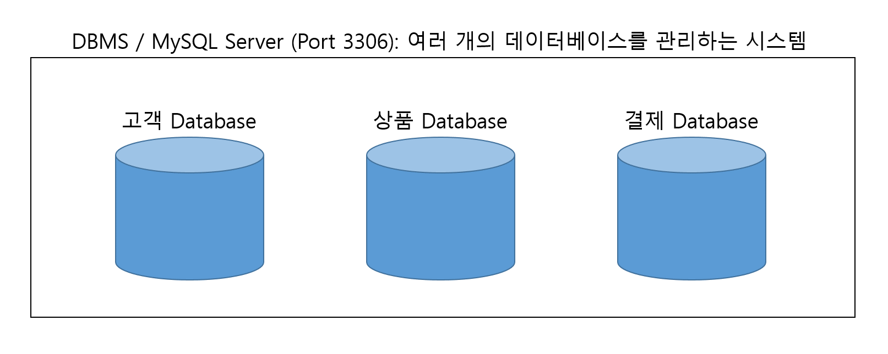

# Database
data가 모여있는 집합체  
관련성이 있는 대용량의 체계적으로 모아놓은 데이터의 집합체

이걸 사용하려면 여러개의 Program이 필요하다.

# DBMS란?

데이터베이스라는 데이터의 집합을 만들고 저장 및 관리할 수 있는 기능들을 제공하는 응용 프로그램이다. 즉, 데이터의 관리에 특화된 프로그램이라고 생각하면 편하다.  

이런 DBMS는 어떤 종류가 있나요

|      |제품명    |회사      |비용                    |
|:----:|----------|----------|------------------------|
|★    |Oracle    |Oracle    |유료                    | 
|★    |MySQL     |Oracle    |유료, 무료              |  
|★    |MariaDB   |MariaDB   |무료                    |
|      |DB 2      |IBM       |유료(Mainframe에서 사용)| 
|      |SQL Server|Microsoft |유료                    |
|★    |PostgreSQL|PostgreSQL|무료                    | 

# DBMS를 사용하는 이유
운영 및 관리적인 전반에 좋아서
개발측면에서 좋아서

# DBMS의 특징
1. 무결성(Integrity)
잘못된 데이터가 들어오면 안 된다. 제약사항(constraints)을 이용해서 관리한다.
2. 독립성
DBMS의 변경 - Disk 용량 증가, Database의 이관
ex) Java Program이 DBMS의 변경에 영향을 받지 말아야한다.
3. 보안
4. 데이터의 중복을 최소화
5. 안정성

# DBMS의 유형
1. file system
   - 느리고 불편하고 보안성 x
2. 계층형 DBMS  
구조 ex)알마인드,4학년 - 1학기 - 알고리즘
계층형 DBMS의 문제는 처음 구성을 완료한 후에 이를 변경하기가 상당히 까다롭다는 것입니다.
3. Network DBMS   
DBMS를 만들기가 너무 힘들다.
4. IBM EF.codd (Relation)  
ex) 한글이나 워드에서의 표 
5. 객체지향의 시대(1990~)  
객체지향의 DBMS가 등장했지만 기존(RDBMS)에 있던게 더 좋아서 쓰지 않게 되었다.
6. 객체-관계형 database  
relational DBMS (RDBMS)
RDBMS에서는 모든 데이터가 테이블에 저장됩니다. 이 구조가 가장 기본적이고 중요한 구성이기 때문에 RDBMS는 테이블로 이루어져 있으며, 테이블은 열과 행으로 구성되어 있다는 것을 파악했다면 RDBMS를 어느정도 이해했다고 할 수 있습니다.  
RDB<-> 요즘에는 비정형데이터 사용을 많이 쓰는데 NoSQL 대표적으로 MongoDB
하지만 nosql은 특별할때만 쓰는 dbms지 발전이 되는 형태가 아니다.

# MySQL
MySQL - "관계형 Database"  
데이터가 저장되는 요소 -> Table-여기에 데이터 저장

|Column Name|Column Name|Column Name| |
|:---------:|:---------:|:---------:|-|
|ㅁ         |ㅁ         |ㅁ         | |
|ㅁ         |ㅁ         |ㅁ         |Row (행) cf. Record: File System에서 사용하는 용어|
|ㅁ         |ㅁ         |ㅁ         | |
|           |Column (열)|           | |