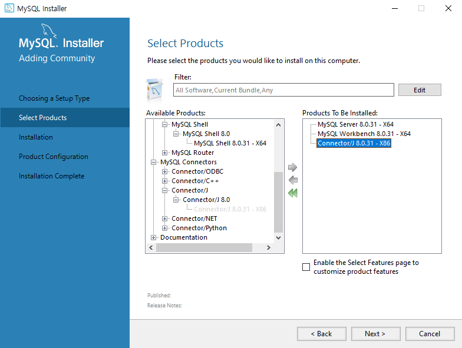

 # MySQL Community 설치
 최신버전, 윈도우 용, 오프라인 인스톨러

 인스톨러 다운로드 후
 1. MySQL Server (메인)
 2. MySQL Workbench (기본적으로 제공되는 불편한 CLI 대신 사용할 수 있는 GUI 툴)
 3. MySQL Connector/J (자바 프로그램에서 MySQL과 연동하기 위해 사용하는 JDBC 드라이버; 나중에 자세하게 설명)
 4. 그 외의 라우터와 같은 잡다한 것은 설치하지 않아도 됨

 

[참고] 현업에서 많이 사용하는 GUI 툴
- DBeaver (유료)
- DataGrip (유료)