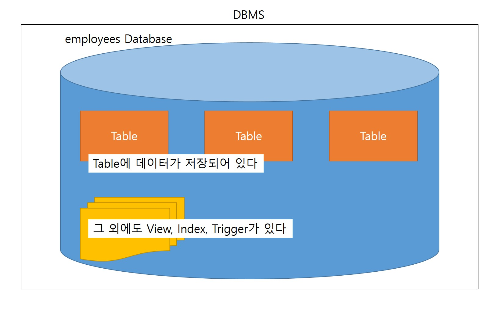

# 실습 환경 구성
1. employees.zip 압축을 풀기
2. CLI 클라이언트를 쉽게 사용하기 위해 환경변수 'Path'에 'C:\Program Files\MySQL\MySQL Server 8.0\bin' 추가 (MySQL 바이너리)
3. 터미널을 띄워서 'mysql -u root -p' 입력 (root 계정으로 접속하며, password를 입력하도록 프롬포트를 띄우라는 의미)
4. 그럼 CLI 클라이언트로 서버에 접속하게 됨

# 실습 1
## 데이터베이스 확인
```
mysql> show databases; -- 내가 볼 수 있는 데이터베이스를 보여라
+--------------------+
| Database           |
+--------------------+
| information_schema |
| mysql              |
| performance_schema |
| sys                |
+--------------------+
4 rows in set (0.00 sec)
```

MySQL은 DBMS, 즉 여러 개의 데이터베이스를 관리하는 시스템이므로 그 안에 여러 개의 데이터베이스가 있다.  
*이때 MySQL에서는 데이터베이스를 스키마라는 말로 표현하기도 한다. (다른 DBMS에서는 다른 의미로 사용되니 주의)
즉, 위의 결과를 보면 root 계정이 접근할 수 있는 데이터베이스가 information_schema, mysql, performance_schema, sys로 총 네 개임을 알 수 있다. 

```
mysql> exit
Bye
```
확인했으면 종료한다.

## 스크립트 실행
```
PS C:\Users\user> cd '.\git\KOSAjava\Assets\2022-12-20 데이터베이스 실습\employees'
PS C:\Users\user\git\KOSAjava\Assets\2022-12-20 데이터베이스 실습\employees>
```
SQL 스크립트가 위치하는 경로로 이동한다.  
이떄 프롬프트의 현재 경로를 워킹 디렉토리라고 표현한다.

```
PS C:\Users\user>
PS C:\Users\user\git\KOSAjava\Assets\2022-12-20 데이터베이스 실습\employees>mysql -uroot -p
mysql>
```
현재 경로를 유지한 상태에서 CLI 클라이언트를 실행한다.  
워킹 디렉토리에 SQL 스크립트가 위치된 상태이다.

```
mysql> source employees.sql

mysql> show databases;
+--------------------+
| Database           |
+--------------------+
| employees          |
| information_schema |
| mysql              |
| performance_schema |
| sys                |
+--------------------+
5 rows in set (0.01 sec)
```
이 상태에서 source 명령을 통해 SQL 스크립트를 실행했다.  
그 후 show databases 명령으로 잘 실행되었는지 확인해본다.  
워크벤치에서도 새로고침을 하면 employees 데이터베이스가 생성되어있음을 볼 수 있다.

# 데이터베이스의 구조와 용어

1.  Table: Data를 저장하는 표현태의 자료구조
2.  Database: Table이 저장되는 고유의 저장소. 식별할 수 있도록 이름이 붙어있다. *즉 어떠한 테이블에 접근하기 위해서는 우선 그 테이블이 속한 데이터베이스의 이름을 명시해줘야 한다.
3.  DBMS: Database를 관리하기 위한 여러 SW의 집합체
4.  Column(열), Column명, Row(행): Table과 연관
    -  이때 데이터는 1개의 Row이다.
    -  Row에는 특정 데이터 타입으로 여러 값이 저장된다.
    -  주요 데이터 타입은 이따가 논의해본다.

Row의 예시
|이름  |나이|주소|
|------|----|----|
|홍길동|20  |서울|

# 테이블, 행, 열, 키
*student Table*
|학번*|이름    |학과        |성적|주민등록번호|
|:---:|--------|------------|---:|------------|
|1    |홍길동  |철학과      |3.0 |Unique      |
|2    |신사임당|컴퓨터과학과|4.0 |Unique      |
|3    |강감찬  |영어영문학과|2.0 |Unique      |

&nbsp;

*department Table*
|학과명*|학과사무실 전화번호|학과사무실 호수|
|-------|-------------------|---------------|
|철학   |123                |203            |
|영문   |456                |204            |
|국문   |789                |205            |

- Key: Row를 **유일하게** 식별할 수 있는 Column의 집합. 다시 말하면, 어떠한 Column이 Key가 되기 위해서는 통해 특정 Row를 유니크하게 식별할 수 있어야 함.
    * 학번: 모든 학생의 학번은 모두 다르므로 Key가 될 수 있다.
    * 이름: 동명이인이 있을 수 있으므로 Key가 될 수 없다.
    * 학과, 성적도 물론 Key가 될 수 없다.
    * Key가 여러 개의 Column으로 구성될 수도 있다. (학번 + 주민등록번호)
      * 이를 복합 Key라고 한다.
      * 다만 학사관리 데이터베이스므로 학번 Column을 Primary Key로, 주민등록번호 Column을 후보 Key로 삼는 것이 적절해보인다.
      * 일반적으로 Key라고 하면 Primary Key를 지칭한다.
  - 모든 Table에는 Primary Key가 있는 것이 원칙 (물론 Key가 없는 테이블을 만들 수는 있음)
  - Primary Key가 설정되면 DBMS 내부적으로 해당 Key를 기준으로 한 Index가 생성됨. -> 검색 효율 증가
  - 일단 위의 두 테이블에서 학번*과 학과명*을 Primary Key로 지정했지만, 일반적으로 학과명처럼 문자열을 Key로 지정하지는 않는다. 문자열 처리가 어렵기 떄문이다.


- Foreign Key(외래키): 한 Table의 Column의 집합이 다른 Table의 Primary Key를 값으로 가지고 있는 경우 Foreign Key라고 한다.
  * 위에서는 student Table의 학과 Column의 값이 department Table의 Primary Key이므로, 학과 Column이 Foreign Key가 된다.
  * 다만 위의 경우, student Talbe 2번 Row의 컴퓨터과학과가 department Table의 Primary Key 중에 없다. 따라서 데이터 무결성이 꺠진 상태로, 이를 Foreign Key 제약 조건에 위배된다.
    * Foreign Key 제약 조건: 모든 Foreign Key는 참조하는 테이블의 Primary Key 안에 포함되어야 한다.
    * 즉, 철학과가 폐과되었다고 해서, 맘대로 department Table에서 철학과 Row를 지울 수 없다. 우선 student Table에서 철학과 학생을 먼저 삭제하여야 한다.