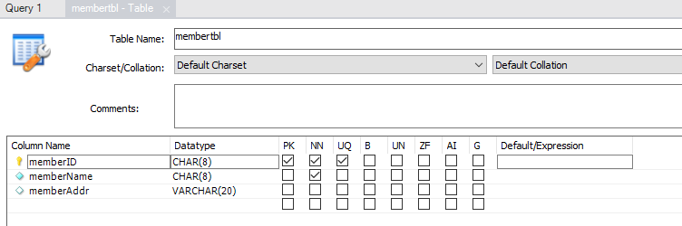

# 워크벤치를 이용한 Database 생성

1. MySQL에서는 Database와 Schema가 동일한 개념으로 사용된다.
2. 워크벤치를 실행하면 좌측에 Navigator가 있다. 이 중 Administration 탭에서는 관리를, Schema 탭에서는 데이터베이스를 조작할 수 있다.
3. Schema 탭을 선택하고, 우클릭하여 CREATE SCHEMA 버튼을 누른다.
4. 새로운 탭이 나오며, Name에 shopdb를 입력하여 Apply 버튼을 누른다.  
자동으로 생성된 SQL 구문을 확인하고, Apply 버튼을 누른다.

# 워크벤치를 이용한 Table 생성
1. Table의 이름을 결정
   - 따로 통일된 명명규칙은 없으니, 조직에서 정한 컨벤션을 따르면 된다.
   - 우리는 TBL이라는 접미어를 붙이기로 한다.
   - 다만 MySQL에서 Table 이름으로 대소문자 구분은 없다. 모두 소문자로 지정된다.
2. Table 설계

**memberTBL Table**

|열 설명|컬럼명    |Data Type |최대 길이|Primary Key|NULL 허용 불가 |Unique|
|-------|----------|----------|---------|-----------|---------------|------|
|아이디 |memberID  |문자(CHAR)|8        |O          |X (PK)         |O (PK)|
|이름   |memberName|문자(CHAR)|8        |X          |X              |X     |
|주소   |memberAddr|문자(CHAR)|20       |X          |O              |X     |

&nbsp;

**[보충] 문자열 Data Type**
- 종류
  - CHAR(MAX_LENGTH)
  - VARCHAR(MAX_LENGTH)
- 비교
  - 위와 같이 선언하면 최대 길이가 같은 문자열 타입이 지정된다.
  - 그러나, CHAR은 무조건 지정한 길이 만큼 공간이 만들어지며, 데이터를 입력하고 남은 공간은 공란으로 남긴다.
  - VARCHAR는 우선 입력된 데이터의 길이만큼 공간을 만들고, 데이터가 변화할 때 마다 할당되는 공간의 크기가 달라진다.
- 장단점
  - 공간의 측면에서는 VARCHAR가 효율적이지만, 저장된 데이터를 가지고 연산을 수행해야 할 떄에는 CHAR가 속도 면에서 효율이 좋다.
  - 자주 변경되는 데이터는 CHAR로, 자주 변경되지 않는 데이터는 VARCHAR로 잡는다.

3. Table 생성
shopdb 데이터베이스의 Tables 우클릭 - Create Table

