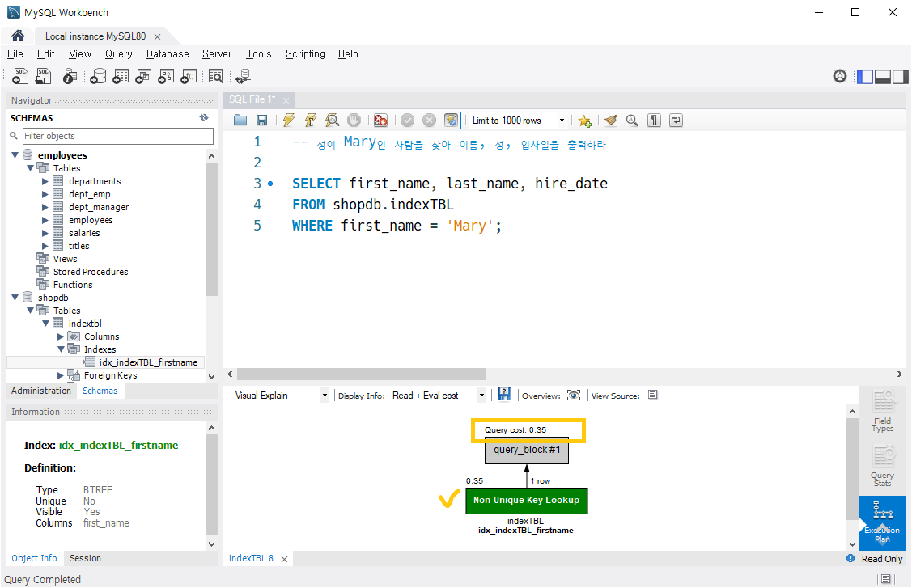

# SQL (Structured Query Language)
다만 현업에서도 이렇게 GUI 툴을 이용하여 데이터베이스를 읽고 쓰지는 않는다.  
보통은 SQL을 이용한다.

구조화된 질의 언어라는 뜻으로, 정해진 구조에 따라 표준화된 구문을 통해 데이터 질의를 수행할 수 있도록 설계된 스크립트 언어이다.

SQL에는 국제적 표준이 있지만, DBMS 벤더에 따라서 디테일한 명세가 상이하다. 특정 DBMS에 특화된 구문을 사용하면 다른 DBMS에는 호환이 안될 수 있다.

특별한 이유가 없다면 표준적인 SQL 문법을 지향하고, 축약형을 사용하지 않는 것이 좋다. 마이그레이션을 하기 위해 노가다를 할 일이 생길 수도 있다. 특히 오라클이 이러한 경향이 강하다.

# SELECT
```sql
SELECT 컬럼명들(콤마로 구분) FROM 데이터베이스명.테이블명;
-- 가져오고 싶은 데이터가 있는 테이블명과 해당 컬럼을 지정해준다.
-- 이떄 조건을 지정하지 않았기 떄문에 모든 데이터가 반환된다.
-- 혹은 USE 구문을 이용하여 아래와 같이 질의할 수도 있다.
USE 데이터베이스명;
SELECT 컬럼명들(콤마로 구분) FROM 테이블명;
```

&nbsp;  
예시:

```sql
SELECT memberName, memberAddr FROM shopdb.membertbl;
```
```
실행 결과
+------------+------------+
| memberName | memberAddr |
+------------+------------+
| 홍길동     | 서울       |
| 강감찬     | 부산       |
| 신사임당   | 인천       |
+------------+------------+
3 rows in set (0.00 sec)
```

# WHERE
SELECT문에 WHERE문을 덧붙여 조건을 추가해줄 수 있다.

```sql
SELECT memberName, memberAddr FROM shopdb.membertbl WHERE memberAddr = '서울';
```
```
실행 결과
+------------+------------+
| memberName | memberAddr |
+------------+------------+
| 홍길동     | 서울       |
+------------+------------+
1 row in set (0.00 sec)
```

**유의점**  
- WHERE 뒤의 조건문에 '=='가 아닌 '='를 사용
- 문자열을 표현할 떄 "..."가 아닌 '...'을 사용함. "..." 자체가 SQL 언어 자체에서 쓰이지 않음.

# 인덱스 (Index)
## 개요
- 목적: 속도를 높이기 위해 사용된다.
- 주의점: 잘못 쓰면 성능이 더 나빠지기도 한다.
- 데이터가 많지 않을 떄에는 인덱스가 큰 의미가 없다. 그러나 데이터가 많아질수록 성능 차이가 커진다.

## 인덱스 만들기
인덱스는 특정 컬럼에 설정한다. 이를 통해 해당 컬럼을 가지고 조회하는 작업의 성능이 개선될 수 있다.

다만, 특정 컬럼이 Primary Key로 설정되면, 해당 컬럼에는 자동으로 인덱스가 설정된다.  

인덱스에는 Clustered Index와 Secondary Index가 있는데, 위와 같은 경우 해당 컬럼에는 자동으로 Clustered Index가 설정된다.

이와는 별개로 다른 컬럼에도 인덱스를 설정할 수 있다. 이 경우 해당 컬럼에는 Secondary Index가 설정된다.

그렇다면 데이터 조회에 사용되는 모든 컬럼에 인덱스를 설정하는게 유리할까? 인덱스가 설정되면 DBMS 내부적으로 인덱스를 구현하기 위한 자료구조가 생성되며, 데이터가 변화될 떄 마다 인덱스도 변화되며 관리되어야 한다.

따라서 인덱스가 너무 많으면 인덱스를 관리하는 데 드는 비용이 높아져 오히려 성능이 낮아질 수 있다는 것이다. 즉, 인덱스는 필요한 경우에만 설정해야 한다.

## 실습
employess 데이터베이스의 employees 테이블에서 값을 가져와 새로운 테이블을 만들고 해당 테이블에서 인덱스 유무의 차이를 확인하여 보자.

```sql
-- 새로운 테이블을 만들어서
-- 아래에서 가져온 데이터를 입력해보자

-- 테이블 만들기
CREATE TABLE shopdb.indexTBL (
	first_name  VARCHAR(14),
    last_name   VARCHAR(16),
    hire_date   DATE
);
-- CREATE TABLE 테이블명 (
-- 컬럼명    타입,
-- 컬럼명    타입,
-- 컬럼명    타입
-- ...
-- );

-- 만든 테이블에 데이터 입력
INSERT INTO shopdb.indexTBL
	SELECT first_name, last_name, hire_date
    FROM employees.employees
    LIMIT 500;
-- INSERT INTO 테이블명
--      테이블에 행을 추가하는 기본 구문
-- 뒤에 SELECT 문을 붙이면 조회한 데이터를 바로 값을 삽입할 수 있음

-- 잘 들어갔는지 확인
SELECT * FROM shopdb.indexTBL;
```

employees 테이블에서 500개의 Row를 불러왔으며, 불러온 데이터를 새로운 테이블에 삽입했음을 확인할 수 있다.  
그렇다면 아래에서 조건을 추가하여 질의해보자.

```sql
-- 성이 Mary인 사람을 찾아 이름, 성, 입사일을 출력하라

SELECT first_name, last_name, hire_date
FROM shopdb.indexTBL
WHERE first_name = 'Mary';
```

워크벤치의 기능을 통해 처리 시간과 처리 과정을 확인해볼 수 있다.  
  
50ms대의 시간이 걸렸으며, Full Table Scan으로 데이터를 조회했음을 볼 수 있다. Full Table Scan이라고 하면, 500개의 모든 행을 일일히 반복하며 조건에 만족하는 행을 찾았다는 것이다.

그렇다면 조회 조건에 따라 first_name에 인덱스를 설정하면
성능이 상승할 것임을 예측할 수 있다.

```sql
-- 인덱스 생성
-- 이름으로 빠르게 파악할 수 있도록
-- 인덱스이름_대상테이블_대상컬럼 컨벤션을 따랐다.
CREATE INDEX idx_indexTBL_firstname ON indexTBL(first_name);
-- CREATE INDEX 인덱스이름 ON 대상테이블명(대상컬럼명);
```

다시 위의 SELECT 문을 실행해보면, 수행시간이 줄어들었으며 Full Table Scan이 아닌 Index를 이용한 질의로 바뀌었음을 알 수 있다.

