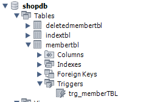

# 트리거 개요
어떠한 테이블에 트리거가 부착되면, 해당 테이블에서 입력, 수정, 삭제(**CRUD**에서 조회를 제외)가 발생하는 경우 자동으로 실행된다.

대표적으로 로그의 구현이 있다.

&nbsp;

[참고] CRUD
|작업|      | | 
|----|------|-|
|입력|Create|C|
|조회|Read  |R|
|수정|Update|U|
|삭제|Delete|D|

&nbsp;

# 트리거 실습
우선 실습을 위한 임시 테이블을 생성한다. 뒤에서 이 테이블에 memberTBL에서 삭제된 Row를 삽입하도록 트리거를 지정할 것이다.

```sql
-- 임시 테이블 생성
-- => memberTBL에서 회원이 삭제되면, 삭제된 회원정보를 모아놓는 테이블

-- CREATE TABLE 테이블명 ( ... );
CREATE TABLE deletedMemberTBL (
--  컬럼명       데이터타입   제약사항 (생략 가능)
    memberID   CHAR(8)  PRIMARY KEY,
    memberName CHAR(8)  NOT NULL,
    memberAddr VARCHAR(20)
);
```

이후 트리거를 설정한다

```sql
DELIMITER //
CREATE TRIGGER trg_memberTBL
	AFTER DELETE -- 삭제 후에 동작하는
    ON memberTBL -- memberTBL 테이블에서
    FOR EACH ROW -- 지워진 행 각각에 대하여
BEGIN
	INSERT INTO deletedMemberTBL VALUES(
		OLD.memberID, OLD.memberName, OLD.memberAddr -- 위에서 넘어온 Row에는 OLD를 통해 접근할 수 있다.
    );
END //
DELIMITER ;
```

그럼 워크벤치 상에서 트리거가 추가되었음을 볼 수 있다.



이제 실제로 데이터를 지워보자.

```sql
-- DELETE FROM 테이블명 (WHERE 조건)
DELETE FROM memberTBL WHERE memberID = 'hong';
-- WHERE을 지정하지 않으면 모든 데이터가 지워진다.

SELECT * FROM memberTBL;
-- 잘 삭제되었는지 테이블의 내용을 확인한다.
```

```
실행 결과
+----------+------------+------------+
| memberID | memberName | memberAddr |
+----------+------------+------------+
| kang     | 강감찬     | 부산       |
| shin     | 신사임당   | 인천       |
+----------+------------+------------+
2 rows in set (0.00 sec)
```

지정한 조건에 맞는 Row가 잘 삭제되었다.

```sql
SELECT * FROM deletedMemberTBL;
```

```
실행 결과
+----------+------------+------------+
| memberID | memberName | memberAddr |
+----------+------------+------------+
| hong     | 홍길동     | 서울       |
+----------+------------+------------+
1 row in set (0.00 sec)
```

트리거에 따라 deletedMemberTBL에 삭제된 데이터가 잘 들어간 것을 볼 수 있다.

이렇게 데이터베이스의 기본 구조를 살펴보았다.
- MySQL
  - 데이터베이스 ...
    - 테이블 ...
    - 뷰 ...
    - 스토어드 프로시져 ...
    - 트리거 ...