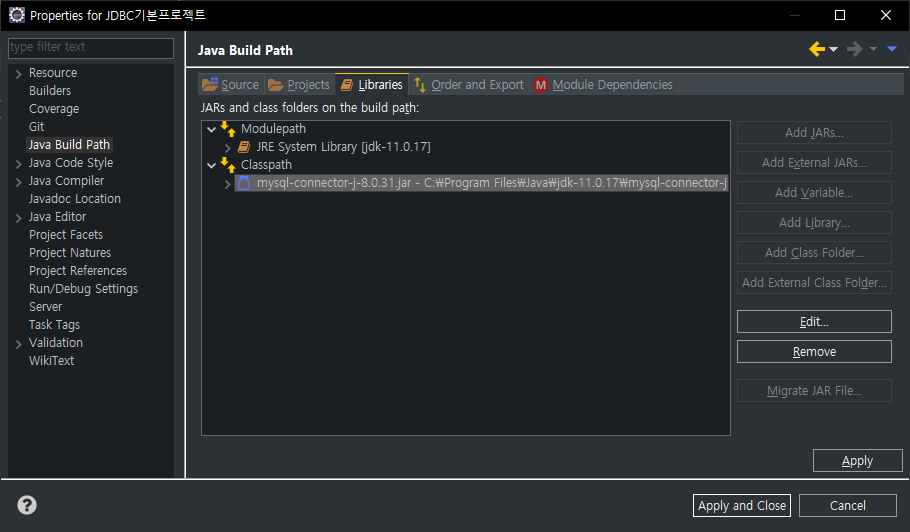
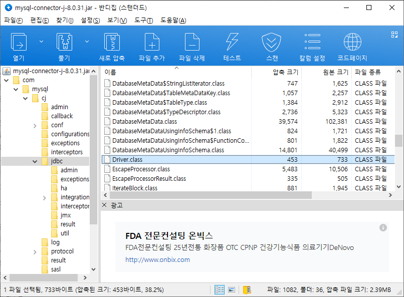
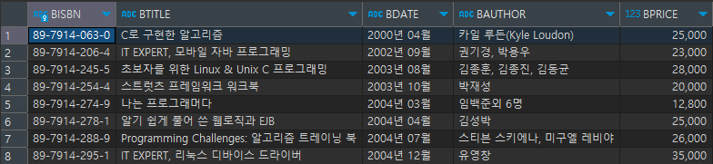

# JDBC
## 개요
DBMS와 연결하기 위한 클래스와 인터페이스를 말함.

오라클, MySQL, MSSQL 등 여러 DBMS의 벤더들은 Java에서 자사의 DBMS에 연결할 수 있도록 여러 클래스와 인터페이스를 제공한다. 가장 대표적인 것이 Driver 클래스이다. 우리가 실습하고 있는 MySQL도 Connetor/J라는 이름으로 제공한다.

그런데, 각 벤더마다 DBMS의 스펙이 다르므로 제공 클래스와 인터페이스도 서로 상이하다. 이 경우 DBMS가 달라지면 코드도 달라져야 하므로 DBMS의 독립성이 지켜지지 못하게 된다.

이에 Java는 DBMS 연결과 관련된 공통 인터페이스를 제공하며, 개발자는 Java가 제공하는 공통 인터페이스만 활용하면 된다. 개발자가 공통 인퍼페이스를 사용하면 뒷단에 있는 각 DBMS 벤더가 작성한 클래스와 인터페이스가 내부적으로 호출되게 된다.

JDBC는 Java가 제공하는 공통 인터페이스와 각 벤더가 제공하는 클래스 및 인터페이스를 총칭한다.

## MySQL Connetor/J
기본 설치 위치는 아래와 같다.

```
C:\Program Files (x86)\MySQL\Connector J 8.0\mysql-connector-j-8.0.31.jar
```

위치는 어디가 되어도 상관 없지만, 우리는 라이브러리를 한데 모아 관리하기 위해 자바가 설치된 위치로 복사해주려고 한다.

```
C:\Program Files\Java\jdk-11.0.17\mysql-connector-j\mysql-connector-j-8.0.31.jar
```

복사한 mysql-connector-j-8.0.31.jar을 사용하고자 하는 프로젝트의 Build Path에 등록시켜준다.



모듈 단위로 압축된 JavaFX와 달리 Connetor/J는 클래스 패스에 추가해줘야 한다는 것을 유의하라.

## JDBC 처리 단계 (SELCT)
### 1. JDBC 드라이버 로딩  
DBMS가 제공하는 Driver 클래스의 객체를 사용할 수 있어야 DBMS에 연결할 수 있다.

Jar의 압축을 풀면 Driver 클래스가 실제로 존재함을 확인할 수 있다.
  
Class.forName()을 통해 해당 클래스를 찾을 것이다.

```java
// 두 가지 방식 중 하나만 기억하면 된다.
try {
    Class.forName("com.mysql.cj.jdbc.Driver");
    // Driver 클래스의 풀패키지를 지정하여 해당 클래스를 찾는다.
    
    System.out.println("Driver Loaded Successfully");
} catch (ClassNotFoundException e) { // 예외처리
    e.printStackTrace();
}
```

### 2. 데이터베이스 접속 (Conncetion 객체 얻기)
- 네트워크를 통해 접속
- 프로토콜, MySQL 서버의 IP와 포트 + 사용할 데이터베이스(스키마) 지정
  - 프로토콜: jdbc
  - IP: localhost
  - 포트: 기본값 3306

```java
try {
    // 전 단계 생략

    String jdbc_uri = "jdbc:mysql://127.0.0.1:3306/library?characterEncoding=UTF-8&serverTimezone=UTC&useSSL=false&allowPublicKeyRetrieval=true";
    String id = "root"; // 실제 개발에는 root를 사용하지 않는다. 테스트로만 사용할 것.
    String pw = "test1234";
    // Java가 제공하는 공통 인터페이스인 DriverManager 이용.
    Connection con = DriverManager.getConnection(jdbc_uri, id, pw); // getConnection은 Static 메서드; Connection 객체 반환
    System.out.println("Connected Successfully");
} catch (ClassNotFoundException e) {
    e.printStackTrace();
} catch (SQLException e) {  // 예외처리 추가
    e.printStackTrace();
}
```

### 3. Statement 객체 생성
- Statement 객체 필요
- 세 가지 종류가 있음
    1. 일반 Statement: 가장 기본적인 인터페이스.
    2. PreparedStatement: Statement 인터페이스를 상속하여 기능이 확장된 것. (주로 사용)
    3. CallableStatement: PreparedStatement 상속. 스토어드 프로시져와 같이 데이터베이스 내의 함수를 호출할 떄 사용.
- Statement 객체는 Connection을 이용해서 만들 수 있음.

```java
// Connection con
Statement stmt = con.createStatement();
```

### 4. Query 작성 및 실행
전 단계에서 생성한 Statement 객체를 통해 SQL 문을 실행할 수 있다.

이떄 실행할 수 있는 메서드로 두 가지가 있다.
    - executeQuery(): SELECT 계열의 SQL을 실행할 때
    - executeUpdate()

```java
try {
			// 전 단계 생략
			
			// 3. Statement 생성
			Statement stmt = con.createStatement(); //java.sql.Statement
			
			// 4. Query 작성 및 실행
			String sql = "SELECT BISBN, BTITLE, BDATE, BAUTHOR, BPRICE FROM BOOK"; // DELIMETER ";"는 포함하지 않음
			stmt.executeQuery(sql);
		} catch (ClassNotFoundException e) {
			e.printStackTrace();
		} catch (SQLException e) {
			e.printStackTrace();
		}
}
```

### 5. 결과 처리
Statement 객체의 메서드를 실행하여 결과 값을 얻었다면, 이를 가져와 가공하여 처리해야한다.

만약 실행한 executeQuery()를 통해 SELECT 문을 실행했다면, 리턴 값은 ResultSet 객체로 반환된다.



SQL의 실행 결과는 우리도 예상하듯 위와 같을 것이다. 우리의 프로그램의 메모리 공간에도 해당 데이터가 존재할 것이다.

그러나 ResultSet 객체 자체는 커서이며, 처음 가져왔을 떄에는 1번 로우 위에 있는 컬럼 명에 위치하고 있다. 따라서 ResultSet(커서)를 내려아 1번 로우를 가리키게 된다.

```java
// Result rs
rs.next();
// 다음 데이터가 존재하여 다음 위치로 커서가 이동할 수 있으면 true 반환
// 더 이상 데이터가 존재하지 않아 커서가 이동할 수 없으면 false 반환
```

```java
try {
        // 전 단계 생략
        
        // 4. Query 작성 및 실행
        String sql = "SELECT BISBN, BTITLE, BDATE, BAUTHOR, BPRICE FROM BOOK"; // DELIMETER ";"는 포함하지 않음
        ResultSet rs = stmt.executeQuery(sql); // ResultSet 참조 변수로 받는다
        
        // 5. 결과 처리
        rs.next();
        String title = rs.getString("btitle"); // 현재 커서가 가리키는 로우의 특정 컬럼의 값을 String으로 가져옴
        int priceInt = rs.getInt("bprice");
        String priceStr = rs.getString("bprice"); // 가능하면 맞춰주는 것이 좋지만 정수 타입 데이터도 String으로 받을 수 있다.
        System.out.println("책 제목은: " + title);
        System.out.println("책 가격은: " + priceInt + " (Integer)");
        System.out.println("책 가격은: " + priceStr + " (String)");
        
        // 컬럼 번호로 가져올 수도 있다. (1부터 시작) 그러나 명확하게 컬럼명을 지정하는 것이 좋다.
        String author = rs.getString(3);
        System.out.println("책 저자는: " + author);
        System.out.println();
        
        // 결과 셋 반복
        while(rs.next()) { // 데이터가 없을 때까지 반복
            String t = rs.getString("btitle");
            int p = rs.getInt("bprice");
            String a = rs.getString("bauthor");
            System.out.println("책 제목은: " + t);
            System.out.println("책 가격은: " + p);
            System.out.println("책 저자는: " + a);
            System.out.println();
        }
    } catch (ClassNotFoundException e) {
        e.printStackTrace();
    } catch (SQLException e) {
        e.printStackTrace();
    }
}
```

### PreparedStatement
책 제목에 특정 키워드가 들어간 책을 조회한다고 하면, Statement 객체를 이용하여 아래와 같이 작성할 수 있다.

```java
// Connection con
String keyword = "자바";
Statement stmt = con.createStatement();
String sql = "SELECT BISBN, BTITLE, BDATE, BAUTHOR, BPRICE FROM BOOK WHERE BTITLE LIKE '%" + keyword + "%'";
ResultSet rs = stmt.executeQuery(sql);
```

SQL 문장을 조합하는 과정이 번거롭다. PreparedStatement를 사용하면 이 과정을 보다 간편화할 수 있다.

```java
// Connection con
String keyword = "자바";
String sql = "SELECT BISBN, BTITLE, BDATE, BAUTHOR, BPRICE FROM BOOK WHERE BTITLE LIKE ?";
PreparedStatement pstmt = con.prepareStatement(sql);
pstmt.setString(1, "%" + keyword + "%"); // 첫번쨰 인파라미터의 값을 지정
ResultSet rs = pstmt.executeQuery(); // 객체 자체가 SQL을 들고 있으므로 인자 없음
while(rs.next()) {
    String t = rs.getString("btitle");
    int p = rs.getInt("bprice");
    String a = rs.getString("bauthor");
    System.out.println("책 제목은: " + t);
    System.out.println("책 가격은: " + p);
    System.out.println("책 저자는: " + a);
    System.out.println();
}
```

위와 같이 PreparedStatement 객체를 쓰면 SQL에서 채울 부분을 ?로 넣을 수 있다. 이를 In Parameter라고 한다.  
다만, 테이블명과 같이 조건을 벗어나는 Keyword에는 지정할 수 없다.

조건을 지정하여 질의해야할 때 Statement보다 PreparedStatement를 사용하는 것이 속도도 빠르고, 간편하므로 PreparedStatement를 사용하는 것이 권장된다. 

### 6. 사용한 자원 해제
작업이 완료되었으면 자원의 할당을 해제하여야 한다.

위의 과정을 요약하면, Connection 객체를 받아 PreparedStatment 객체를 얻었고, 여기에서부터 ResultSet 객체를 반환받았다. 해제할 떄에는 역순으로 진행하면 된다.

자바는 가비지컬렉션 덕분에 메모리 공간 부족에서 보다 자유롭지만, DBMS 서버는 커넥션을 닫아주지 않으면 커넥션을 계속 잡고 있어서 메모리 공간이 부족해지고 크래쉬될 수 있다.

```java
// ResultSet rs
// PreparedStatment ps
// Connection con

rs.close();
pstmt.close();
con.close();
```

## JDBC 처리 단계 (DELETE)
### Auto Commit
SELECT가 아닌 DELETE/UPDATE 구문도 비슷한 단계에 따라 실행할 수 있다.

```java
try {
    // 1. 드라이버 로딩
    Class.forName("com.mysql.cj.jdbc.Driver");
    String jdbc_uri = "jdbc:mysql://127.0.0.1:3306/library?characterEncoding=UTF-8&serverTimezone=UTC&useSSL=false&allowPublicKeyRetrieval=true";
    String id = "root";
    String pw = "test1234";
    
    // 2. 데이터베이스 연결
    Connection con = DriverManager.getConnection(jdbc_uri);
    
    // 3. PreparedStatement 생성
    String sql = "DELETE FROM book WHERE btitle LIKE ?"; // 특정 키워드가 들어간 책을 지우려고 한다
    String keyword = "여행";
    PreparedStatement pstmt = con.prepareStatement(sql);
    pstmt.setString(1, "%" + keyword + "%");
    
    // 4. SQL 실행
    // DELETE 구문이므로 executeQuery()가 아닌 executeUpdate() 호출
    // 이때 리턴 값은 int로, 영향을 받은 로우 수가 반환됨.
    // ex> 4개의 로우가 삭제/수정되면 4가 반환됨.
    int count = pstmt.executeUpdate(); 
    
    // 5. 결과 처리
    System.out.println("삭제한 로우의 수는: " + count);
    
    // 6. 자원 할당 해제
    pstmt.close();
    con.close();
    
} catch (ClassNotFoundException e) {
    e.printStackTrace();
} catch (SQLException e) {
    e.printStackTrace();
}
```

### Transaction

위에서는 따로 트랜잭션을 걸지 않았다. 이와 같은 경우 Auto Commit 모드에 있다고 하며, SQL 한 줄 한 줄이 트랜잭션인 상태가 된다.

JDBC에서 트랜잭션을 지정하려면, 관련 설정을 Connection 객체에 걸어야 한다. 기본 설정은 위와 같은 Auto Commit 모드이다.

```java
try {
    Class.forName("com.mysql.cj.jdbc.Driver");
    String jdbc_uri = "jdbc:mysql://127.0.0.1:3306/library?characterEncoding=UTF-8&serverTimezone=UTC&useSSL=false&allowPublicKeyRetrieval=true";
    String id = "root";
    String pw = "test1234";
    
    // DB 접속
    Connection con = DriverManager.getConnection(jdbc_uri, id, pw);
    con.setAutoCommit(false); // 트랜잭션 시작
    
    String sql = "DELETE FROM book WHERE btitle LIKE ?";
    String keyword = "여행";
    PreparedStatement pstmt = con.prepareStatement(sql);
    pstmt.setString(1, "%" + keyword + "%");
    
    int count = pstmt.executeUpdate(); 
    
    // 결과 처리
    System.out.println("삭제한 로우의 수는: " + count);
    /* con.commit(); // 트랜잭션을 종료하고 지금까지 실행한 SQL 영구 적용 */
    con.rollback(); // 트랜잭션을 종료하고 지금까지 실행한 SQL 무효화
    System.out.println("롤백됨");
    
    // 만약, 트랜잭션을 종료(커밋, 롤백)하지 않고,
    // 커넥션을 닫으려고 하면(con.close()), 그 시점에서 커밋되고 커넥션이 닫힘.
    pstmt.close();
    con.close();
    
} catch (ClassNotFoundException e) {
    e.printStackTrace();
} catch (SQLException e) {
    e.printStackTrace();
}
```

Connection 객체의 setAutoCommit(false)를 호출하여 트랜잭션을 시작하고, commit()이나 rollback()을 호출해 트랜잭션을 끝낼 수 있다.