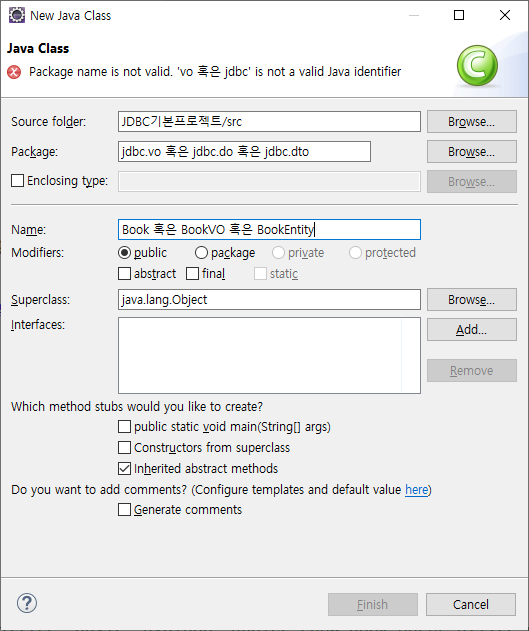

# DO, VO, DTO, Entity의 개념
네 용어는 엄연히 모두 다른 의미이지만, 같은 맥락에서 사용되는 경우가 많다. 그러나 생긴 것은 비슷하지만, 용도에서 조금씩 차이가 있다. 우리는 VO를 많이 사용할 것이다.

## DO (Domain Object)
가장 넓은 개념.

DO에서 도메인이란 사전적으로는 영역을 의미하는데, 어플리케이션 개발에서는 현실에서 프로그램을 통해 해결해야 하는 문제를 지칭한다. 여기에는 문제 해결을 위한 로직, 로직에서 이용되는 데이터 일체가 포함된다.

DO는 도메인을 구성하는(문제 해결과정에서 이용되는) 데이터를 표현하는 오브젝트를 의미한다. 데이터 각각이 클래스로 정의되어 그 객체로서 단일 데이터가 표현되는 것이다.

예컨대 학사정보통합시스템을 구축한다고 하자. 이 시스템에는 학생정보, 교수정보, 학과정보, 과목정보 등 여러가지 데이터가 사용된다. 이 중에서 학생 홍길동에 대한 정보를 DO로 취급하고자 한다면, 우선 이름 / 나이 / 학과 / 연락처를 담을 수 있는 클래스를 사전에 정의해야 한다. 그 후 그 객체를 생성하여, DB에서 불러온 값을 넣어주면 된다.

## VO (Value Object)
VO는 한 개, 혹은 두 개 이상의 속성을 묶어서 값을 표현하는 객체이다. 위에서 DO는 도메인의 모든 속성을 담을 수 있는 클래스로부터 생성된 객체이다. 반면에 VO는 이 중 일부의 속성만을 담을 수 있도록 정의된 클래스의 객체이다.

예컨대 학생의 이름 / 나이 / 학과 / 연락처를 담을 수 있는 DO의 클래스와는 구별되게, 이름과 학과만을 담을 수 있는 클래스를 재정의하고 이로부터 객체를 생성하여 데이터를 표현하는 경우 VO에 해당한다.

죽, DO는 VO의 서브셋 개념으로, 프로그램에서 필요로 하는 데이터에 한하여 값을 표현하는 객체인 것이다.

## DTO (Data Transfer Object)
데이터를 교환할 때에, 위와 같이 데이터를 객체화하여 표현하고, 객체 단위로 교환하게 되면 편리하다. 이러한 데이터 교환의 측면에서 데이터를 표환하는 객체를 지칭하는 개념이 DTO이다.

## Entity
엔티티는 DO, VO와 비슷하지만, 그 자체에 프라이머리 키를 담고 있는 객체를 지칭하는 것이다. DO나 VO에는 키가 들어있지 않은 경우도 있지만, 엔티티는 일반적으로 키가 포함된 도메인 객체를 의미한다.

위와 같이 네 개의 개념은 조금씩 다르지만, 특정 객체가 복수적인 성격을 띌 수 있어 자주 혼용된다. 데이터를 표현하는 객체가 키를 들고 있으면 VO이자 엔티티이며, 이를 데이텨 교환을 하는데 활용하면 DTO에 해당되기도 하기 떄문이다. 우리 과정에서는 VO라는 용어를 많이 사용할 것이다.

# VO의 이해
이전 실습에 사용된 프로그램에서 도메인은 도서 관련 정보의 검색 및 조작 과정 전체가 될 것이다.

이때 도서 VO를 만든다고 해보자. VO는 객체이므로, 클래스가 있어야 생성될 수 있다. 따라서 우선 클래스를 만들어야 한다.

Book이라는 클래스를 만든다면, 그 필드에 ISBN, 제목, 가격, 저자, 출판사가 들어가야 한다. 이때 각 항목은 테이블의 각 컬럼에 해당한다. 즉, VO의 클래스는 DB 테이블의 컬럼을 필드로 가진다는 것을 알 수 있다. VO 클래스를 만들기 위해서는 먼저 테이블의 컬럼을 보면 된다.

하나의 VO가 테이블에서 하나의 로우에 해당하며, VO의 클래스의 각 필드는 각 컬럼에 맵핑된다. 이때 테이블의 모든 컬럼을 표현하는 객체라면 DO로 볼 수 있으며, 일부 컬럼을 표현하는 객체라면 VO라고 할 수 있다. 이때 각 오브젝트에 프라이머리 키가 포함된다면 엔티티라고 할 수도 있다. 이렇게 DO, VO, 엔티티는 흔히 같은 맥락에서 사용된다.

# VO 실습
## VO를 표현하는 클래스 작성



VO를 만들기 위해서는 클래스가 필요하므로 새로운 클래스를 만들어준다.

```java
package jdbc.vo;

// VO는 데이터를 표현하는 객체
// 따라서 비즈니스 로직이 포함되면 안된다.
// 테이블의 컬럼을 참고해서 만들어야 한다.
public class Book {
	// 테이블의 컬럼을 확인하고 필드로 잡는다.
	private String bisbn; // 특별한 이유가 없다면 컬럼명과 필드명은 동일한 편이 좋다.
	private String btitle; // 모든 컬럼을 필드로 잡으면 DO, 필요한 컬럼만 필드로 잡으면 VO
	private String bauthor;
	private int bprice; 
	
	public Book() {
		
	}

	public Book(String bisbn, String btitle, String bauthor, int bprice) {
		super();
		this.bisbn = bisbn;
		this.btitle = btitle;
		this.bauthor = bauthor;
		this.bprice = bprice;
	}

	public String getBisbn() {
		return bisbn;
	}

	public void setBisbn(String bisbn) {
		this.bisbn = bisbn;
	}

	public String getBtitle() {
		return btitle;
	}

	public void setBtitle(String btitle) {
		this.btitle = btitle;
	}

	public String getBauthor() {
		return bauthor;
	}

	public void setBauthor(String bauthor) {
		this.bauthor = bauthor;
	}

	public int getBprice() {
		return bprice;
	}

	public void setBprice(int bprice) {
		this.bprice = bprice;
	}
	
	@Override
	public String toString() {
		return bisbn + "\t" + btitle + "\t" + bauthor + "\t" + bprice;
	}
}
```

이렇게 테이블에 존재하는 컬럼만을 필드로 갖고, 최소한의 생성자와 Getter / Setter를 갖춘 클래스가 VO 클래스의 전형이다. 이때 비즈니스 로직은 들어가지 않는 것이 좋으며, Setter에 유효성 검사 정도의 로직을 넣는 정도만 하는 것이 좋다.

&nbsp;

**VO를 활용한 도서 검색 프로그램**
```java
package jdbc;

import java.sql.Connection;
import java.sql.DriverManager;
import java.sql.PreparedStatement;
import java.sql.ResultSet;
import java.sql.SQLException;
import java.util.ArrayList;
import java.util.Scanner;

import jdbc.vo.Book;

public class SearchPracUsingVO {
	public static void main(String[] args) {
		Scanner sc = new Scanner(System.in);
		
		System.out.print("검색할 책의 키워드 입력: ");
		String keyword = sc.nextLine();
		sc.close();
		System.out.println();
		
		try {
			Class.forName("com.mysql.cj.jdbc.Driver");
			String jdbc_uri = "jdbc:mysql://127.0.0.1:3306/library?characterEncoding=UTF-8&serverTimezone=UTC&useSSL=false&allowPublicKeyRetrieval=true";
			String id = "root";
			String pw = "test1234";
			
			Connection con = DriverManager.getConnection(jdbc_uri, id, pw);
			
			StringBuffer sqlBuf = new StringBuffer();
			sqlBuf.append("SELECT BISBN, BTITLE, BDATE, BAUTHOR, BPRICE ");
			sqlBuf.append("FROM BOOK ");
			sqlBuf.append("WHERE BTITLE LIKE ? ");
			sqlBuf.append("ORDER BY BPRICE DESC");
			
			String sql = sqlBuf.toString();
			PreparedStatement pstmt = con.prepareStatement(sql);
			pstmt.setString(1, "%" + keyword + "%");
			ResultSet rs = pstmt.executeQuery();
			
			ArrayList<Book> list = new ArrayList<Book>();
			while(rs.next()) {
				Book book = new Book(rs.getString("bisbn"),
							rs.getString("btitle"),
							rs.getString("bauthor"),
							rs.getInt("bprice"));
				list.add(book);
			}
			
			System.out.println("ISBN\t\t\t제목\t\t\t저자\t\t\t 가격");
			for (Book b : list) {
				System.out.println(b);
			}
			
			if (list.size() == 0) {
				System.out.println("불러올 값이 없습니다.");
			} else {
				System.out.println("전체 " + list.size() + "건을 불러왔습니다.");
			}
			
			rs.close();
			pstmt.close();
			con.close();
		} catch (ClassNotFoundException e) {
			e.printStackTrace();
		} catch (SQLException e) {
			e.printStackTrace();
		}
		
	}
}
```