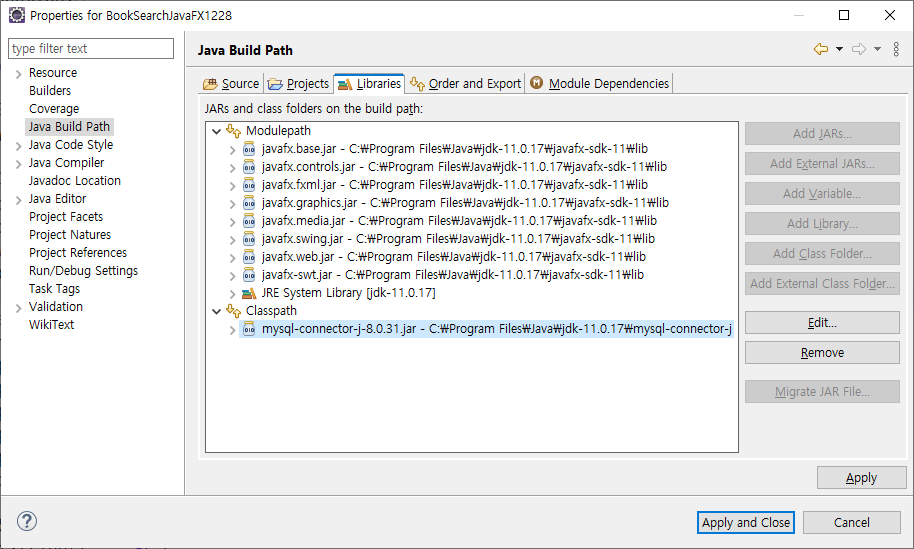

# JavaFX를 이용한 도서 검색 프로그램
## 프로젝트 환경 구성


새로운 프로젝트를 만들고 JavaFX와 Connector/J를 필드 패스에 추가해준다.

## 테이블 뷰 컴포넌트 테스트
테이블 뷰의 한 로우는 하나의 VO에 맵핑된다. 따라서 제네릭에 VO 클래스를 넣어 선언한다.

테이블 뷰의 객체를 생성했으면, 컬럼 객체를 생성하여 붙여줘야 한다.
```java
// TableColumn<데이터 소스가 되는 VO의 클래스, 컬럼에 들어가는 값의 타입> 변수 이름 = new TableColumn<>("화면표시이름");
TableColumn<BookVO, String> isbnColumn = new TableColumn<>("ISBN"); // 화면 표시 이름
isbnColumn.setMinWidth(150); // 최소 가로 150px
isbnColumn.setCellValueFactory(new PropertyValueFactory<>("bisbn"));// VO의 어떤 필드에서 값을 가져오는지 지정
```

## 데이터베이스 연동
start() 메서드를 보면 main()과 달리 static이 아니다. 여기서 main()에서 launch()를 호출하고 GUI가 표시되는 과정 중 현재 클래스의 오브젝트가 인스턴스화된다는 것을 알 수 있다.

따라서 데이터베이스의 1, 2번 준비 단계를 현재 클래스의 생성자에서 진행하고, 3-5번 단계는 검색창의 이벤트 리스터에서 진행하도록 하면 간단하게 기능을 구현할 수 있다.

마지막 6번 자원 할당 해제는 Stage 객체의 setOnCloseRequest() 메서드를 통해 창이 닫힐 때 발생하는 이벤트에 대한 리스너 안에서 수행하면 된다.

그러나 이후 시간에서 살펴볼 것처럼 우리의 코드에는 겉보기에는 기능상 문제가 없지만, 몇 가지 문제의 여지가 있다. 이를 해결하기 위한 논의를 진행할 것이다.

```java
package lecture.jdbc;

import java.sql.Connection;
import java.sql.DriverManager;
import java.sql.PreparedStatement;
import java.sql.ResultSet;
import java.sql.SQLException;

import javafx.application.Application;
import javafx.collections.FXCollections;
import javafx.collections.ObservableList;
import javafx.geometry.HPos;
import javafx.geometry.Insets;
import javafx.scene.Scene;
import javafx.scene.control.TableColumn;
import javafx.scene.control.TableView;
import javafx.scene.control.TextField;
import javafx.scene.control.cell.PropertyValueFactory;
import javafx.scene.image.Image;
import javafx.scene.layout.BorderPane;
import javafx.scene.layout.FlowPane;
import javafx.stage.Stage;
import lecture.jdbc.vo.BookVO;

public class BookSearchJavaFXAns extends Application {
	private TableView<BookVO> tableView; // VO 클래스를 제네릭으로 지정. 한 로우가 하나의 VO에 대응.
	private TextField textField;
	
	Connection con;
	
	public BookSearchJavaFXAns() {
		// 생성자에서 준비 단계
		try {
			Class.forName("com.mysql.cj.jdbc.Driver"); // 1단계 드라이버 로딩
			String jdbcUrl = "jdbc:mysql://127.0.0.1:3306/library?characterEncoding=UTF-8&serverTimezone=UTC&useSSL=false&allowPublicKeyRetrieval=true";
			String id = "root";
			String pw = "test1234";
			con = DriverManager.getConnection(jdbcUrl, id, pw);  // 2단계 접속
		} catch (ClassNotFoundException e) {
			e.printStackTrace();
		} catch (SQLException e) {
			e.printStackTrace();
		}
	}
	
	@Override
	public void start(Stage primaryStage) throws Exception {
		// 1. 루트 레이아웃 잡기
		// BorderPane 이용 (동 서 남 북 중앙)
		BorderPane root = new BorderPane();
		root.setPrefSize(700, 500);
		
		// 2. 루트 레아아웃 아래 붙일 FlowPane
		FlowPane flowpane = new FlowPane();
		flowpane.setPadding(new Insets(10, 10, 10, 10));
		flowpane.setColumnHalignment(HPos.CENTER);
		flowpane.setPrefSize(700, 40);
		flowpane.setHgap(10);
		
		// 3. 각 컴포넌트를 생성하여 Pane에 위치
		textField = new TextField();
		textField.setPrefSize(250, 40);
		textField.setOnAction(e -> {
			try {
				StringBuffer sqlBuf = new StringBuffer();
				sqlBuf.append("SELECT BISBN, BTITLE, BDATE, BAUTHOR, BPRICE ");
				sqlBuf.append("FROM BOOK ");
				sqlBuf.append("WHERE BTITLE LIKE ? ");
				sqlBuf.append("ORDER BY BPRICE DESC");
				
				String sql = sqlBuf.toString();
				PreparedStatement pstmt = con.prepareStatement(sql);
				pstmt.setString(1, "%" + textField.getText() + "%");
				
				ResultSet rs = pstmt.executeQuery();
				
				ObservableList<BookVO> list = FXCollections.observableArrayList();
				
				while(rs.next()) {
					BookVO book = new BookVO(rs.getString("bisbn"),
								rs.getString("btitle"),
								rs.getString("bauthor"),
								rs.getInt("bprice"));
					list.add(book);
				}
				
				tableView.setItems(list);
			} catch (SQLException e1) {
				e1.printStackTrace();
			}
		});
		flowpane.getChildren().add(textField);
		
		// 컬럼 객체를 생성
		// 제네릭: <데이터 소스가 되는 VO의 클래스, 컬럼에 들어가는 값의 타입>
		TableColumn<BookVO, String> isbnColumn = new TableColumn<>("ISBN"); // 화면 표시 이름
		isbnColumn.setMinWidth(150); // 최소 가로 150px
		isbnColumn.setCellValueFactory(new PropertyValueFactory<>("bisbn"));// VO의 어떤 필드에서 값을 가져오는지 지정
		
		TableColumn<BookVO, String> titleColumn = new TableColumn<>("Title");
		titleColumn.setMinWidth(150);
		titleColumn.setCellValueFactory(new PropertyValueFactory<>("btitle"));
		
		TableColumn<BookVO, String> authorColumn = new TableColumn<>("Author");
		authorColumn.setMinWidth(150);
		authorColumn.setCellValueFactory(new PropertyValueFactory<>("bauthor"));
		
		TableColumn<BookVO, Integer> priceColumn = new TableColumn<>("Price");
		priceColumn.setMinWidth(150);
		priceColumn.setCellValueFactory(new PropertyValueFactory<>("bprice"));
		
		tableView = new TableView<BookVO>();
		tableView.getColumns().addAll(
				isbnColumn, titleColumn, authorColumn, priceColumn); // 컬럼 객체를 테이블 뷰에 붙임
		
		root.setCenter(tableView);
		root.setBottom(flowpane);
		
		Scene scene = new Scene(root);
		
		primaryStage.setScene(scene);
		primaryStage.setTitle("Simple JavaFX TableView");
		
		primaryStage.setOnCloseRequest(e -> { // 창이 닫힐 때 실행
			try {
				con.close();
			} catch (SQLException e1) {
				e1.printStackTrace();
			}
		});
		
		primaryStage.show();
	}
	
	public static void main(String[] args) {
		launch();
	}
}
```