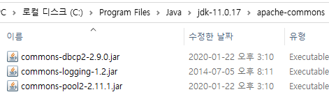

# Apache commons DBCP 세팅
아파치 재단에서 제공하는 커넥션 풀 라이브러리. 아래의 세 가지 라이브러리를 모두 프로젝트에 포함시켜야 dbcp를 사용할 수 있다.

- commons-dbcp
- commons-pool
- commons-logging

[Apache Commons](https://commons.apache.org/)에서 각각을 찾아 다운로드 받고 압축을 푼다.


압축을 푼 디렉토리에서 아래의 jar 파일만을 복사하여 한 곳에 모은다. 위치를 헷갈리지 않게 JAVA_HOME 아래에 apche-commons 디렉토리를 만들어 복사해두었다.

&nbsp;



&nbsp;

완료하였으면, 다운로드한 commons와 함께, Connector/J, JavaFX를 모두 빌드 패스에 포함시켜준다.


# 실습
## 콘솔 환경에서 커넥션 풀 테스트
```java
/* 콘솔 환경에서 DBCP를 테스트해본다. */

package testmain;

import java.sql.Connection;
import java.sql.PreparedStatement;
import java.sql.ResultSet;
import java.sql.SQLException;

import javax.sql.DataSource;

import org.apache.commons.dbcp2.BasicDataSource;

public class TestMain {
	
	private static BasicDataSource basicDS;
	
	// main 메서드 실행 전 실행되는 코드 블럭
	// 보통 리소스 로딩에 사용
	static {
		// 메인이 호출되기 전에 커넥션 풀 구성
		basicDS = new BasicDataSource();
		basicDS.setDriverClassName("com.mysql.cj.jdbc.Driver"); // JDBC 드라이버 로드
		basicDS.setUrl("jdbc:mysql://127.0.0.1:3306/library?characterEncoding=UTF-8&serverTimezone=UTC&useSSL=false&allowPublicKeyRetrieval=true");
		basicDS.setUsername("root");
		basicDS.setPassword("test1234"); // DBMS 연결 정보 지정 완료
		basicDS.setInitialSize(10); // 초기 풀 크기 지정 (처음에 10개의 커넥션 설정)
		basicDS.setMaxTotal(20); // 최대 풀 크기 지정;
									// 즉 커넥션 수가 더 필요하면 커넥션을 더 늘릴 수 있으며, 여기서 그 한도를 지정하였음.
	}
	
	public static DataSource getDataSource() {
		// DataSource는 BasicDataSource가 구현한 인터페이스
		return basicDS;
	}
	
	public static void main(String[] args) {
		DataSource ds = getDataSource(); // 커넥션 풀을 가져옴
		Connection con = null;
		try {
			con = ds.getConnection(); // 커넥션 풀에서 커넥션을 빌려옴
			String sql = "SELECT btitle, bauthor FROM book";
			PreparedStatement pstmt = con.prepareStatement(sql);
			ResultSet rs = pstmt.executeQuery();
			while (rs.next()) {
				System.out.println(rs.getString("btitle"));
			}
			rs.close();
			pstmt.close();
			con.close(); // 연결이 끊어지지 않고, 커넥션 풀에 반납됨
			((BasicDataSource)(getDataSource())).close(); // 커넥션 풀 닫기
		} catch (SQLException e) {
			e.printStackTrace();
		}
	}
}
```
## JavaFX 애플리케이션에 커넥션 풀 적용
```java
package lecture.jdbc;

import java.sql.Connection;
import java.sql.PreparedStatement;
import java.sql.ResultSet;
import java.sql.SQLException;
import java.util.Optional;

import javax.sql.DataSource;

import org.apache.commons.dbcp2.BasicDataSource;

import javafx.application.Application;
import javafx.collections.FXCollections;
import javafx.collections.ObservableList;
import javafx.geometry.HPos;
import javafx.geometry.Insets;
import javafx.scene.Scene;
import javafx.scene.control.Alert;
import javafx.scene.control.Alert.AlertType;
import javafx.scene.control.Button;
import javafx.scene.control.ButtonType;
import javafx.scene.control.TableColumn;
import javafx.scene.control.TableRow;
import javafx.scene.control.TableView;
import javafx.scene.control.TextField;
import javafx.scene.control.cell.PropertyValueFactory;
import javafx.scene.layout.BorderPane;
import javafx.scene.layout.FlowPane;
import javafx.stage.Stage;
import lecture.jdbc.vo.BookVO;

public class BookSearchJavaFxConnectionPool extends Application {
	private TableView<BookVO> tableView;
	private TextField textField;
	private Button deleteBtn;
	private String deleteTargetISBN;
	
	private static BasicDataSource basicDS;
	
	private void getBook(String keyword) {
		Connection con = null;
		try {
			con = basicDS.getConnection(); // 커넥션 풀에서 커넥션 가져오기
			
			StringBuffer sqlBuf = new StringBuffer();
			sqlBuf.append("SELECT BISBN, BTITLE, BDATE, BAUTHOR, BPRICE ");
			sqlBuf.append("FROM BOOK ");
			sqlBuf.append("WHERE BTITLE LIKE ? ");
			sqlBuf.append("ORDER BY BPRICE DESC");
			
			String sql = sqlBuf.toString();
			PreparedStatement pstmt = con.prepareStatement(sql);
			pstmt.setString(1, "%" + keyword + "%");
			
			ResultSet rs = pstmt.executeQuery();
			
			ObservableList<BookVO> list = FXCollections.observableArrayList();
			
			while(rs.next()) {
				BookVO book = new BookVO(rs.getString("bisbn"),
							rs.getString("btitle"),
							rs.getString("bauthor"),
							rs.getInt("bprice"));
				list.add(book);
			}
			
			tableView.setItems(list);
			
			rs.close();
			pstmt.close();
			con.close(); // 커넥션 반납
		} catch (SQLException e1) {
			e1.printStackTrace();
		}
	}
	
	private int deleteBook(String isbn) {
		Connection con = null;
		try {
			con = basicDS.getConnection(); // 커넥션 풀에서 커넥션 가져오기
			
			StringBuffer sqlBuf = new StringBuffer();
			sqlBuf.append("DELETE ");
			sqlBuf.append("FROM BOOK ");
			sqlBuf.append("WHERE BISBN = ? ");
			
			String sql = sqlBuf.toString();
			
			con.setAutoCommit(false); // 트랜잭션 시작
			
			PreparedStatement pstmt = con.prepareStatement(sql);
			pstmt.setString(1, deleteTargetISBN);
			
			int affectedRowsCount = pstmt.executeUpdate();
			if (affectedRowsCount == 1) {
				con.commit();
				getBook(textField.getText());
			} else {
				con.rollback();
			}
			
			pstmt.close();
			con.close(); // 커넥션 반납
			
			return affectedRowsCount;
		} catch (SQLException e2) {
			// TODO Auto-generated catch block
			e2.printStackTrace();
		}
		
		return -1;
	}
	
	@Override
	public void start(Stage primaryStage) throws Exception {
		// 1. 루트 레이아웃 잡기
		// BorderPane 이용 (동 서 남 북 중앙)
		BorderPane root = new BorderPane();
		root.setPrefSize(700, 500);
		
		// 2. 루트 레아아웃 아래 붙일 FlowPane
		FlowPane flowpane = new FlowPane();
		flowpane.setPadding(new Insets(10, 10, 10, 10));
		flowpane.setColumnHalignment(HPos.CENTER);
		flowpane.setPrefSize(700, 40);
		flowpane.setHgap(10);
		
		// 3. 각 컴포넌트를 생성하여 Pane에 위치
		// 검색창
		textField = new TextField();
		textField.setPrefSize(250, 40);
		textField.setOnAction(e -> {
			getBook(textField.getText());
		});
		
		// 삭제 버튼
		deleteBtn = new Button("선택된 책 삭제");
		deleteBtn.setPrefSize(150, 40);
		deleteBtn.setDisable(true);
		deleteBtn.setOnAction(e -> {
			Alert alert = new Alert(AlertType.WARNING, 
						            "한 번 삭제하면 돌이킬 수 없습니다. 정말 삭제하시겠습니까?",
						             ButtonType.OK, 
						             ButtonType.CANCEL);
			alert.setTitle("삭제 경고");
			Optional<ButtonType> result = alert.showAndWait();

			if (result.get() == ButtonType.CANCEL) {
			    return;
			}
			
			int affectedRowsCount = deleteBook(deleteTargetISBN);
			if (affectedRowsCount == 1) {
				Alert alert2 = new Alert(AlertType.INFORMATION,
										"삭제가 완료되었습니다.");
				alert2.setTitle("삭제 완료");
				alert2.showAndWait();
			} else {
				Alert alert3 = new Alert(AlertType.ERROR,
						"삭제 중 문제가 발생했습니다.");
				alert3.setTitle("삭제 중 오류 발생");
				alert3.showAndWait();
			}
		});
		
		flowpane.getChildren().add(textField);
		flowpane.getChildren().add(deleteBtn);
		
		TableColumn<BookVO, String> isbnColumn = new TableColumn<>("ISBN");
		isbnColumn.setMinWidth(150);
		isbnColumn.setCellValueFactory(new PropertyValueFactory<>("bisbn"));
		
		TableColumn<BookVO, String> titleColumn = new TableColumn<>("Title");
		titleColumn.setMinWidth(150);
		titleColumn.setCellValueFactory(new PropertyValueFactory<>("btitle"));
		
		TableColumn<BookVO, String> authorColumn = new TableColumn<>("Author");
		authorColumn.setMinWidth(150);
		authorColumn.setCellValueFactory(new PropertyValueFactory<>("bauthor"));
		
		TableColumn<BookVO, Integer> priceColumn = new TableColumn<>("Price");
		priceColumn.setMinWidth(150);
		priceColumn.setCellValueFactory(new PropertyValueFactory<>("bprice"));
		
		tableView = new TableView<BookVO>();
		tableView.getColumns().addAll(
				isbnColumn, titleColumn, authorColumn, priceColumn);
		
		tableView.setRowFactory(e1 -> {
			TableRow<BookVO> row = new TableRow<>();
			
			row.setOnMouseClicked(e2 -> {
				deleteBtn.setDisable(false);
				BookVO book = row.getItem();
				
				if (book != null) {
					deleteTargetISBN = book.getBisbn(); 
				}
			});
			return row;
		});
		
		root.setCenter(tableView);
		root.setBottom(flowpane);
		
		Scene scene = new Scene(root);
		
		primaryStage.setOnCloseRequest(e1 -> {
			try {
				((BasicDataSource)(getDataSource())).close(); // 종료시 커넥션 풀을 닫는다
			} catch (SQLException e2) {
				e2.printStackTrace();
			}
		});
		
		primaryStage.setScene(scene);
		primaryStage.setTitle("Simple JavaFX TableView");
		primaryStage.show();
	}
	
	static {
		// 메인이 호출되기 전에 커넥션 풀 구성
		basicDS = new BasicDataSource();
		basicDS.setDriverClassName("com.mysql.cj.jdbc.Driver");
		basicDS.setUrl("jdbc:mysql://127.0.0.1:3306/library?characterEncoding=UTF-8&serverTimezone=UTC&useSSL=false&allowPublicKeyRetrieval=true");
		basicDS.setUsername("root");
		basicDS.setPassword("test1234");
		basicDS.setInitialSize(10);
		basicDS.setMaxTotal(20); 
	}
	
	public static DataSource getDataSource() { // 커넥션 풀 Getter
		return basicDS;
	}
	
	public static void main(String[] args) {
		launch();
	}
}
```

# 고민
SQL문을 실행하는 코드가 많이 중복된다. 위와 같이 따로 메서드로 코드를 뺸다고 하더라도, 또 다른 SQL을 실행시켜야 할 경우가 생기면 비슷한 코드의 메서드를 또 만들어야 할 것이다. 조금 더 재사용성이 높고 유지보수가 쉬운 코드로 리팩토링할 수는 없을까?
