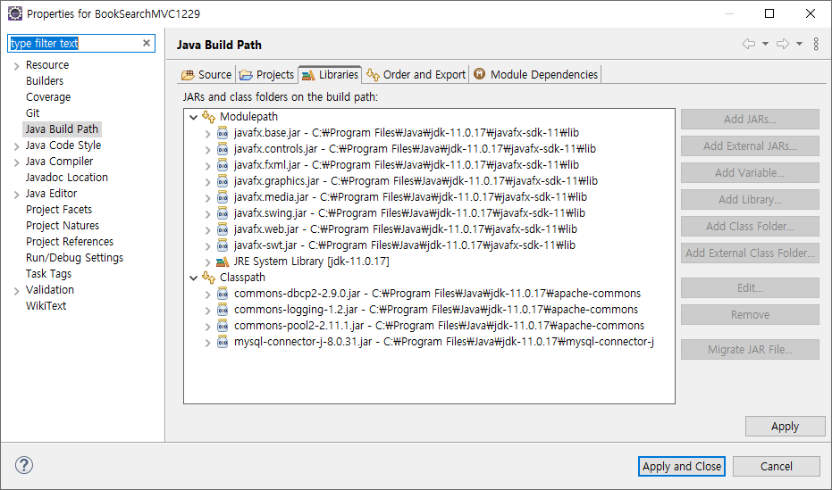
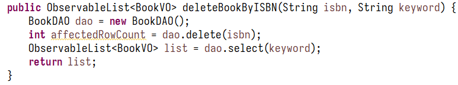

# 실습 환경 준비

# 실습
[Repo](https://github.com/0tak2/KOSAjava/tree/main/Projects-With-Java/BookSearchMVC1229)

View ↔ Controller ↔ Service ↔ DAO

컨트롤러는 기능 마다 클래스를 새로 만들어준다 (메소드 명은 통일)

서비스는 하나의 클래스에 기능마다 여러 개의 메소드를 만들어준다.
각 메소드는 하나의 트랜잭션 단위가 되어야 하며, 이름 역시 트랜잭션을 대표해줄 수 있는 이름으로 명명한다.

DAO는 데이터베이스에서 직접 요청을 하므로 그 메서드 명을 select, delete와 같이 SQL문에서 따서 잡는 것이 자연스러워보인다.

# 한계점

서비스 코드의 일부분이다. 서비스의 메서드는 하나의 트랜잭션 단위가 되도록 설계하는 것이 적합하지만, 실질적으로 dao.select()와 dao.delete()를 하나의 트랜잭션으로 묶을 방법이 없다. 이를 위해서는 코드를 수정할 수 밖에 없으며, 관련 내용은 내일 다뤄보려고 한다.