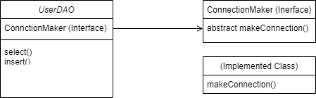

# 결합을 느슨하게
클래스 간의 의존관계를 약화시키기 위해 사용할 수 있는 것이 인터페이스이다.



ConnectionMaker를 인터페이스로 갖고 있도록 UserDAO를 수정해보자.

**ConnectionMaker.java**
```java
package lecture.jdbc.di.step5;

import java.sql.Connection;

public interface ConnectionMaker {

	/* public abstract */ Connection getConnection();
    // 자동으로 컴파일러가 붙여줌
}
```

&nbsp;

**KosaConnectionMaker.java**
```java
package lecture.jdbc.di.step5;

import java.sql.Connection;
import java.sql.DriverManager;
import java.sql.SQLException;

public class KosaConnectionMaker implements ConnectionMaker {

	@Override
	public Connection getConnection() {
		Connection con = null;
		
		try {
			Class.forName("com.mysql.cj.jdbc.Driver");
			String jdbcUrl = "jdbc:mysql://127.0.0.1:3306/example01?characterEncoding=UTF-8&serverTimezone=UTC&useSSL=false&allowPublicKeyRetrieval=true";
			String id = "root";
			String pw = "test1234";
			con = DriverManager.getConnection(jdbcUrl, id, pw);
		} catch (ClassNotFoundException e) {
			e.printStackTrace();
		} catch (SQLException e) {
			e.printStackTrace();
		}
		
		return con;
	}

}
```

**UserDAO.java**
```java
package lecture.jdbc.di.step5;

import java.sql.Connection;
import java.sql.PreparedStatement;
import java.sql.ResultSet;
import java.sql.SQLException;

import lecture.jdbc.di.step4.User;

public class UserDAO {
	private ConnectionMaker connectionMaker; // 인터페이스
	
	public UserDAO() {
		connectionMaker = new KosaConnectionMaker();
		// 결합도를 낮췄으나 인스턴스는 생성해줘야 하므로
		// 인터페이스를 구현한 클래스가 다시 박히게 됨
		// 결국 여전히 강결합 상태.
	}
	
	public void insert(User user) {
		try {
			Connection con = connectionMaker.getConnection();
			
			String sql = "INSERT INTO users VALUES (?, ?, ?)";
			PreparedStatement pstmt = con.prepareStatement(sql);
			pstmt.setString(1, user.getId());
			pstmt.setString(2, user.getName());
			pstmt.setString(3, user.getPassword());
			pstmt.executeUpdate();
			
			pstmt.close();
			con.close();
			
		} catch (SQLException e) {
			e.printStackTrace();
		}
		
	}

	public User select(String findingID) {
		
		User user = null;
		
		try {
			Connection con = connectionMaker.getConnection();
			
			String sql = "SELECT * FROM users WHERE id = ?";
			PreparedStatement pstmt = con.prepareStatement(sql);
			pstmt.setString(1, findingID);
			
			ResultSet rs = pstmt.executeQuery();
			rs.next();
			user = new User(rs.getString("id"), rs.getString("name"),
								rs.getString("password"));
			
			rs.close();
			pstmt.close();
			con.close();
			
		} catch (SQLException e) {
			e.printStackTrace();
		}
		
		return user;
	}
}
```

인터페이스를 통해 결합도는 확실히 낮아진 것 같다. 그러나 여전히 필드에 인스턴스를 생성하여 할당시켜줘야 하므로 인터페이스를 구현한 특정 클래스가 UserDAO에 박히게 된다. 여전히 강결합 상태인 것이다. 이를 해결할 방법은 무엇일까?