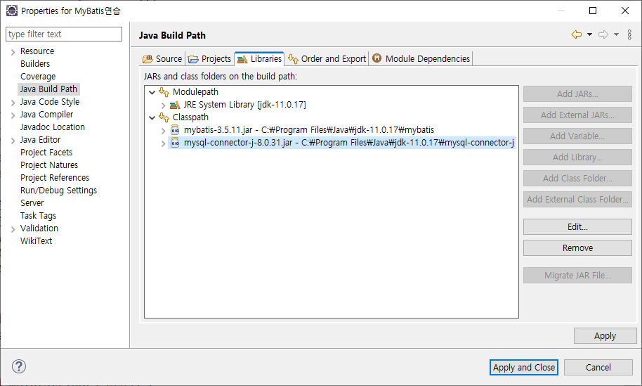

현재 진행중인 프로젝트의 데이터베이스 처리 로직에 MyBatis를 적용해보자

# MyBatis란
원래 ibatis라는 이름이었고 현재는 MyBatis로 이름이 바뀌었음.  
데이터베이스 연동을 도와주는 프레임워크.  
JDBC를 이용해 처리했던 로직을 간소화해줌.

# MyBatis의 사용 이유
1. Java 코드를 간소화하기 위해서
   - 현재 프로젝트의 DAO를 보면 자바 코드 내에 SQL 문이 들어가 있음
   - 비슷한 구문이 불필요하게 반복됨
2. 결과처리를 쉽게 하기 위해
   - ResultSet을 반복하여 리스트에 값을 추가해야했던 기존과 달리 Map을 이용하여 질의 결과에 접근할 수 있음
3. SQL 구문과 Java 코드를 분리하기 위해 (1번과 연관)
   - SQL 구문을 Java 코드와 별도인 XML 파일로 분리하여 관리할 수 있음
   - SQL 구문을 변경해야 할 떄 재컴파일하지 않아도 됨. 유지보수 용이
4. DataSource와 Transaction 처리 기능을 자체적으로 제공.
   - 개발자가 DBCP를 셋팅하지 않아도 커넥션 풀을 사용할 수 있음.
   - 트랜잭션 처리도 자체적으로 제공함.

한 마디로 말하면, Java 코드와 SQL 구문 분리 -> DB 처리 간편화 && 자바 코드 간결화 && SQL 구문 관리 용이

# MyBatis 사용
아직은 Maven과 같은 패키지 관리자를 배우지 않았기 떄문에, Jar 형식으로 다운로드 받아 프로젝트에 포함시켜 보자.

## 1. 다운로드
[홈페이지](https://mybatis.org/)로 가서 해당되는 링크를 클릭하면 Jar 패키지가 있는 Github 저장소로 이동하게 된다.


다운로드 받은 Zip 파일의 압축을 풀고, Jar 파일의 위치를 기억한다.

## 2. 프로젝트 설정
### 실습 프로젝트 생성 및 Build Path에 MyBatis 추가


MyBatis와 함꼐 MySQL connector/j를 추가한다.

### XML 파일 등을 위치시킬 resources 폴더 생성


### XML을 만들기 위한 설정


  
하나 더 추가해준다

```
http://mybatis.org/dtd/mybatis-3-config.dtd
-//mybatis.org/DTD Config 3.0//EN

http://mybatis.org/dtd/mybatis-3-mapper.dtd
-//mybatis.org/DTD Mapper 3.0//EN
```

=> MyBatis를 사용하기 위해 config XML 파일(1개)과 mapper XML 파일을(1개 이상) 만들어야 하므로, 위와 같이 두 개의 카탈로그(DTD)를 추가하였다.

없어도 상관은 없지만, 있으면 편하다.

## 3. 프로젝트에 코드와 설정 작성
### 두 종류의 XML 파일 작성
- config
  - MyBatis 설정 파일
  - 파일 이름: SqlMapConfig.xml
    - 꼭 이 이름을 따라야하는 것은 아니지만, MyBatis 관용적으로 저렇게 잡는다.


- mapper
SQL 구문이 들어가는 SQL Mapper