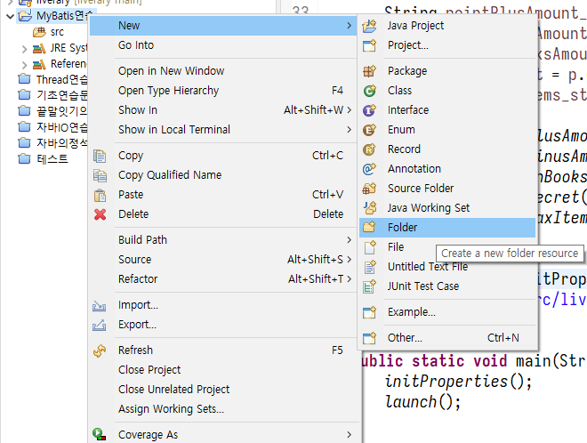
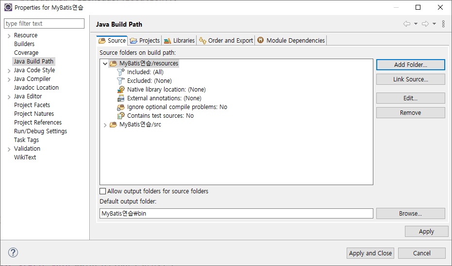
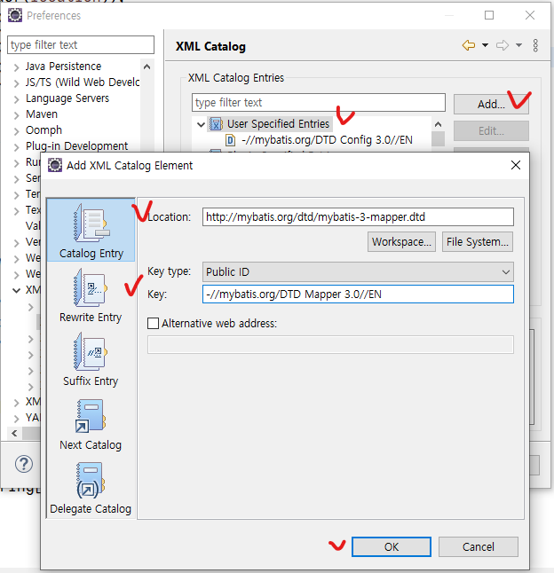
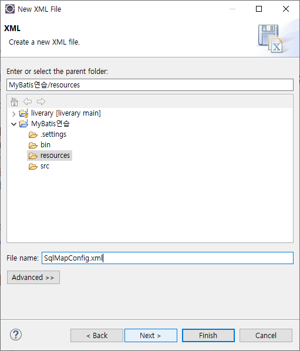
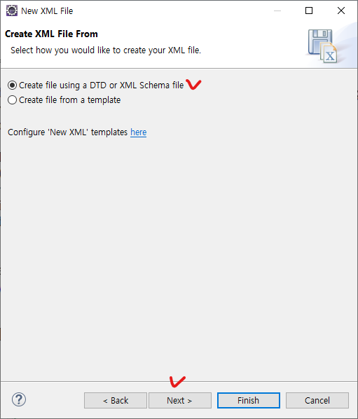
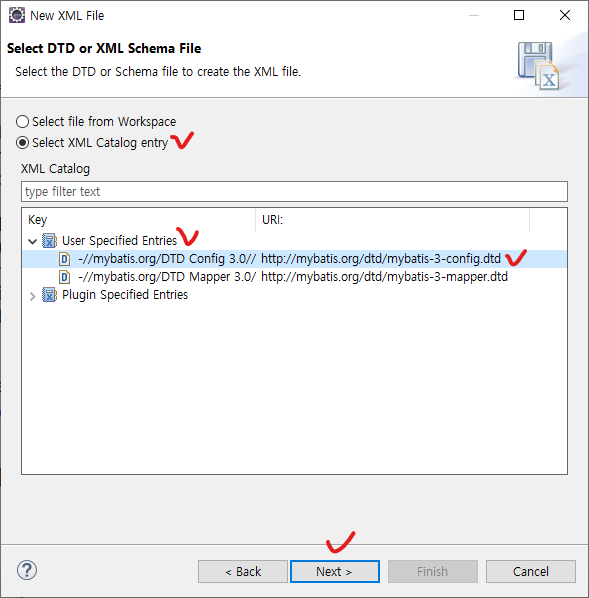

아직은 Maven과 같은 패키지 관리자를 배우지 않았기 떄문에, Jar 형식으로 다운로드 받아 프로젝트에 포함시켜 보자.

# 1. 다운로드
[홈페이지](https://mybatis.org/)로 가서 해당되는 링크를 클릭하면 Jar 패키지가 있는 Github 저장소로 이동하게 된다.


다운로드 받은 Zip 파일의 압축을 풀고, Jar 파일의 위치를 기억한다.

# 2. 프로젝트 설정
## 실습 프로젝트 생성 및 Build Path에 MyBatis 추가


MyBatis와 함꼐 MySQL connector/j를 추가한다.

## XML 파일 등을 위치시킬 resources 폴더 생성





## XML을 만들기 위한 설정


  
하나 더 추가해준다

```
http://mybatis.org/dtd/mybatis-3-config.dtd
-//mybatis.org/DTD Config 3.0//EN

http://mybatis.org/dtd/mybatis-3-mapper.dtd
-//mybatis.org/DTD Mapper 3.0//EN
```

=> MyBatis를 사용하기 위해 config XML 파일(1개)과 mapper XML 파일을(1개 이상) 만들어야 하므로, 위와 같이 두 개의 카탈로그(DTD)를 추가하였다.

없어도 상관은 없지만, 있으면 편하다.

# 3. 프로젝트에 코드와 설정 작성
## 두 종류의 XML 파일 작성
- config
  - MyBatis 설정 파일
  - 파일 이름: SqlMapConfig.xml
    - 꼭 이 이름을 따라야하는 것은 아니지만, MyBatis 관용적으로 저렇게 잡는다.
- mapper  
    - SQL 구문이 들어가는 SQL Mapper

&nbsp;

config 파일 생성









```XML
<!-- 주의!

XML의 모든 태그는 시작하고 닫혀야한다.

Nested될 항목이 없는 경우 <tag />로 줄여쓸 수 있다. -->

<!-- 즉 -->
<properties /> <!-- 는 -->
<properties></properties> <!-- 와 같다. -->
```

&nbsp;

driver.properties 작성


```
# driver.properties
# DB Connection Information
# key=value
driver=com.mysql.cj.jdbc.Driver
url=jdbc:mysql://127.0.0.1:3306/liverary?characterEncoding=UTF-8&serverTimezone=UTC&useSSL=false&allowPublicKeyRetrieval=true
user=root
password=test1234
```

&nbsp;

BookVO 작성

```java
// example.vo.BookVO
package example.vo;

public class BookVO {

	private String bisbn;
	private String btitle;
	private String bauthor;
	private int bprice;
	
	public BookVO() {
	}

	public BookVO(String bisbn, String btitle, String bauthor, int bprice) {
		super();
		this.bisbn = bisbn;
		this.btitle = btitle;
		this.bauthor = bauthor;
		this.bprice = bprice;
	}

	public String getBisbn() {
		return bisbn;
	}

	public void setBisbn(String bisbn) {
		this.bisbn = bisbn;
	}

	public String getBtitle() {
		return btitle;
	}

	public void setBtitle(String btitle) {
		this.btitle = btitle;
	}

	public String getBauthor() {
		return bauthor;
	}

	public void setBauthor(String bauthor) {
		this.bauthor = bauthor;
	}

	public int getBprice() {
		return bprice;
	}

	public void setBprice(int bprice) {
		this.bprice = bprice;
	}
	
	
}
```

&nbsp;

mapper 생성 (Book.xml)


일단 파일만 만들어놓자.

&nbsp;

MyBatisConnectionFactory 클래스 생성


- 세 가지를 기억해야 한다.
    1. SqlSessionFactoryBuilder
    2. SqlSessionFactory
    3. SqlSession
- SQL 구문을 실행하기 위해 필요한 것은 실질적으로 SqlSession
- SqlSession은 SqlSessionFactory로부터 얻을 수 있음
- SqlSessionFactory는 SqlSessionFactoryBuilder로부터 얻을 수 있음
- SqlSessionFactoryBuilder는 Config XML(SqlMapConfig.xml)을 넘겨 만들 수 있음.
- 즉 Config XML 작성 후 위의 순서대로 만들어야 함.
  - SqlMapConfig.xml -> SqlSessionFactoryBuilder -> SqlSessionFactory -> SqlSession -> DB 요청
  - SqlSessionFactory를 확보하기까지의 코드를 MyBatisConnectionFactory 클래스 내에 작성해 줄 것임

```java
// example.mybatis.MyBatisConnectionFactory
package example.mybatis;

import java.io.IOException;
import java.io.Reader;

import org.apache.ibatis.io.Resources;
import org.apache.ibatis.session.SqlSessionFactory;
import org.apache.ibatis.session.SqlSessionFactoryBuilder;

public class MyBatisConnectionFactory {

	private static SqlSessionFactory sqlSessionFactory;
	
	static {
		// resources 폴더도 소스 폴더로 간주되기 때문에 .으로 접근 가능
		String resource = "./SqlMapConfig.xml";
		
		// SqlMapConfig.xml를 읽기 위한 스트림 준비
		try {
			Reader reader = Resources.getResourceAsReader(resource);
			
			if (sqlSessionFactory == null) {
				// sqlSessionFactory 인스턴스가 아직
				// 생성되지 않은 경우에만 인스턴스 생성
				// == 프로그램 실행 중 한 번만 인스턴스 생성 (싱글톤)
				sqlSessionFactory = new SqlSessionFactoryBuilder().build(reader);
			}
		} catch (IOException e) {
			e.printStackTrace();
		}
		
		
	}

	public static SqlSessionFactory getSqlSessionFactory() {
		return sqlSessionFactory;
	}
}
```

&nbsp;

SqlMapConfig.xml 작성

```XML
<!-- SqlMapConfig.xml -->
<?xml version="1.0" encoding="UTF-8"?>
<!DOCTYPE configuration
		PUBLIC "-//mybatis.org/DTD Config 3.0//EN"
		"http://mybatis.org/dtd/mybatis-3-config.dtd" >
		
<configuration>
	<!-- <properties>
		외부파일 'driver.properties'를 만들고,
		이를 불러와 데이터베이스의 접속 정보를 지정할 것임
		
		여기에서 불러온 값을 아래의 설정에서 이용
	-->
	<properties resource="./driver.properties" />
	
	
	<!-- <settings>
		MyBatis에 대한 기본 세팅정보
		MyBatis가 동작하는 기본적인 방식에 대한 세팅 정보
		
		설정 가능한 값은 아래의 공식 문서를 참고
		https://mybatis.org/mybatis-3/configuration.html
		
		기본값이 이미 지정이 되어 있기 때문에
		기본값으로부터 변경하고자 하는 값만 지정해줘도 무방함
	-->
	<settings>
		<!--
			jdbcTypeForNull
			기본값 OTHER /
			
			지정값 NULL
			질의 결과가 없다면 NULL로 처리
		-->
		<setting name="jdbcTypeForNull" value="NULL" />
	</settings>
	
	
	<!-- <typeAliases>
		VO에 대한 별명 (Alias) 지정
	-->
	<typeAliases>
		<!--
			앞으로 XML 내에서 VO 클래스를 명시해야할 때,
			별칭을 대신 사용할 수 있음.
			
			단, Java 코드 내에서는 기존 방법대로
		-->
		<typeAlias type="example.vo.BookVO" alias="Book" />
	</typeAliases>
	
	
	<!-- <environments>
		데이터베이스 연결 정보 선언
		
		여러 개를 선언할 수 있으며,
		default 어트리뷰트에 기본값 지정 가능
		사용할 환경을 명시하지 않으면 기본값에
		지정한 환경이 적용됨
	-->
	<environments default="development">
		<!-- 복수 환경 지정 예시
		<environment id="operation">
		</environment>
		
		<environment id="test">
		</environment>
		-->
		
		<environment id="development">
			<!-- 연결 환경에 대한 세부 사항 -->
			
			<transactionManager type="JDBC">
				<!--
					type="JDBC"이면 트랜잭션을 수동으로 처리
					기존에 사용하던 방식. 커밋과 롤백을 개발자가 직접 처리
					
					type="MANAGED"이면 트랜잭션을 자동으로 관리
					Container가 알아서 트랜잭션을 관리하게 됨.
					그러나 아직은 스프링을 배우지 않았기 떄문에 사용할 수 없음.
				-->
			</transactionManager>
			
			<dataSource type="POOLED">
				<!--
					type="UNPOOLED"이면 커넥션 풀을 사용하지 않고
					필요할 때마다 커넥션을 생성 (비효율적)
					
					따라서 일반적으로 type="POOLED"로 지정하여
					커넥션 풀 사용하도록 설정함
				-->
				
				
				<!--
					데이터베이스 연결정보
					위에서 불러온 properties 파일의 값을 이용
					
					name 어트리뷰트에 들어가는 키값 각각은 예약되어 있음
					
					value 어트리뷰트에 properties 파일에서 읽어들일
					키를 지정할 수 있음
					즉, ${키이름} -> 키에 해당하는 value로 치환됨
					
					*주의* #{} 으로 값을 불러오면 SQL 문자열로 취급되어,
					값의 시작과 끝에 ''(따옴표)가 붙게 되므로 여기서는 사용하지 않음
				-->
				<property name="driver" value="${driver}" />
				<property name="url" value="${url}" />
				<property name="username" value="${user}" />
				<property name="password" value="${password}" />
				
				
				<!-- 
					데이터베이스 커넥션 풀에 대한 부가적인 설정을 아래에 해줄 수 있음.
					자세한 내용은
					https://mybatis.org/mybatis-3/configuration.html#environments
					
					기본값을 사용하고자 하면 추가하지 않아도 무방함
				-->
				
			</dataSource>
		</environment>
	</environments>
	
	<!-- <mappers>
		맵핑된 SQL 구문이 있는 XML 파일을 명시
	-->
	<mappers>
		<mapper resource="./sqlmap/Book.xml" />
	</mappers>
	
</configuration>
```

&nbsp;

# 4. 실습 코드 작성
example.dao.BookDAO (Step 1)

```java
package example.dao;

import java.util.HashMap;

import org.apache.ibatis.session.SqlSession;
import org.apache.ibatis.session.SqlSessionFactory;

public class BookDAO {

	private SqlSessionFactory factory;
	
	public BookDAO() {
	}
	
	public BookDAO(SqlSessionFactory factory) {
		this.factory = factory; // SqlSessionFactory의 객체 주입
	}

	public HashMap<String, Object> selectByISBNHashMap(String isbn) {
		HashMap<String, Object> map = null;
		
		SqlSession session = factory.openSession(); // 팩토리 객체로부터 세션을 얻음
		
		map = session.selectOne("어떤거 실행할까요", isbn); // selectOne 메서드는 한 개의 로우만을 가져옴.
		
		return map;
	}

}
```

&nbsp;

Book.xml
```xml
<?xml version="1.0" encoding="UTF-8"?>
<!DOCTYPE mapper PUBLIC "-//mybatis.org/DTD Mapper 3.0//EN" "http://mybatis.org/dtd/mybatis-3-mapper.dtd" >

<!--
	Mapper가 여러 개여도 혼동되지 않도록
	임의의 문자열을 namespace로 잡아준다.
	패키지 경로도, 디렉토리 경로도 아닌 일반 문자열이다.
-->
<mapper namespace="example.myBook">
	<!-- 임의의 아이디, 인자 타입, 리턴 타입을 지정 -->
	<select id="selectBookByISBNHashMap" parameterType="String" resultType="HashMap">
		<![CDATA[ 
			SELECT bisbn, btitle, bauthor, bprice
			FROM booksTBL
			WHERE bisbn = #{isbn}
		]]> <!-- CDATA 구문 -> XML 태그가 아닌 순수한 텍스트임을 지시.
				부등호 등 자유롭게 사용 가능 -->
	</select>
</mapper>
```

&nbsp;

example.dao.BookDAO (Step 2)

```java
package example.dao;

import java.util.HashMap;
import java.util.List;

import org.apache.ibatis.session.SqlSession;
import org.apache.ibatis.session.SqlSessionFactory;

public class BookDAO {

	private SqlSessionFactory factory;
	
	public BookDAO() {
	}
	
	public BookDAO(SqlSessionFactory factory) {
		this.factory = factory; // SqlSessionFactory의 객체 주입
	}

	public HashMap<String, Object> selectByISBNHashMap(String isbn) {
		HashMap<String, Object> map = null;
		
		SqlSession session = factory.openSession(); // 팩토리 객체로부터 세션을 얻음
		
		// selectOne 메서드는 한 개의 로우만을 가져옴
		// SQL 구문은 Mapper XML 내에 작성
		// 첫 번째 인자로 Mapper 내의 ID를, 두 번쨰 인자로 패러미터를 넘겨줌
		map = session.selectOne("example.myBook.selectBookByISBNHashMap", isbn);
		
		return map;
	}

	public List<HashMap<String, Object>> selectAllHashMap() {
		List<HashMap<String, Object>> list = null;
		
		SqlSession session = factory.openSession();
		
		// selectList 메서드는 여러 로우를 List로 가져옴
		list = session.selectList("example.myBook.selectAllHashMap");
		
		return list;
	}

}
```

&nbsp;

example.main.Main

```java
package example.main;

import java.util.HashMap;
import java.util.List;

import org.apache.ibatis.session.SqlSessionFactory;

import example.dao.BookDAO;
import example.mybatis.MyBatisConnectionFactory;

public class Main {

	public static void main(String[] args) {
		// 책을 조회하고 삭제처리하는 데이터베이스 처리를
		// MyBatis를 이용하여 해본다
		
		// 예제이므로 DAO만을 만들어서 처리 (Controller, Service 적용 X)
		
		SqlSessionFactory factory = 
				MyBatisConnectionFactory.getSqlSessionFactory();
		
		BookDAO dao = new BookDAO(factory); // 기존 프로젝트에서는 DAO에 커넥션을 넘겨 줬지만,
										// 여기서는 SqlSessionFactory를 넘겨줄 것임
		
		// 1. 책의 ISBN을 이용해 책 1권의 데이터를 가져와 출력
		//    DAO에는 비즈니스 로직을 배제해야하며,
		//    메서드명으로 selectOne, selectAll 정도가 적절하지만,
		//    본 예제에서는 Controller와 Service를 적용하지 않고 있으므로
		//    구체적으로 명명하였음
		
		/*    아래와 같은 HashMap으로 결과를 받아오려고 함
			 +---------+----------+
			| Key     | Value    |
			+---------+----------+
			| bisbn   | 123-45-6 |
			+---------+----------+
			| btitle  | 홍길동전 |
			+---------+----------+
			| bauthor | 허균     |
			+---------+----------+
			| bprice  | 13000    |
			+---------+----------+
		 */
		
		System.out.println("1. 책의 ISBN을 이용해 책 1권의 데이터를 가져와 출력");
		HashMap<String, Object> map = dao.selectByISBNHashMap("89-7914-206-4");
		for (String key : map.keySet()) {
			System.out.println(key + ", " + map.get(key));
		}
		System.out.println();
		
		// 2. 조건 없이 모든 책의 데이터를 가져와 출력
		System.out.println("2. 조건 없이 모든 책의 데이터를 가져와 출력");
		List<HashMap<String, Object>> list = dao.selectAllHashMap();
		
		for (HashMap<String, Object> rowAsMap : list) {
			for (String key : rowAsMap.keySet()) {
				System.out.println(key + ", " + rowAsMap.get(key));
			}
			System.out.println();
		}
	}
}
```

-> 잘 되지만 HashMap으로 결과를 받는 것은 너무 불편하다