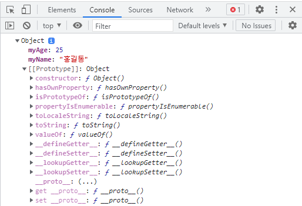
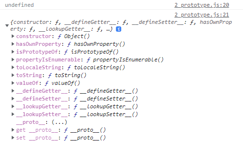
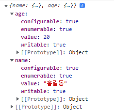

# 프로토타입

## 내부 슬롯과 내부 메서드 Internal Slot & Internal Method
- 개념
  - Internal Slot
    - 변수에 해당
  - Internal Method
    - 함수에 해당
- 형태
    ```js
    [[ /* 특정 변수, 특정 함수 */ ]]
    ```
- 사용
  - 개발자가 직접적으로 참조할 수 없음
  - 내부적으로 자바스크립트 엔진이 특정 상황에서 활용
  - 하지만 필요에 의해 *간접적으로* 사용 가능

## [[Prototype]]

```js
__proto__
```

- Internal Slot 중 하나
  - 엔진 내부적으로는 변수처럼 취급됨
- 내부 슬롯임으로 직접 참조는 불가, 간적 사용 가능.

```js
const obj = {
    myName: '홍길동',
    myAge: 25
};
```

객체를 위와 같이 객체 리터럴로 생성하고, 객체 자체를 console.log한 결과를 보면,



객체 내에 프로퍼티를 두 개 만들었으나, [[Prototype]]이 추가되었음. 다만 직접 접근할 수는 없으며, '\_\_proto\_\_'를 통해 간접적으로 접근할 수 있음.

```js
console.log(obj['[[Prototype]]']); // undefined
console.log(obj.__proto__);
```



모든 객체에는 프로토타입이 있으며 관련 정보를 담고 있음.

## 프로퍼티 어트리뷰트 Attribute
### 프로퍼티
- 객체의 구성요소
- key: value 쌍

### 프로퍼티에 대한 어트리뷰트
프로퍼티는 atrribute를 가지고 있으며, 각각은 내부 슬롯

1. [[Value]]: Property의 Value
2. [[Writable]]: Property의 수정 가능 여부 (true / false)
3. [[Enumerable]] : Property의 열거 가능(for문 등) 여부 (true / false)
4. [[Configurable]]: Property의 재정의 가능 여부 (true / false)

내부 슬롯이므로 직접 참조는 불가.

> **Object**  
생성자 함수. 자바스크립트의 모든 함수 중 최상위에 위치한 함수.  
자바스크립트의 모든 함수는 객체이며, 따라서 Property를 가짐. Object 생성자 함수 역시 Property를 가지고 있음.

Object 생성자 함수의 프로퍼티 중 하나인 아래의 함수를 사용하여 어트리뷰트를 가져올 수 있음.

```js
Object.getOwnPropertyDescriptor()
// 객체가 가진 특정 프로퍼티의 세부 정보 (어트리뷰트)를 가져와 반환하는 함수

Object.getOwnPropertyDescriptors()
// 모든 프로퍼티의 세부 정보 일괄을 반환하는 함수
```

### 어트리뷰트 실습 1
아래와 같이 어트리뷰트를 받아올 수 있다.

```js
const person = {
    name: '홍길동',
    age: 20
}

console.log( Object.getOwnPropertyDescriptors(person) );
```



직접 참조할 수 없는 프로퍼티 내의 어트리뷰트를 접근할 수 있는 형태로 가공하여 반환해주었다.

### 어트리뷰트 실습 2
```js
const person2 = { // 빈 객체 생성
};

// Object.defineProperty()를 이용해 객체에 프로퍼티를 정의할 수 있다.
Object.defineProperty(person2, 'firstName', {
    value: '홍',
    writable: true,
    enumerable: true,
    configurable: true
});

// 위와 같은 작업은 아래와 동일한 객체를 생성한다.
const person2_1 = {
    firstName: '홍'
}

console.log(person2.firstName); // '홍'

// => 객체 리터럴을 통해 쉽게 객체를 만들 수 있으나
// 내부적으로는 이러한 과정이 진행된다

person2.firstName = '최'
// writable이 true임으로 수정 가능하다. false라면 무시됨 (오류 없음)
console.log(person2.firstName);
```

&nbsp;

**굳이 다루는 이유**
- 내부 슬롯의 존재을 알기 위해
- 항상 값을 바꿀 수 있는 것은 아님을 알기 위해

### 어트리뷰트 실습 3
```js
const person3 = { // 빈 객체 생성
};

Object.defineProperty(person3, 'firstName', {
    value: '홍',
    writable: true,
    enumerable: false, // enumerable을 false로 지정
    configurable: true
});

for (let key in person2) {
    console.log(key); // person2의 경우 'firstName' 출력됨
}

for (let key in person3) {
    console.log(key);
    // person3의 경우 firstName 프로퍼티의 writable이 false이므로
    // 아무것도 출력되지 않음
}
```

value 어트리뷰트 대신 writable 어트리뷰트를 다루어보았다.