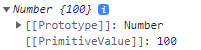
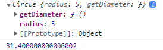
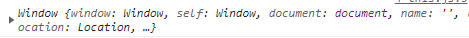
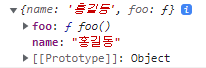

# 생성자 함수
> - Built-in 생성자 함수
>   - Object
>       - 최상위
>   - String
>       - string은 데이터타입
>   - Number
>   - Boolean
>   - Function
>   - Array
>   - Date
> - User-defined 생성자 함수
>   - 개발자가 생성자 함수를 만들어 사용할 수도 있음

## Built-in 생성자 함수
### Object
객체를 생성할 떄 객체 리터럴({...})뿐 아니라 생성자 함수를 사용할 수 있음

```js
const person = new Object(); // 내용적으로는 {}와 같으나, 내부 구조는 다름

person.name = '홍길동';
person.age = 20; // 동적할당 가능. 이때 attribute는 default값

console.log(person);
```

### String
```js
const str = '소리없는 아우성!';
const strObj = new String('소리없는 아우성!');
console.log(typeof str); // string
console.log(typeof strObj); // object
console.log(strObj); // '소리없는 아우성!'이 아닌 String {'소리없는 아우성!'}
```


유사배열 객체가 반환되었음. for문 등으로 열거 가능하지만, 일반 배열이 가지는 함수는 사용할 수 없어서 사용에 제약이 따름.

내부슬롯으로 [[Prototype]], [[PrimitiveValue]]가 있는 것을 볼 수 있음.

실제 Primitive Value는 메모리 공간 상 다른 곳에 있고, 이를 가지고 인덱스별 유사배열 객체가 만들어져 반환된 것.

### Number
```js
const numObj = new Number(100);
console.log(numObj);
```



### Date
```js
const dateObj = new Date(); // 현재 시간
console.log(dateObj); // Mon Jan 16 2023 12:29:19 GMT+0900
console.log(dateObj.toLocaleString()); // 2023. 1. 16. 오후 12:31:18
console.log(dateObj.getHours()); // 12
```

가장 빈번하게 사용됨. 현재 시간을 객체화함.

## User-defined 생성자 함수
### 문제
> 동일한 프로퍼티를 가지는 객체를 여러 개 만들려면 어떻게 하면 좋을까?

리터럴을 통해서 만들려면,

```js
const obj1 = {
    name: '홍길동',
    age: 20
}
const obj2 = {
    name: '신사임당',
    age: 22
}
const obj3 = {
    name: '강감찬',
    age: 21
}
```

이렇게 변수를 새롭게 선언하여 할당하거나, 배열에 넣어야 한다. 직관적이기는 하지만, 너무 노동 집약적인 형태이다.

자바에서 클래스를 사용하듯이, 약속된 형태를 정하고, 원할 때마다 재사용할 수는 없을까? -> 생성자 함수를 사용할 수 있다.

```js
// 생성자 함수는 관용적으로 식별자의 첫 글자를 대문자로 한다.
function Person() {
}

const person1 = new Person();
// 생성자 함수는 일반 함수와 동일하게 생겼다. 
// 이름이 관용적으로 대문자로 시작할 뿐이다.

const person2 = {};

console.log(person1); // Person {}
console.log(person2); // {}
// 콘솔에 조금 다르게 출력되며, 내부 구조도 약간 다르다.
// 내용이 비어있다는 것은 동일하다.
```

### 생성자 함수 만들기 & 활용하기

#### 생성자 함수 만들기

```js
function Circle(radius) {
    this.radius = radius; // 객체의 프로퍼티에 반지름 할당
    this.getDiameter = function() { // 객체의 프로퍼티에 함수 할당
        return 2 * 3.14 * radius;
    }
}
```

#### 생성자 함수의 형태
1. this keyword
    - this: 이 생성자 함수로 만들어지는 객체를 지칭
2. return 구문이 없음
    - 대신 묵시적으로 생성된 객체를 리턴함.
    - 따라서 리턴 구문을 따로 쓰지 않음.

```js
function Circle_mistake(radius) {
    this.radius = radius;
    return {};
}
const circle_mistake2 = new Circle_mistake(10); // {}

console.log(circle_mistake2); // {}
// 실수 방지를 위해서라도 return을 적으면 안된다.
// *참고: Primitive Value를 리턴하면 이를 무시하고 객체를 반환
//        객체를 리턴한 경우 무조건 해당 객체 반환
```

#### 생성자 함수를 통해 객체 생성
```js
const circle1 = new Circle(5); // 객체 생성
const circle2 = new Circle(10);

console.log(circle1);
console.log(circle1.getDiameter());
```



생성자 함수 Circle로 만들어진 객체이며, 각 프로퍼티의 값, 내부 슬롯 Prototype 등이 표시됨.

### 해결
> Q. 동일한 프로퍼티를 가지는 객체를 여러 개 만들려면 어떻게 하면 좋을까?
>
> A. 생성자 함수를 정희한 후 new 키워드를 이용하여 객체를 생성
> 그럼 생성자 함수를 마치 Java의 Class처럼 이용할 수 있음

\* 참고: ES6(ECMA 2015)에 class 개념과 keyword가 도입됨
그러나 ES6에서 class 기능을 통해 객체를 만들면, 내부적으로는 생성자 함수로 객체를 생성하는 과정이 동일하게 일어난다. 생성자 함수의 다른 표현일 뿐이라는 것이며, 여전히 자바스크립트는 함수 기반의 언어라고 할 수 있다.

## this
- 일반 함수 내에서 this가 사용되는 경우
  - 전역객체 (window)를 가리킴
- 메서드 형태로 정의된 함수 내에서 this가 사용되는 경우
  - 해당 메서드를 가지고 있는 인스턴스를 가리킴
- 생성자 함수 내에서 this가 사용되는 경우
  - 해당 생성자 함수로 만들어질 인스턴스를 가리킴
  
=> 헷갈리지 않고 잘 쓸 수 있어야 함

#### 일반 함수 내에서 this가 사용되는 경우
```js
function foo() {
    console.log(this);
}

foo(); // 일반함수로 호출. this는 전역객체 window
```



#### 메서드로 정의된 함수 내에서 this가 사용되는 경우
```js
const obj = {
    foo, // 'foo: foo'의 축약형 (ES6)
    name: '홍길동'
};
// 함수 foo는 객체 obj가 가진 함수.
// 이렇게 "축약형으로 정의된" 함수를 메소드라고 함 (ES6)

obj.foo();
```



해당 메서드가 위치한 인스턴스의 obj가 반환됨.

#### 생성자 함수 내에서 this가 사용되는 경우
```js
const newObj = new foo();
```


new에 의해 생성된 객체가 반환되었음.

> 함수는 형태에 의해 그 종류(일반 함수 / 생성자 함수)가 결정되는 것이 아니다.  
> 어떻게 호출되고 사용되는지에 따라 그 종류가 결정된다.  
> 물론 형태적인 경향성은 있다.
> - 생성자 함수: 일반적으로 내부에 return이 없고, 묵시적으로 new에 의해 만들어진 객체가 반환
> - 일반 함수: 일반적으로 내부에 return이 있고, return이 없으면 undefined 반환