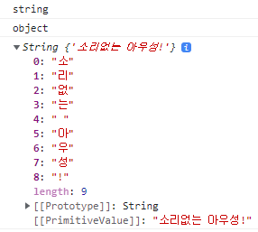

# 생성자 함수
> - Built-in 생성자 함수
>   - Object
>       - 최상위
>   - String
>       - string은 데이터타입
>   - Number
>   - Boolean
>   - Function
>   - Array
>   - Date
> - User-defined 생성자 함수
>   - 개발자가 생성자 함수를 만들어 사용할 수도 있음

## Built-in 생성자 함수
### Object
객체를 생성할 떄 객체 리터럴({...})뿐 아니라 생성자 함수를 사용할 수 있음

```js
const person = new Object(); // 내용적으로는 {}와 같으나, 내부 구조는 다름

person.name = '홍길동';
person.age = 20; // 동적할당 가능. 이때 attribute는 default값

console.log(person);
```

### String
```js
const str = '소리없는 아우성!';
const strObj = new String('소리없는 아우성!');
console.log(typeof str); // string
console.log(typeof strObj); // object
console.log(strObj); // '소리없는 아우성!'이 아닌 String {'소리없는 아우성!'}
```



유사배열 객체가 반환되었음. for문 등으로 열거 가능하지만, 일반 배열이 가지는 함수는 사용할 수 없어서 사용에 제약이 따름.

내부슬롯으로 [[Prototype]], [[PrimitiveValue]]가 있는 것을 볼 수 있음.

실제 Primitive Value는 메모리 공간 상 다른 곳에 있고, 이를 가지고 인덱스별 유사배열 객체가 만들어져 반환된 것.

## User-defined 생성자 함수
