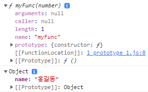

# 함수의 프로퍼티

## 복습
자바스크립트의 함수는 Reference Type이며 함수이기 이전에 객체이다. 따라서 프로퍼티를 가질 수 있으며, 선언 이후에 동적으로 프로퍼티를 추가할 수 있음을 보았다.

### console.dir을 통해 객체를 인스펙션
```js
// 일반 객체
var obj = {
    name: '홍길동'
}

// 함수 선언문
function myFunc(number) {
    return 2 * number;
}

console.dir(myFunc);
console.dir(obj);
```



obj의 내부에는 name 프로퍼티와 모든 객체에 있는 [[Prototype]] 내부 슬롯이 있다.  
반면에 myFunc에는 내부 슬롯이 한 개 더 있고, arguments 등의 프로퍼티 몇 개가 추가되어있는 것을 알 수 있다. arguments는 함수에 넘겨지는 모든 인자가 유사배열 객체의 형태로 저장되는 프로퍼티로, 이전에 다룬 바 있다.

## arguments 프로퍼티
```js
function myFunc2() {
    // arguments 유사배열 객체 사용
    let result = 0;

    for (let i in arguments) {
        result += arguments[i];
    }

    return result;
}

console.log(myFunc2(1, 3, 5, 7, 9, 11, 13, 15, 17, 19, 21));  // 121
```

arguments는 배열은 아니지만, 배열처럼 구성된 유사배열로, 위의 코드도 정상적으로 작동한다.

### 레스트 파라미터 Rest Parameters

참조: [MDN](https://developer.mozilla.org/en-US/docs/Web/JavaScript/Reference/Functions/rest_parameters)

arguments는 배열은 아니므로, 여러 제약이 있다. 이로 인한 불편함을 해결하기 위해 ES6부터 도입된 것이 레스트 파라미터이다.

```js
function restParam(...args) {
    let result = 0;
    args.forEach(item => { // 배열이므로 forEach 사용 가능
        result += item;
    })
    return result;
}

console.log(restParam(1, 3, 5, 7, 9, 11, 13, 15, 17, 19, 21)); // 121
```

온전한 배열이므로 ES6부터 arguments 보다 잘 활용된다. 또한 Arrow Function에서는 그 자체로 arguments 프로퍼티가 없어, Rest Parameters를 사용해야 한다.

다만 Rest Parameters는 프로퍼티가 아님에 주의하라.

## caller 프로퍼티
A 함수가 B 함수를 호출한 경우,
- A: caller 호출자
- B: callee 피호출자

즉 어떤 함수의 caller 프로퍼티에는, 해당 함수를 호출한 함수에 대한 정보가 담겨있다.

유용하게 사용할 수 있으나, 문제는 이 프로퍼티가 비표준이라는 것이다. (MDN에 따르면 Deprecated)  
따라서 사용을 지양할 것.

## length 프로퍼티
함수의 매개변수의 개수(길이)

```js
function func(a, b) { // 매개변수의 개수: 2
    return a + b;
}

func(a, b, c); // 인자의 개수: 3

// func의 length: 2
```

매개변수와 인자를 혼동하지 않도록 주의할 것

## name 프로퍼티
함수의 이름

## prototype 프로퍼티
해당 함수를 생성자 함수라고 하자. 그렇다면 new 연산자와 해당 함수를 이용해 별도의 객체를 생성할 수 있다.  
이때 new 연산을 통해 생성된 객체는 당연히 인터널 슬롯에 [[Prototype]]을 가진다.

prototype 프로퍼티에는 위와 같이 *생성자 함수를 통해 생성될 자식 객체의 [[Prototype]]에 들어가게 되는* 프로퍼티가 위치하게 된다.

즉, prototype 프로퍼티는 Constructor만 가지고 있는 프로퍼티이다.
- Constructor의 조건
  - 함수선언문을 통해 정의됨
  - 함수표현식(리터럴)을 통해 정의됨
  - 클래스
- Non-Constructor
  - 화살표 함수
  - 메서드 (ES6의 Method Definitions)
  - prototype 프로퍼티가 없음

