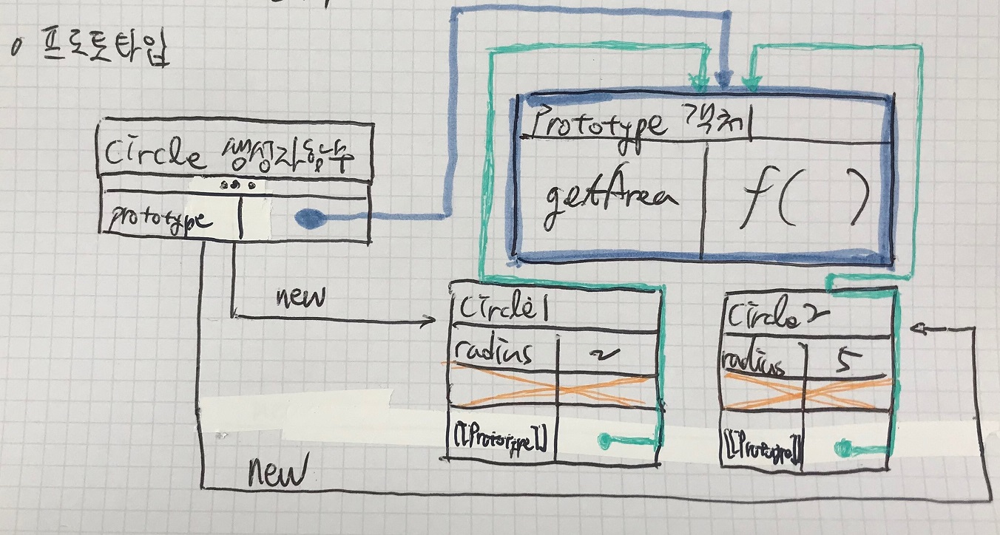

# 함수 Prototype
## 개요
함수 기반 언어인 자바스크립트에서 상속을 구현하기 위해 사용

자바스크립트는 함수 기반 언어이면서도 객체지향 개념이 가미되어 있는 멀티 패러다임 언어

ES6에서 Class가 도입되었으나, 실제로 내부적으로는 여전히 생성자 함수가 동작함

## 생성자 함수를 이용한 객체 생성의 문제점

```js
function Circle(radius) {
    this.radius = radius; // 프로퍼티
    this.getArea = function() {
        return Math.PI * this.radius ** 2;
        // Math는 빌트인 오브젝트
        // ** 는 제곱 연산자
    }
}

const circle1 = new Circle(2);
const circle2 = new Circle(5);
```


결국 getArea 함수 바디는, 매번 객체를 생성할 떄마다 새로운 메모리 공간에 할당된다는 문제가 발생. 메모리 누수의 위험이 있음.

Prototype은 이러한 문제를 해결하기 위한 것. 자바에 Method Area가 있듯이, 객체마다 공통적으로 반복 할당되는 객체를 링크하는 별도의 공간을 도입하게 된 것임.

## 함수 Prototype의 개념



생성자함수의 Prototype 프로퍼티는 위와 같이 공유될 객체에 대한 포인터와 같다. 이 객체가 Prototype 객체이다.

해당 객체에는 공통된 데이터가 할당되며, new 연산과 생성자함수를 통해 생성된 각 객체의 [[Prototype]] 내장 슬롯은 해당 객체를 가리키게 된다.  
이후 '.' 연산자를 통해 각 객체의 프로퍼티를 찾을 때 객체 자신이 가지고 있지 않은 객체의 경우 [[Prototype]] 내장 슬롯이 가리키는 프로토타입 객체에서 해당 객체를 찾게 된다.

실제로는 Prototype 객체의 주소를 공유하고 있는 것이나, 상속과 유사한 기능을 하게 된다. 실제 객체지향 언어에서 상속을 구현하는 방법과는 다른 부분이 있기는 하다.

```js
function Circle(radius) {
    this.radius = radius; // 프로퍼티
    Circle.prototype.getArea = function() { // 프로토타입
        return Math.PI * this.radius ** 2;
    }
}

const circle1 = new Circle(2);
const circle2 = new Circle(5);

// 참고:
// == 내용이 같은지 비교
//    단 타입이 다르면 일단 타입을 변환하여 통일시키고 비교
// === 타입이 같고 내용도 같은지 비교
//     완전히 동일한지를 알 수 있음

console.log(circle1.radius === circle2.radius); // false
console.log(circle1.getArea === circle2.getArea); // true
```

위와 같이 radius 프로퍼티는 각 객체 별로 따로 할당되었기 때문에 false가 반환된다. (물론 포인터를 비교하는 것이 아니라 값을 비교하는 것이므로 radius를 같게 주면 true가 반환된다. 그러나 그럼에도 두 값은 다른 메모리 공간에 위치한다.)

getArea는 각 객체의 프로퍼티에 존재하지 않고, 공유되는 프로토타입 객체에 위치하기 때문에 true가 반환된다.

## 함수 Prototype 연습
```js
function Circle(radius) {
    this.radius = radius;
    Circle.prototype.getArea = function() {
        return Math.PI * this.radius ** 2;
    }; // 공유 프로퍼티 (함수)
    Circle.prototype.name = '홍길동'; // 공유 프로퍼티 (변수)
}

const circle1 = new Circle(2);
const circle2 = new Circle(5);

console.log(circle1.name, circle2.name); // 홍길동 홍길동

circle1.name = '신사임당';
console.log(circle1.name, circle2.name); // 신사임당 홍길동
// 원래 circle의 프로퍼티에는 name이 없었으므로,
// circle1.name은 Prototype 객체의 name 프로퍼티를 가리킴
//
// 그러나 circle1.name에 새로운 값을 할당하게 되면,
// circle1에 name 프로퍼티를 만들고 새로운 값을 할당
//
// 이후부터는 circle1.name 참조시 객체 자체에
// 새롭게 할당된 name 프로퍼티가 있으므로, 해당 값을 가리키게 됨.

// ----------------------

delete circle1.name;
circle1.__proto__.name = '강감찬';

console.log(circle1.name, circle2.name); // 강감찬 강감찬
```

## 함수 Prototype 소결
자바스크립트의 (거의) 모든 객체가 [[Prototype]] 내장 슬롯을 가지고 있다는 것은 -> 모든 객체는 객체마다 하나의 (상위) Prototype 객체를 갖는다는 것을 의미

이러한 Prototype 객체는 생성자 함수와 연결되어 있음 (해당 함수의 prototype 프로퍼티가 해당 객체를 가리키는 포인터)

생성자 함수가 생성될 때, 해당 함수가 자식에게 상속해줄 Prototype 객체도 메모리 공간에 생성되며, 해당 함수의 prototype 프로퍼티에 Prototype 객체가 링크된다.

new 연산자를 통해 객체가 생성되면, 각 객체의 [[Prototype]] 내장 슬롯이 생성자 함수가 prototype 프로퍼티로 갖고 있던 (실제로는 링크된) Prototype 객체를 가리키게 된다. 이 객체는 \_\_proto\_\_를 통해 간접적으로 참조할 수 있다.

한편, Prototype 객체의 constructor 프로퍼티는 객체 자신이 링크된 생성자함수를 가리키고 있다.

```js
console.log(circle1.constructor === Circle); // true
console.log(circle1.__proto__.constructor === Circle); // true
```

console.dir을 통해 논의한 내용이 실제로 맞는지 확인해보자.

```js
console.dir(circle1);
```


&nbsp;

이때, [[Prototype]]에도 [[Prototype]]이 있다. 이 [[Prototype]]의 constructor 프로퍼티를 통해 Object()를 통해 생성된 객체임을 알 수 있다. 이렇게 자바스크립트의 객체는 연결을 거듭하여 생성되는 것이다.


## 프로토타입 체인
```js
console.log("\nEXAMPLE 8");

var newAnotherObj = {
    name: "홍길동"
}

console.dir(newAnotherObj);
// 'new Object()'가 아닌 리터럴로 만든 객체임에도,
// [[Prototype]]의 constructor가 Object()

// 자바스크립트의 Object()를 통해 Protorype이 상속되어
// 객체에 대한 갖가지 기능을 사용 가능한 것.
// __proto__ 역시 Object()의 prototype 프로퍼티가 가리키는
// Prototype 객체에 위치하고 있음.

// ----------------------

const circle_test = new CircleEnhanced2(3);

console.dir(circle_test);
```


이렇게 console.dir을 통해 인스펙션하면 객체의 Prototype 객체를 타고 더 상위에 있는 Prototype 객체와 생성자 함수가 있음을 알 수 있다. 이를 프로토타입 체인이라 하며, 스코프 체인과 혼동하지 않도록 주의할 것.

## 유일한 예외
```js
// const obj = new Object(); // 생성자 함수가 아닌,

// 프로퍼티 함수로 객체를 생성하는 경우,
// 임의로 상위 프로토타입 지정 가능
// Object.create(상위_프로토타입_객체)
//
// 만약 인자로 null을 넘기면 상위 프로토타입이 없는 객체가 생성됨
// __proto__ 등 상속받지 못해 사용 불가
const someWhatObj = Object.create(null);
console.dir(someWhatObj);
```

;


## Safe한 Prototype 참조
위와 같이 '모든' 객체가 [[Prototype]]과 \_\_proto\_\_을 가지고 있는 것은 아님. 어떤 이유에서든 프로토타입 체인이 끊어진 객체가 있을 수 있음. 이 경우 우리가 했던 것처럼 \_\_proto\_\_를 참조하면 오류가 발생할 것임.

따라서 \_\_proto\_\_에 직접 참조하는 것은 권장되지 않음. (참조: [MDN](https://developer.mozilla.org/en-US/docs/Web/JavaScript/Reference/Global_Objects/Object/proto)) 대신 자바스크립트가 제공하는 다른 방법을 사용할 수 있음. -> Object.getPropertyOf(), Object.setPropertyOf()

```js
const obj = {};

const parent = {
    x: 1
};

/* obj.__proto__.DO_SOMETHING // -> Bad. '__proto__' is deprecated. */
const property = Object.getPrototypeOf(obj);

Object.setPrototypeOf(obj, parent); // set the property of obj to 'parent'

console.log(obj.x); // 1
```

## 주의
### Non-constructor 함수
생성자 함수가 아닌 Non-constructor 함수는 Prototype 객체를 가지고 있지 않으며, prototype 프로퍼티 자체가 없다.

> Non-constructor 함수
> 1. Defined by method
> 2. Arrow-function

```js
// Non-constructor 함수에는 정말 property 객체가 생성되지 않는지 검증

const person = (name) => {
    this.name = name
};

console.log(person.prototype) // undefined
```
prototype 프로퍼티가 없으므로 undefined가 반환되었음

### Protorype Chain 따라가기


두 개의 체인이 생기는 것이 볼 수 있으며, 실질적으로 객체까지 내려오는 것은 노란색으로 표시된 라인.

```js
function Circle(radius) {
    this.radius = radius;
}

Circle.test1 = 'test1';
Circle.prototype.test2 = 'test2';

const circle1 = new Circle(5);
console.log(circle1.test1); // undefined
console.log(circle1.test2); // test2
```

생성자 함수와 객체는 직접적으로 하나의 체인으로 이어지지 않으므로 당연히 첫번째 값으로 undefined가 출력된다.