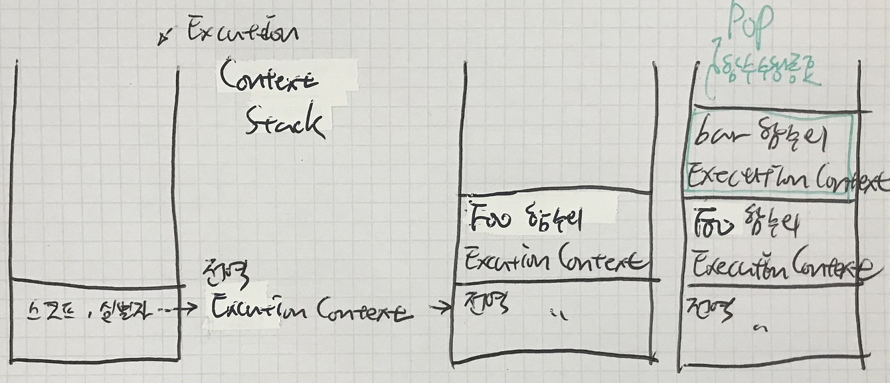

# 클로져

## 개요
자바스크립트 고유의 개념이 아님. 자바스크립트 문법에 종속된 요소가 아니라, 함수형 언어의 일반적 특징.

정의: 함수와 그 함수가 선언된 렉시컬 환경의 조합. 그리고 그 조합에 의해 발생되는 현상  
쉬운 정의: 아주 특별한 상황에 놓인 함수

## 렉시컬 스코프 Lexical Scope
다른 말로 Static Scope. 어디에서 사용되는지가 아니라, 어디에서 선언되는지에 따라 Scope가 결정.

렉시컬 환경과 혼동하지 않도록 주의

## 실행 컨텍스트 Execution Context
자바스크립트 엔진은 소스 코드를 4개의 타입으로 분류
1. 전역코드: Global 영역(전역 영역, 전역 스코프에 해당해는 위치)에 존재하는 코드
    - 전역 영역에 위치한 각 함수의 선언부는 전역코드
    - 그러나 각 함수의 본문 코드는 전역코드에서 제외
2. 함수코드: 함수 본문 코드
    - 이때 함수가 중첩된 경우 외부(Outer) 함수와 내부(Inner) 함수는 별개의 함수 코드로 처리됨
3. eval 코드
    - built-in 함수 중 eval()의 인자로 넘겨지는 소스 코드
    - 보안문제로 사용 지양
4. module 코드
    - 모듈 스코프 안에 있는 소스코드
    - 모듈을 명시적으로 만들었을 때에 한함

- 소스 코드 타입 분류의 목적
  - 특정 Type의 코드가 실행되면 타입 별로 실행 컨텍스트 Execution Context가 생성됨.
  - 소스코드 타입에 따라 실행 컨텍스트가 생성되고 동작하는 방식이 달라짐

- eval 코드는 거의 사용되지 않으며, module은 아직 배우지 않았으므로 전역코드와 함수코드만을 다루어보려고 함.

### 전역코드
자바스크립트 엔진은 전역코드가 실행될 때 전역 변수(let 제외)를 관리하기 위해 최상위 스코프인 전역 스코프를 생성.  
스코프는 같은 스코프에 위치한 식별자들을 모아놓은 자료 구조이며, 자바스크립트 엔진에 의해 메모리에 할당되어 관리됨.

또한 이뿐만 아니라, 이전에 다루었듯이 var로 선언된 전역변수는 window 객체에 프로퍼티로 등록하며,  
전역에서 선언된 함수 역시 window 객체에 프로퍼티로 등록되어야 함. 이러한 일련의 과정이 사전에 실행되어야 문제 없이 전역코드를 실행할 수 있음.

이렇게 메모리 공간을 확보하여 전역 스코프를 생성하고 이후 수행되는 작업을 총칭하여 전역 실행 컨텍스트라고 함.

### 함수코드
지역 스코프 생성.

함수 내부의 지역변수를 지역 스코프에 선언

함수의 매개변수도 참조할 수 있도록 처리됨

현재 스코프와 상위 스코프가 어떤 구조로 연결되었는지 표현하는 스코프 체인도 만들어져야 함

일련의 작업을 총칭하여 함수 실행 컨텍스트라고 함

이떄, 함수마다 별도의 실행 컨텍스트가 만들어지게 됨

### 소결
> **실행 컨텍스트 Execution Context** :  
> 소스코드를 실행하는데 필요한 환경을 제공  
> 실행한 결과를 관리하는 메모리 영역을 포함

식별자, Scope, 스코프 체인 등은 실행 컨텍스트의 렉시컬 환경 Lexical Environment에서 관리됨. 

## 실행 컨텍스트 스택

실행 컨텍스트 간의 코드 실행 순서를 관리하는 것은 실행 컨텍스트 스택 Execution Context Stack이다.

```js
console.log("\nEXAMPLE 1");

const x = 1; // 전역1

function foo() { // 전역1
    const y = 2; // 함수1

    function bar() { // 함수1
        const z = 3; // 함수2
        console.log(x + y + z); // 함수2
    }
    bar(); // 함수1
}

foo();  // 전역1

// 각 타입의 소스코드는 타입별 실행 환경에서 실행됨
```




## 함수를 리턴하는 함수
```js
const x = 1;

function outer(){
    const x = 10;

    const inner = function() {
        console.log(x);
    }
    
    //inner();
    return inner; // 함수가 함수를 리턴
}

const result = outer();

result(); // 10
result()()
```

앞선 논의에 따르면, 10이 출력되는 것이 이상해보인다.  
outer()가 실행되면, 해당 함수 컨텍스트가 실행 컨텍스트 스택에 들어가고,  
inner에 할당된 함수를 리턴한 후, 스택에서 실행 컨텍스트가 pop된다.

이후 inner를 리턴받아 result 변수에 할당한 후 실행하면, x가 10이었던 컨텍스트는 이미 pop 되었기 때문에 10에 접근할 수 없어, 1이 출력되는 것이 적절하지 않을까?

그러나 자바스크립트가 렉시컬 스코프 Rule을 따른다는 것을 생각하자. inner가 선언되었을 때, 선언 위치에 따라 inner 본문 코드의 x는 전역 x가 아닌 outer 내의 x를 가리킨다.

이후 inner가 리턴된 후에는, outer의 실행이 종료되었기 때문에 outer의 실행 컨텍스트는 소멸된다. 그러나 outer의 실행 컨텍스트 내에 있는 x를 가리키는 레퍼런스가 outer 밖에서 유지되고 있으므로, 해당 x는 소멸되지 않게 된다. 이렇게 함수가 종료된 이후에 레퍼런스가 남아있는 경우 렉시컬 환경이 유지되는 현상을 클로져라고 한다.

## 어디에 사용할 수 있나
나중에 웹 프론트엔드를 짤 때 활용 가능하다. 지금 상황에서는 논의가 어렵다.  
그러나 다음과 같은 간단한 예제를 생각해볼 수 있다.

```js
// 클로져 응용
// ------- 간단한 카운터 프로그램 --------
let num = 0;

const increase = function() {
    return ++num;
}

console.log(increase());
console.log(increase());
console.log(increase());

// mistake!
num = 10;
console.log(increase());
console.log(increase());


// ----------- 정보 은닉 시도 ------------

const increase2 = function() {
    let num = 0;
    return ++num;
}

console.log(increase2()); // 1
console.log(increase2()); // 1
console.log(increase2()); // 1
// num이 매번 초기화됨

// ------- 클로져를 통한 정보 은닉 --------
// 지역변수임에도 계속 유지될 수 있게 하려면?
// 클로져 사용

const increase3 = (function() {
    let num = 0;

    return function() {
        return ++num;
    }
})(); // IIFE. increase3에는 Nested Function이 할당. 이때 유지된 Lexical Environment는 유지됨

console.log(increase3()); // 1
console.log(increase3()); // 2
console.log(increase3()); // 3
```