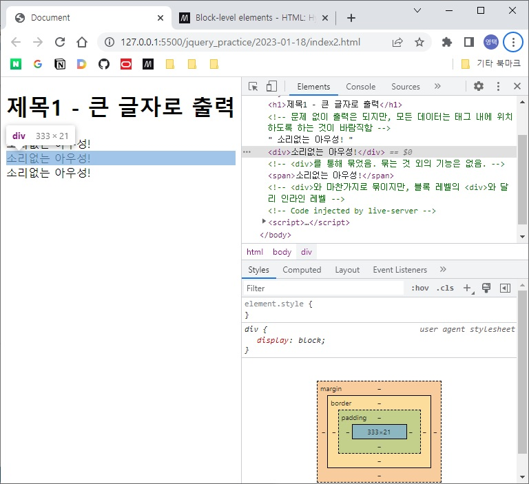
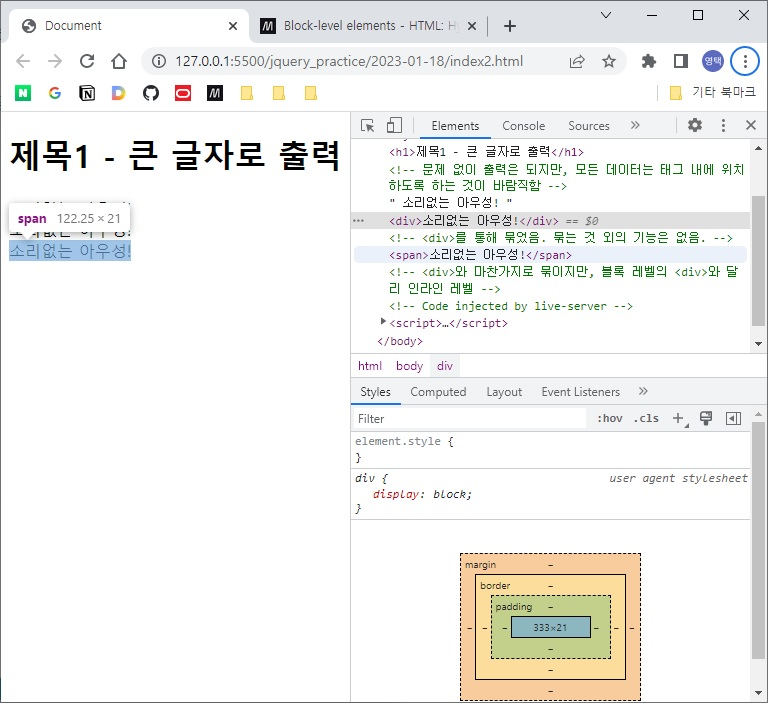
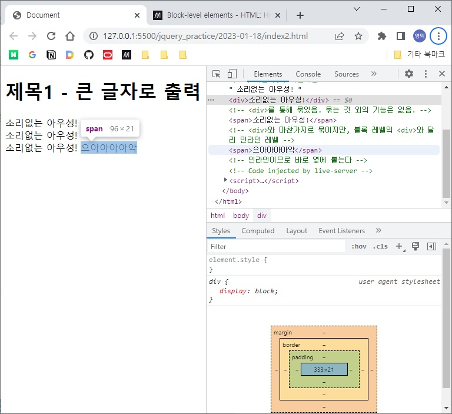

# HTML 기초
## 개요
현재의 표준은 HTML5를 기반으로 한 HTML Living Standard. HTML5은 좁은 의미로 순수한 HTML 스펙만을 가리키기도 하지만, HTML5 스펙과 함께 발표된 CSS3, Javascript(ES6)을 함께 지칭하기도 함.

HTML은 Hypertext Markup Lanugage의 약자. 로직을 표현하고자 하는 것이 아니라 문서의 구조와 내용을 규정하기 위한 언어.

순수한 HTML만으로는 만들 수 있는 것은 텍스트로만 이루어진 문서에 한정. 오늘날 웹 환경에서 이러한 문서는 선호되지 않기 때문에 문서의 스타일링을 위해 CSS(Casacading Stylesheet)를 함께 사용.

여기에 동적 웹앱 구현을 위해 Javascript도 사용. Javascript를 통해 동적으로 HTML과 CSS(정확히는 렌더링된 DOM 요소)를 제어할 수 있음.  
Javascript는 ECMAScript core와 Client-side web API로 구성되며, DOM 제어는 web API를 이용하여 가능.

## HTML의 기본구조
HTML 파일의 가장 기본 이름은 index.html

> **기본용어**  
> - 태그 tag
>   - HTML 문서의 문법 요소.
>   - \<html\>\</html\>
> - 엘리먼트 element (요소)
>   - HTML의 기본 요소. 보통 시작 태그와 끝 태그로 둘러싸여 있음.
>   - 다만 끝나는 태그가 없는 태그도 있으니 주의.
> - 어트리뷰트 attribute (속성)
>   - 각 엘리먼트는 어트리뷰트를 가질 수 있음.
>   - 시작 태그 뒤에 key=value 형태로 명시
>   - 각 엘리먼트에 적용할 수 있는 대부분의 어트리뷰트는 이미 명세에 정의되어있음.
>   - 사용자 임의로 어트리뷰트를 만들어 적용할 수도 있음.

```html
<!DOCTYPE html> <!-- HTML 문서는 DOCTYPE으로 시작 -->
<html> <!-- 전체 내용은 <html>에 묶임 -->
    <head>
        <!-- 화면에 출력할 내용이 아니라 설정 사항 -->
    </head>

    <body>
        <!-- 화면에 출력할 내용 -->
    </body>
</html>

```

\<html\>은 크게 \<head\>와 \<body\>로 구성된다.

> **HTML 파일 열기**  
> - 웹브라우저를 띄우고 직접 HTML 파일을 열어 실행
>   - 내용 확인은 가능하지만 추천되지 않는 방법
> - 웹서버에 HTML 파일을 배포Deploy한 후, 웹브라우저로 HTTP URL을 통해 접속
>   - 적절한 방법
>   - 사용 웹서버를 설치하고 세팅하는 것은 번거로우므로 VSCode의 플러그인을 활용

### \<head\>
화면에 표시될 내용이 아닌 설정될 내용을 기술. 대표적으로 캐릭터 셋.

```html
<head>
    <!-- 화면에 출력할 내용이 아니라 설정 사항 -->
    <meta charset="utf-8"> <!-- 캐릭터 셋 지정; meta는 닫는 태그 없음 -->
    <title>제목표시줄에 표시할 텍스트</title>
</head>
```

### \<body\>
다양한 태그를 사용하여 화면에 표시될 내용을 기술

기본 구조를 파악했으면 앞으로는 VSCode의 코드 스니펫 기능을 이용하여 HTML 템플릿을 불러오자. ! -> <Tab>

불러온 템플릿에서 아래는 당장 필요 없으므로 삭제해도 된다.

```html
<!-- <head>에서 아래를 삭제 -->
<meta http-equiv="X-UA-Compatible" content="IE=edge">
<meta name="viewport" content="width=device-width, initial-scale=1.0">
```

## HTML의 기본 태그 (실습)
### 블록과 인라인
```html
<!DOCTYPE html>
<html lang="en">
<head>
    <meta charset="UTF-8">
    <title>Document</title>
</head>
<body>
    <h1>제목1 - 큰 글자로 출력</h1>
    
    <!-- 문제 없이 출력은 되지만, 모든 데이터는 태그 내에 위치하도록 하는 것이 바람직함 -->
    소리없는 아우성!

    <div>소리없는 아우성!</div> <!-- <div>를 통해 묶었음. 묶는 것 외의 기능은 없음. -->

    <span>소리없는 아우성!</span> <!-- <div>와 마찬가지로 묶이지만, 블록 레벨의 <div>와 달리 인라인 레벨 -->

</body>
</html>
```

> 블록 레벨 엘리먼트:  
> h1, div 등
> 부모 엘리먼트의 수평 공간 전체를 차지

> 인라인 레벨 엘리먼트:  
> span 등

블록레벨 엘리먼트인 div는 개발자도구에서 아래와 같이 표시된다. 



인라인 엘리먼트인 span은 개발자도구에서 아래와 같이 표시된다. 



따라서 span 다음에 span을 추가하면 아래가 아닌 바로 옆에 붙게 된다.

```html
<!-- 전략 -->
<span>소리없는 아우성!</span>
<span>으아아아아악</span>
<!-- 후략 -->
```



### 이미지
```html
<!-- 이미지 -->
<!-- 너비 조정은 CSS로 할 수도 있고, width 어트리뷰트를 활용할 수도 있다 -->
<!-- CSS로 하는 것이 바람직지만, 아직 안 배웠기 때문에... -->


```

이미지도 인라인 엘리먼트이기 때문에 바로 옆에 붙는다. 다만 마진과 패딩의 기본값 때문에 완전히 붙지는 않았다. CSS를 통해 세부적으로 조정할 수 있다.

### 하이퍼링크
```html
<!-- 하이퍼링크 -->
<a href="https://www.naver.com/">네이버로 이동</a> <!-- anchor의 약자-->
```

href(Hyperlink reference)에 이동할 URL 지정

### 사용자 입력 양식 (form)
일반적인 엘리먼트와 구분됨.

```html
<!-- 사용자 입력 양식 -->
<!-- input 태그에 type 어트리뷰트 지정 -->
<!-- type 어트리뷰트에 따라 원하는 컨트롤 생성 가능 -->
<input type="text">
<input type="button">
<input type="radio">
<input type="checkbox">
<textarea>여러 줄의 입력상자는 별도의 태그로 생성</textarea>
```