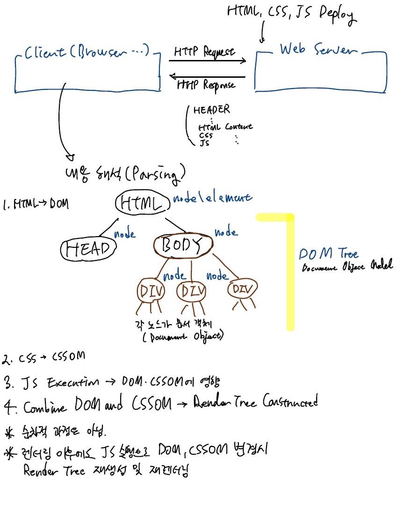
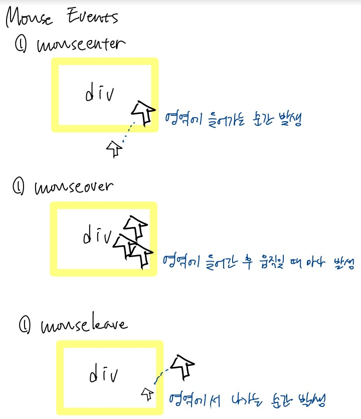

# jQuery 메서드
## 이벤트 처리
### 콤보박스

**기본 HTML 문서 작성**
```html
<!DOCTYPE html>
<html lang="en">
<head>
    <meta charset="UTF-8">
    <title>Document</title>

    <!-- jQuery를 사용하기 위한 CDN 설정 (https://releases.jquery.com/) -->
    <script src="https://code.jquery.com/jquery-3.6.3.min.js" integrity="sha256-pvPw+upLPUjgMXY0G+8O0xUf+/Im1MZjXxxgOcBQBXU=" crossorigin="anonymous"></script>
    <script src="./js/index1.js"></script>
</head>
<body>
    <select>
        <option>홍길동</option>
        <option>신사임당</option>
        <option>강감찬</option>
        <option>이순신</option>
    </select>
    <br>
    <br>
    <div id="result">
        여기에 선택된 사람 출력
    </div>
</body>
</html>
```

콤보박스에서 아이템을 바꾸면 Change 이벤트 발생  
즉, 웹브라우저에 사용자가 발생시킬 수 있는 이벤트의 종류가 정해져 있으며, 자바스크립트에서 취급할 수 있음.

&nbsp;

> 이벤트의 예시  
> click, dblclick, change, mouseover, mouseenter, mouseleave, keypress, keyup, keydown 등

- 인라인 이벤트 모델 Inline Event Model
  - HTML 요소의 어트리뷰트에 이벤트리스너를 지정
  - 어트리뷰트 이름은 'on + (대상 이벤트 이름)'으로 예약되어있음

- 위임 모델 Delegation Model
  - JavaFX에서 사용해봤던 방식
  - 딜리게이션 모델의 구성요소
    1. Event source 이벤트가 발생한 DOM 객체
    2. Event listener (Event handler) 이벤트를 처리하는 함수/메서드
    3. Event name/type: 발생한 이벤트의 종류
         - click, dblclick, mouseover, ... 등
    4. Event 객체: 발생한 이벤트의 세부 정보
         - 자바스크립트 엔진/JVM이 만들어 이벤트 핸들러에 전달

> **jQuery가 HTML 요소를 찾는 원리**
> 
> 사실 렌더링된 HTML 문서에서 각 요소는 문서 객체로 변환되어 메모리 상 자료구조인 DOM Tree에 위치하고 있다.
> 
> jQuery는 쿼리 문자열을 통해 HTML 문서를 직접 파싱하는 것이 아니라, 렌더링된 DOM의 해당 문서 객체를 찾는다. 이를 jQuery에서 사용하는 특수한 객체의 형태로 변환하여 제공한다.
> 따라서 이벤트 소스 요소도 곧 우리가 작성한 태그 자체가 아니라, 브라우저가 파싱하여 생성한 DOM 요소라는 것을 알 수 있다.

```html
<select onchange="handleEvent(event)">
    <option>홍길동</option>
    <option>신사임당</option>
    <option>강감찬</option>
    <option>이순신</option>
</select>
```

```js
function handleEvent(event) { // event: 이벤트에 대한 세부 정보
    const index = event.target.selectedIndex; // event.target: 이벤트 소스
    $('#result').text(event.target[index].text);
}
```

&nbsp;

아래와 같이 이벤트 리스너를 더 간단하게 작성할 수도 있다.
```js
function handleEvent(event) {
    $('#result').text($('select > option:selected').text());
}
```

### 마우스



1. mouseenter
2. mouseover
3. mouseleave

호버링된 요소 하이라이팅하기

```html
<ul>
    <li>홍길동</li>
    <li>신사임당</li>
    <li>강감찬</li>
    <li onmouseenter="handleMouseEnter(event)" onmouseleave="handleMouseLeave(event)">이순신</li>
</ul>
```

```js
function handleMouseEnter(event) {
    // 1. 이벤트가 발생한 객체 (target) 찾기
    $(event.target) // DOM 객체를 $()에 넘기면 jQUery 객체가 반환됨
    .css('color', 'red'); // 2. CSS 변경
    $(event.target).css('background-color', 'yellow');
}

function handleMouseLeave(event) {
    $(event.target).css('color', 'black');
    $(event.target).css('background', 'white');
}
```

동작은 되지만 비효율적. CSS를 직접 변경하기 때문에 매번 CSSOM를 변경, 렌더 트리가 재생성되고 재렌더되는 과정이 반복됨.
css()는 사용에 주의해야함.

대신, 아래와 같이 클래스명을 바꾸어 스타일링이 다르게 적용되도록 수정 가능.

```html
<style>
    .highlighted-block { /* 미리 클래스 정의 */
        color: red;
        background-color: yellow;
    }
</style>

<ul>
    <li onmouseenter="handleMouseEnter(event)" onmouseleave="handleMouseLeave(event)">홍길동</li>
    <li onmouseenter="handleMouseEnter(event)" onmouseleave="handleMouseLeave(event)">신사임당</li>
    <li onmouseenter="handleMouseEnter(event)" onmouseleave="handleMouseLeave(event)">강감찬</li>
    <li onmouseenter="handleMouseEnter(event)" onmouseleave="handleMouseLeave(event)">이순신</li>
</ul>
```

```js
function handleMouseEnter(event) { // 이벤트에 따라 클래스 변경
    $(event.target).addClass('highlighted-block');
}

function handleMouseLeave(event) {
    $(event.target).removeClass('highlighted-block');
}
```

그러나 각 li 요소에 이벤트 리스너를 등록할 때에 중복 코드가 반복된다는 문제가 있다. 이때 JS에서 Propagation 현상이 발생한다는 것을 생각하면, ul 요소에만 이벤트를 등록해도 될 것 같다. 그러나 이렇게 하면 event.target이 ul 요소가 되어서 의도된 대로 동작하지 않는다. 이 문제는 나중에 jQuery를 이용하여 해결해야할 듯 하다.

> **Propagation 현상**
>
> 아래와 같은 HTML 문서에서,
> ```html
>        <div class="special-div"
>             onclick="handleDiv()">
>
>            <button class="btn btn-danger"
>                    onclick="handleBtn()">버튼</button>
>            <!-- 버튼 클릭시 이중으로 이벤트 처리됨 [Propagation] -->
>        </div> ```
> 버튼을 클릭하면, handleBtn()과 handleDiv()가 모두 실행됨

## each

아래와 같은 문서에서,

```html
<ul>
    <li>홍길동</li>
    <li>신사임당</li>
    <li>강감찬</li>
</ul>
<br>
<button onclick="handleBtn()">클릭</button>
```

```js
function handleBtn() {
    console.log($('ul > li').text());
}
```

[클릭] 버튼을 누르면 "홍길동신사임당강감찬"이 출력된다. 요소 각각을 다룰 수 있는 방법은 없을까?

```js
function handleBtn() {
    // console.log($('ul > li').text()); // 홍길동신사임당강감찬
    $('ul > li').each(function(idx, item) { // 각 li 요소마다 넘겨준 콜백함수가 실행됨
        // idx: 순번(0부터 1 증가).
        // item: 현재 문서 객체 (DOM 입력됨. jQuery 객체가 아님.)
        console.log($(item).text());
    });
}
```

각 li의 내용이 개행되어 출력된다.  
이렇게 each를 사용하면 Selector에 의해 DOM이 다중 선택된 경우 각 요소에 대한 반복 작업을 수행할 수 있다.

## 그 외의 메서드
- text()
  - tag 사이의 글자를 반환해줌
  - 혹은 임의의 문자열을 인자로 넘겨 변경 가능
- css()
  - 해당 요소에 대한 CSS 변경
  - 하지만, 한 개의 CSS 속성만 변경 가능하므로 효율이 좋지 않음.
  - 특히나 동적으로 빈번하게 스타일 속성을 변경하는 경우 CSSOM이 변경되어 렌더트리가 재생성, 재렌더되므로 성능이 떨어짐.
    - [참고1](https://web.dev/critical-rendering-path-render-tree-construction/)
    - [참고2](https://developer.mozilla.org/ko/docs/Web/Performance/Critical_rendering_path)
- addClass(), removeClass()
  - 특정 요소에 대해 클래스를 추가하거나 제거
  - 위와 같이 css를 직접 변경하는 대신, 특정 클래스에 대한 스타일을 사전에 정의해두고, 필요할 때 클래스를 바꿔주는 방식으로 동적 스타일링이 가능함.
- attr()
  - 해당 요소의 어트리뷰트를 반환
  - 혹은 특정 어트리뷰트의 값을 변경