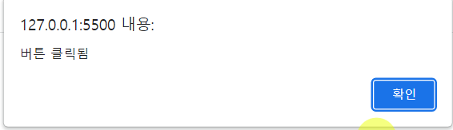
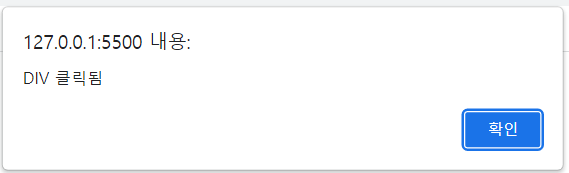

# jQuery Event

## 개요

우리는 그동안 이벤트 리스너를 HTML 인라인 방식으로 등록하였다. 편하지만, 로직 밖에서 등록하므로 한계가 있다. jQuery를 통해 이벤트 리스너를 등록해보자.

## on 메서드

```html
<ul>
  <li>홍길동</li>
  <li>신사임당</li>
  <li>강감찬</li>
</ul>
<button class="btn btn-primary" onclick="handleBtn1()">새로운 아이템</button>
<button class="btn btn-primary" onclick="handleBtn2()">새로운 이미지</button>
<button class="btn btn-primary" onclick="handleBtn3()">새로운 이벤트 리스너</button>
```

```js
function handleBtn3() { // 새로운 이벤트 리스너
    $('ul > li:last') // 1. 이벤트 핸들러를 붙일 요소를 찾는다. <li>강감찬</li>
    .on('click', function() {
        console.log('아이템 \'강감찬\'이 클릭됨');
    }) // 이벤트 핸들러를 특정 이벤트에 등록
    console.log('새로운 이벤트 리스너 등록 완료');
}
```

jQuery_객체.on(이벤트명, 콜백함수)

## 축약 메서드

on 메서드 대신 이벤트명을 이름으로 하는 메서드로 이벤트 핸들러를 등록할 수 있다.

```js
function handleBtn3() { // 새로운 이벤트 리스너
    $('ul > li:last') // 1. 이벤트 핸들러를 붙일 요소를 찾는다. <li>강감찬</li>
    .click(function() {
        console.log('아이템 \'강감찬\'이 클릭됨');
    }) // 이벤트 핸들러를 특정 이벤트에 등록
    console.log('새로운 이벤트 리스너 등록 완료');
}
```

on('click', f)를 click(f)로 줄여 썼다.

> 이렇게 이벤트 리스너는 html 요소의 on- 어트리뷰트에 등록하지 말고, jQuery 코드 상에서 추가하는 방법으로 등록하는 것을 기본으로 한다.

## 실습 및 주의 사항

```html
<!DOCTYPE html>
<html lang="en">
<head>
    <meta charset="UTF-8">
    <title>Document</title>

    <!-- jQuery 포함 (CDN) (https://releases.jquery.com/) -->
    <script src="https://code.jquery.com/jquery-3.6.3.min.js" integrity="sha256-pvPw+upLPUjgMXY0G+8O0xUf+/Im1MZjXxxgOcBQBXU=" crossorigin="anonymous"></script>

    <!-- Bootstrap CSS 포함 (CDN)-->
    <link href="https://cdn.jsdelivr.net/npm/bootstrap@5.3.0-alpha1/dist/css/bootstrap.min.css" rel="stylesheet" integrity="sha384-GLhlTQ8iRABdZLl6O3oVMWSktQOp6b7In1Zl3/Jr59b6EGGoI1aFkw7cmDA6j6gD" crossorigin="anonymous">

    <script src="./js/index8.js"></script>
</head>
<body>
    <div class="container-md">
        <ul>
            <li>홍길동</li>
            <li>신사임당</li>
            <li>강감찬</li>
        </ul>
    </div>
</body>
</html>
```

이 외에 이벤트 리스너 등록을 위한 처리를 HTML에서는 하지 않는다.

아래와 같이 자바스크립트를 구성하여 이벤트 리스너를 등록하려고 한다

```js
// Bad Example
// 모든 ul > li에 대해 클릭 이벤트에 대한 리스너를 등록
$('ul > li').on('click', function() {
    alert('클릭');
});
```

그러나 브라우저를 실행시켜 li 요소를 클릭해도 반응이 없다. DOM 트리가 만들어지기 전에 코드가 실행되었기 때문이다. 우리의 코드가 import된 위치는 브라우저의 HTML 파서가 body를 참조하기 전인 head이다. 때문에, 아직 li 문서 객체가 생성되지 않은 시점에서 코드가 실행된 것이다. 즉, 코드는 DOM에 대해 아무런 변화를 일으키지 못하고 종료되었고, 이후에 이벤트 리스너가 등록되지 않은 li가 DOM 트리에 생성된다.

따라서 아래와 같이 수정해야 한다.

```js
// document는 DOM 트리를 가리킴. document에 대한 ready 이벤트는 페이지의 모든 요소가 준비된 시점에 발생함.
$(document).ready(function() {
    console.log("asdf")
    $('ul > li').on('click', function() {
        alert('클릭');
    });
});
```

document는 DOM을 가리키며, DOM이 모두 만들어지면 발생하는 ready 이벤트에 우리가 원하는 작업을 수행하는 함수를 핸들러로 등록했다.
그러면 문서가 모두 로드된 후 ready 이벤트가 발생하고 콜백으로 넘겨준 리스너가 실행되게 된다.

\* 이때 jQuery 1.8 이후부터는 on을 통한 이벤트처리는 불가능하다. ready() 함수로만 사용 가능하다. [참고: .ready() | jQuery API Documentation](https://api.jquery.com/ready/)

이때 일괄로 등록한 이벤트 리스너 함수 내에서, 이벤트가 발생한 요소를 참조하려면 어떻게 해야할까? 이벤트 리스너 내에서 this를 사용하면 된다.

```js
$(document).ready(function() {

    $('ul > li').on('click', function() {
        alert($(this).text());
    });
});
```

&nbsp;

> **중요: this**
> 
> 1. 일반 함수: 전역객체 (window)
> 
> 2. 객체의 프로퍼티로 등록된 함수: 함수를 호출한 객체
> 
> 3. 생성자 함수: 생성자 함수가 생성할 객체
>    
>    &nbsp;
> 
> 그러나,
> 
> *jQuery 이벤트 처리 코드 내에서 등장하는 this는 이벤트 소스에 대한 문서객체*

## 디폴트 이벤트 Default Event

jQuery랑은 상관 없음. 자바스크립트의 기본적인 이벤트 처리 특성.

```html
<a href="https://www.naver.com">네이버로 가기</a>
```

위와 같은 평범한 앵커 태그에 대해 우리는 흔히 이동한다고 표현하지만, 사실 해당 하이퍼링크를 클릭하면 브라우저는 해당 URL로 새로운 요청Request를 보내며, 그 결과를 렌더링하는 것이다.

그런데 이 작업 역시 내부적으로는 이벤트 기반으로 동작하게 된다.

1. 사용자의 앵커 요소 클릭 이벤트

2. 요청에 대한 결과를 받아온 후 페이지 전환 이벤트

이는 개발자와는 상관 없이, 앵커 태그의 기능을 구현하기 위해 브라우저가 내부적으로 자동 발생시키고 처리하는 것이다. 이러한 이벤트를 디폴트 이벤트라고 한다.

&nbsp;

따라서,

```html
<a href="https://www.naver.com" onclick="handleAnchor()">네이버로 가기</a>
```

```js
function handleAnchor() {
    alert("Link Clicked"); // Alert가 닫히면 페이지 전환 이벤트가 발생
}
```

와 같이 작성했을 떄,  경고창이 닫히고 나서 네이버로 페이지가 전환되는 것은 자동적으로 발생한다.

이를 방지할 수는 없을까? Event.preventDefault()를 사용하면 된다.

```html
<a href="https://www.naver.com" onclick="handleAnchor(event)">네이버로 가기</a>
```

```js
function handleAnchor(event) {
    event.preventDefault();
    alert("Link Clicked"); // Alert가 닫히면 페이지 전환 이벤트가 발생
}
```

## 이벤트 전파 Event Propagation

역시 자바스크립트의 기본적인 이벤트 처리 특성.

```html
<div class="container-md" onclick="handleOuterDiv()">
  <!-- Event Propagation -->
  <button class="btn btn-primary"
          onclick="handleInnerBtn()">
    클릭
  </button>
</div>
```

```js
function handleInnerBtn() {
    alert('버튼 클릭됨');
}

function handleOuterDiv() {
    alert('DIV 클릭됨');
}
```





버튼에 대한 이벤트가 상위 요소인 div에 전파되어 두 개의 이벤트 리스너가 모두 순차적으로 호출되었다. 의도되지 않은 상황이다. 이를 막기 위해서는 어떻게 해야할까? Event.stopPropagation()을 이용한다.


```js
function handleInnerBtn(event) {
    event.stopPropagation();
    alert('버튼 클릭됨');
}

function handleOuterDiv() {
    alert('DIV 클릭됨');
}
```


그럼 버튼에 대한 이벤트 리스너만 실행된다.