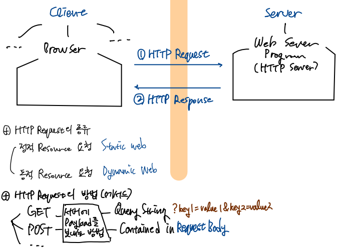
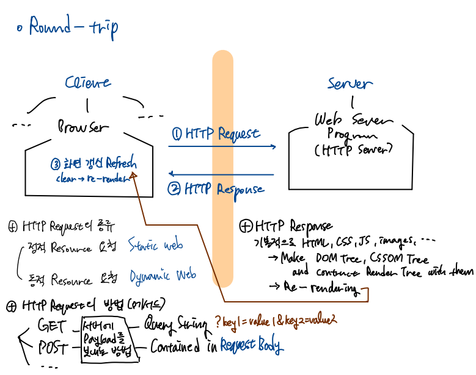
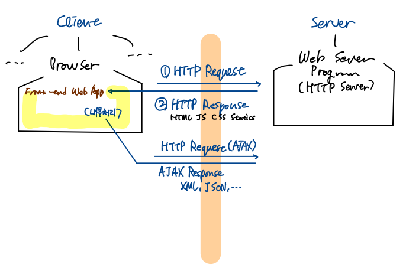
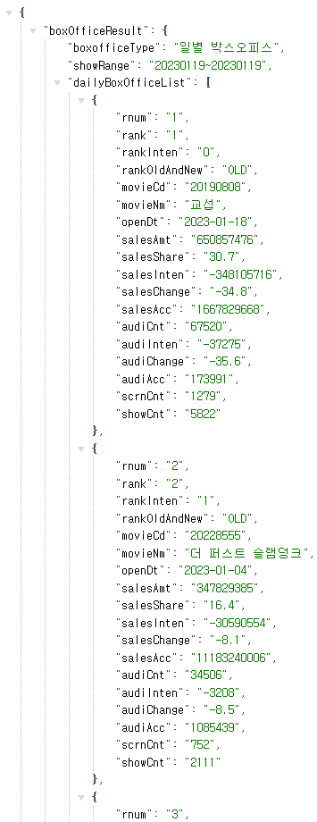

# AJAX 개념

## 복습

- selector: 원하는 요소 찾기

- method: 찾은 요소를 원하는 방식으로 제어

- event
  
  - HTML 인라인 방식으로 핸들러 등록
    
    ```html
    <button onclick="handleBtn()">버튼</button>
    ```
  
  - 자바스크립트에서 이벤트 핸들러 등록
    
    - 바닐라 자바스크립트 (다루지 않았음)
    
    - jQuery
      
      ```js
      $('button').on('click', function() {});
      ```

## AJAX 개요

자바스크립트 상에서 통신할 수 있는 기능

처음 자바스크립트 코드로 XML 기반 통신을 할 수 있도록 고안한 것은 마이크로소프트였으나, 도입 당시에는 호응되지 않았음. 도입 당시 성능 문제 등.

그러나 구글이 구글 맵스, 구글 어스 등 웹앱을 만들 때 이 기술을 사용하여 비동기 통신을 구현하면서 화제가 되었음.

다만 바닐라 자바스크립트로 처리하려면 코드가 복잡하고 구현이 난해하다는 문제가 있음. ([XMLHttpRequest - Web APIs | MDN](https://developer.mozilla.org/en-US/docs/Web/API/XMLHttpRequest)) jQuery를 사용하면 직관적이고 쉽게 구현이 가능. 혹은 axios와 같은 AJAX 전용 라이브러리를 사용할 수 있음.

## HTTP 통신 기초



이때, HTTP Request시,

- 정적 리소스 요청
  
  - HTML, CSS, JS, Image, Video...
  
  - 이미 작성된, 준비된 데이터 요청
  
  - Static web

- 동적 리소스 요청
  
  - 서버 사이드 프로그램을 실행하여 그 결과를 반환받고자 하는 경우
  
  - Dynamic web

Request의 방식: HTTP 스펙에는 8개의 메서드가 있으나, 4개 정도를 주로 사용. 지금은 GET, POST 정도를 숙지하기

- 클라이언트가 Request시 서버에 데이터(payload)를 실어 보낼 때가 있는데, 아래의 두 메서드는 그 방식에 있어 차이가 있음.

- GET 방식
  
  - Data를 URL의 뒤에 Query String으로 붙임
    
    - Query String은 '?'로 시작하여, key=value의 쌍으로 데이터를 표현. 구분자는 '&'
    
    - 예시: http://test.site/some-resource?key1=value1&key2=value2&key3=value3
  
  - 주의: Query String으로 데이터를 보낸다고 해서 무조건 GET 방식은 아님
  
  - 단점: URL에는 길이 제한이 있어 보낼 수 있는 데이터의 양에 한계가 있음

- POST 방식
  
  - Data를 Request Body 내에 key=value 쌍으로 포함하여 전송
  
  - 길이 제한이 없음.
  
  - 데이터가 Request Body 안에 들어가기 때문에 URL 뒤에 덧붙이는 GET 방식에 비해 비교적 노출되기 어려움
    
    - 그러나 보안성이 의미있게 향상되는 것은 아님. 암호화하지 않는 한 제3자가 볼 수 있음.

### GET 요청 방법

- 브라우저 주소창에 URL을 입력하고 엔터 입력시 GET 방식으로 요청 전송

- Link 클릭시 GET 방식으로 요청 전송
  
  ```html
  <a href="http://where.to.request/by/get">Click</a>
  ```

- 사용자 임력 양식(form)의 method를 GET으로 지정

> **HTML Form (사용자 입력 양식)**
> 
> 사용자가 정보를 입력할 수 있는 대화식 컨트롤 요소
> 
> 서버에 해당 정보를 전달하기 위함이므로 action 어트리뷰트에 서버의 엔트리포인트를, method에 요청 방식을 지정할 수 있음.

#### Form 예제

```html
<div class="container">
  <form action="http://www.naver.com/" method="GET"> <!-- 입력 컨트롤을 form 요소로 감싼다 -->
    <select name="addr">
      <option value="seoul">서울</option>
      <option value="daegoo">대구</option>
      <option value="busan">부산</option>
    </select>
    <br><br>

    이름: <input type="text" name="username">
    <!-- <input type="button" class="btn btn-primary" value="제출"> type="button" 인 경우 전송 X -->
    <input type="submit" class="btn btn-primary" value="제출"> <!-- Request -->
  </form>

  나이: <input type="text" name="age"> <!-- form 요소 밖에 있다면 전송되지 않는다 -->
</div>
```

### POST 요청 방법

- 사용자 임력 양식(form)의 method를 POST로 지정

## Round-trip 방식



위와 같이 매 요청마다 새로운 렌더 트리를 만들어 화면을 갱신하는 방식을 Round-trip 방식이라고 한다. 로직이 간단하고 구현이 쉬우며, 오랫동안 이러한 방식이 사용되어 왔다.

대다수의 비즈니스 로직은 백엔드 단에서 이뤄지므로 프론트엔드 구현이 간편하다. 서버에서 모든 처리를 거친 후 결과 화면까지 만들어 웹브라우저에 전송하고, 웹브라우저는 받은 Response 그대로 화면에 표시하면 된다.

그러나 단점도 있다.  

먼저 서버에 부하가 가중된다. 데이터 처리, DB 처리 및 기타 로직 처리까지 완료 후 클라이언트용 화면까지 작성하여 리스폰스를 만들어야 한다.

또한 트래픽이 늘어나며 네트워크 대역폭(bandwidth)이 커져야 한다. 화면을 구성하는 정적 리소스가 매번 요청할 때마다 서버에서 클라이언트로 전송되어야 하기 때문이다. 데스크탑 위주였던 2010년대까지의 웹 환경에서는 소요되는 데이터량이 큰 문제가 되지 않았지만, 모바일 시대로 변화한 현재 불필요한 데이터 교환은 줄여야 한다. 

## SPA (Single Page Application)

SPA를 개발하면 Round-trip 방식의 단점을 보완할 수 있다.

그러나 기존 방식을 대체하는 여러 새로운 기술과 인력을 필요로 하기 때문에 비용이 증가한다는 문제가 있다.



최초 HTTP Request시 웹앱 구동에 필요한 HTML, JS, CSS 등의 정적 리소스를 로드

이후 웹앱이 구동되면 AJAX 요청하여 비동기적으로 데이터 송수신. 이때 페이지 전체가 아닌 데이터 자체를 받아오며, 따라서 페이지 이동 및 렌더링이 이뤄지지 않음

웹앱이 자체적으로 받아온 데이터를 처리하여 화면 일부를 실시가능로 업데이트

백엔드 외에도 프론트엔드 웹앱을 개발해야하기 때문에 비용이 발생하는 것은 어쩔 수 없지만, 데이터만을 받아와 화면에서 변경할 부분만을 받아올 수 있다는 장점이 있음

## 데이터 표현

### 1. CSV

Comma Separated Value. 콤마로 구분된 값의 집합

```csv
이름, 나이, 지역
홍길동, 20, 서울
신사임당, 22, 부산
강감찬, 24, 대전
```

- 장점: 값 구분에 ','만을 사용하기 때문에 불필요한(redeundant) 데이터가 적다.
  
  - 따라서 데이터 양이 아주 많을 때 CSV로 표현하는 경우가 있음.
  
  - 데이터 분석 분야 등에서 자주 활용됨

- 단점: 계층 구조를 표현할 수 없어 데이터의 구조(포함관계 등)를 나타내기 어렵다.

### 2. XML

Extended Markup Language. 

```xml
<name>홍길동</name>
<addr>서울</addr>
<age>20</age>
```

- 장점: 데이터 구조 표현 가능. 이미 Parser가 많이 만들어져 데이터 처리가 간편

- 단점: 문서 구조 표현을 위해 필요한 불필요한 데이터가 많음. '이름=홍길동'을 표현하기 위해 '\<name\>홍길동\</name\>'를 입력.

### 3. JSON

JavaScript Object Notation

자바스크립트에서 객체를 표현하는 방법으로 데이터를 나타냄

```json
{
  "name": "홍길동",
  "age": 20,
  "addr": "서울"
}
```

자바스크립트와 직접적인 연관은 없으며, 오직 표현법만 따온 것임. 언어에 의존하지 않고 어떠한 환경에서든 자유롭게 사용 가능.

- 장점
  
  - 그럼에도 자바스크립트 객체로의 변환이 쉽다는 것은 맞기 때문에, 자바스크립트와 궁합이 좋으며 데이터 처리가 간편.
  
  - 계층 구조도 표현 가능.
  
  - 문서 구조 표현을 위해 필요한 불필요한 데이터가 들어감. 그러나 XML보다 덜하기 때문에 전체 용량이 훨씬 적음. 

최근에는 XML보다 JSON이 선호되나, 여전히 레거시 시스템에서는 XML이 이용되기 때문에 두 방식이 혼용

## Open API

공공기관, 기업 등에서 제공하는, 누구나 사용가능한 서버 사이드 프로그램 및 이에 접근할 수 있는 인터페이스

우리는 영화진흥위원회 일일 박스오피스 API를 사용하고자 함

[영화진흥위원회 오픈API 일일 박스오피스 API 서비스](https://www.kobis.or.kr/kobisopenapi/homepg/apiservice/searchServiceInfo.do?serviceId=searchDailyBoxOffice)

키를 발급받고, 문서를 꼼꼼히 읽어보자

### 샘플 요청

문서를 참고하여 base URL과 파라미터로 넣어줄 값을 정리해본다.

| 요청 변수    | 값       | 설명                                |
| -------- | ------- | --------------------------------- |
| key      | 문자열(필수) | 발급받은키 값을 입력합니다.                   |
| targetDt | 문자열(필수) | 조회하고자 하는 날짜를 yyyymmdd 형식으로 입력합니다. |

```
http://www.kobis.or.kr/kobisopenapi/webservice/rest/boxoffice/searchDailyBoxOfficeList.json

20230119

90dfd9c8e20f0795f7f84f5f4ccf15a0
```

이 값들을 쿼리 스트링 방식으로 base URL에 넣어주면 아래와 같을 것이다.

```
http://www.kobis.or.kr/kobisopenapi/webservice/rest/boxoffice/searchDailyBoxOfficeList.json?key=90dfd9c8e20f0795f7f84f5f4ccf15a0&targetDt=20230119
```

브라우저의 주소창에 입력하면 아래와 같은 응답을 받을 수 있다.



JSON의 각 키값은 레퍼런스 문서를 보면 알 수 있다.

| 응답 필드         | 값   | 설명                                            |
| ------------- | --- | --------------------------------------------- |
| boxofficeType | 문자열 | 박스오피스 종류를 출력합니다.                              |
| showRange     | 문자열 | 박스오피스 조회 일자를 출력합니다.                           |
| rnum          | 문자열 | 순번을 출력합니다.                                    |
| rank          | 문자열 | 해당일자의 박스오피스 순위를 출력합니다.                        |
| rankInten     | 문자열 | 전일대비 순위의 증감분을 출력합니다.                          |
| rankOldAndNew | 문자열 | 랭킹에 신규진입여부를 출력합니다.<br>“OLD” : 기존 , “NEW” : 신규 |
| movieCd       | 문자열 | 영화의 대표코드를 출력합니다.                              |
| movieNm       | 문자열 | 영화명(국문)을 출력합니다.                               |
| openDt        | 문자열 | 영화의 개봉일을 출력합니다.                               |
| salesAmt      | 문자열 | 해당일의 매출액을 출력합니다.                              |
| salesShare    | 문자열 | 해당일자 상영작의 매출총액 대비 해당 영화의 매출비율을 출력합니다.         |
| salesInten    | 문자열 | 전일 대비 매출액 증감분을 출력합니다.                         |
| salesChange   | 문자열 | 전일 대비 매출액 증감 비율을 출력합니다.                       |
| salesAcc      | 문자열 | 누적매출액을 출력합니다.                                 |
| audiCnt       | 문자열 | 해당일의 관객수를 출력합니다.                              |
| audiInten     | 문자열 | 전일 대비 관객수 증감분을 출력합니다.                         |
| audiChange    | 문자열 | 전일 대비 관객수 증감 비율을 출력합니다.                       |
| audiAcc       | 문자열 | 누적관객수를 출력합니다.                                 |
| scrnCnt       | 문자열 | 해당일자에 상영한 스크린수를 출력합니다.                        |
| showCnt       | 문자열 | 해당일자에 상영된 횟수를 출력합니다.                          |

이제 AJAX로 데이터를 받아 화면에 출력하는 코드를 작성해보자.

[KOSAjava/practice2.html at main · 0tak2/KOSAjava · GitHub](https://github.com/0tak2/KOSAjava/blob/main/Projects-With-JS/jquery_practice/2023-01-20/practice2.html)

[KOSAjava/practice2.js at main · 0tak2/KOSAjava · GitHub](https://github.com/0tak2/KOSAjava/blob/main/Projects-With-JS/jquery_practice/2023-01-20/js/practice2.js)