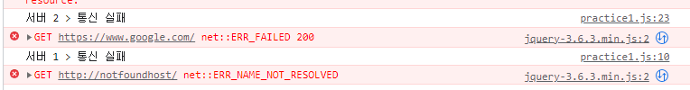

# 2. AJAX

## Blocking과 Non-blocking

### Blocking

```js
alert("Blocked"); // 경고창이 닫히기 전까지 코드 진행이 되지 않음
console.log("Hello");
```

블로킹 함수는 호출되어 모든 작업을 수행하고 리턴될 때까지 다음 코드가 실행되지 않는다. 한 작업이 끝나고 다음 작업으로 넘어가기 때문에 사람의 사고와 유사한 방식이라는 장점이 있다. 다만 한 번에 한 작업만 가능하므로 비효율적인 상황이 발생한다.

### Non-blocking

논 블로킹 함수는 작업이 모두 수행되기 전에 리턴되며, 따라서 호출 직후 다음 코드가 바로 실행된다. 따라서 논 블로킹 함수를 통해 비동기 작업 수행이 가능하다. (물론 모든 논 블로킹 함수가 비동기 작업을 수행하는 것은 아니다.)

예시로 jQuery의 AJAX 함수가 대표적인 Non-blocking 함수이다.

### Jquery.ajax()

ajax 함수는 대표적인 Non-blocking 함수.
호출 후 값을 받아오기 까지 물리적으로 시간이 소요될 수밖에 없다.
만약 이 작업을 동기적으로 수행한다면, 대기 시간 동안 프로그램이 멈추게 된다.
따라서 기본값으로 ajax는 Non-blocking 함수로서 비동기적으로 작동하도록 되어있다.

즉, ajax는 호출되자 마자 바로 리턴되며, 그 리턴 값은 당연히 서버의 응답 데이터가 아니다.
서버 응답 데이터는 ajax()에 넘겨준 콜백을 통해 받아 처리한다.

```js
let result = $.ajax({
    url: 'http://notfoundhost/', // 서버 url
    async: true,
    type: 'GET',
    dataType: 'json',
    success: function() {
        console.log('통신 성공');
    },
    error: function() {
        console.log('통신 실패');
    }
});
console.log(result); // 통신 실패 메시지가 나오기 전에 출력된다. 통신 실패 후 값이 변한다.
```

## 블로킹/논 블로킹과 동기/비동기

> - 동기: process가 실행한 순서대로 동작
> 
> - 비동기: process가 실행한 순서와 무관하게 동작

엄연히 말하면 블로킹/논 블로킹과 동기/비동기는 다른 개념이지만, 대개 동기 작업을 수행하기 위해 블로킹 함수를, 비동기 작업을 수행하기 위해 논 블로킹 함수를 사용한다.

```js
$.ajax({
    url: 'http://notfoundhost/', // 서버 url
    async: true,
    type: 'GET',
    dataType: 'json',
    success: function() { // 어떤 콜백이 먼저 실행될지 할 수 없다.
        console.log('서버 1 > 통신 성공');
    },
    error: function() {
        console.log('서버 1 > 통신 실패');
    }
});

$.ajax({
    url: 'https://www.google.com/', // 서버 url
    async: true,
    type: 'GET',
    dataType: 'json',
    success: function() {
        console.log('서버 2 > 통신 성공');ㅂ3ㅇㅌ1ㅂㅊ 
    },
    error: function() {
        console.log('서버 2 > 통신 실패');
    }
});
```



async에 false를 주면 동기적으로 실행된다. 그러나 ajax와 같은 처리를 동기적으로 수행하면 네트워크 상황에 따라 적지 않은 시간 동안 사용자와 상호작용할 수 없다. 따라서 이러한 처리는 지양해야만 한다.

## 박스오피스 웹앱 같이 만들어보기

저번 시간 과제였던 박스오피스 웹앱을 같이 만들어보자.

[KOSAjava/Projects-With-JS/jquery_practice/2023-01-25 at main · 0tak2/KOSAjava · GitHub](https://github.com/0tak2/KOSAjava/tree/main/Projects-With-JS/jquery_practice/2023-01-25)