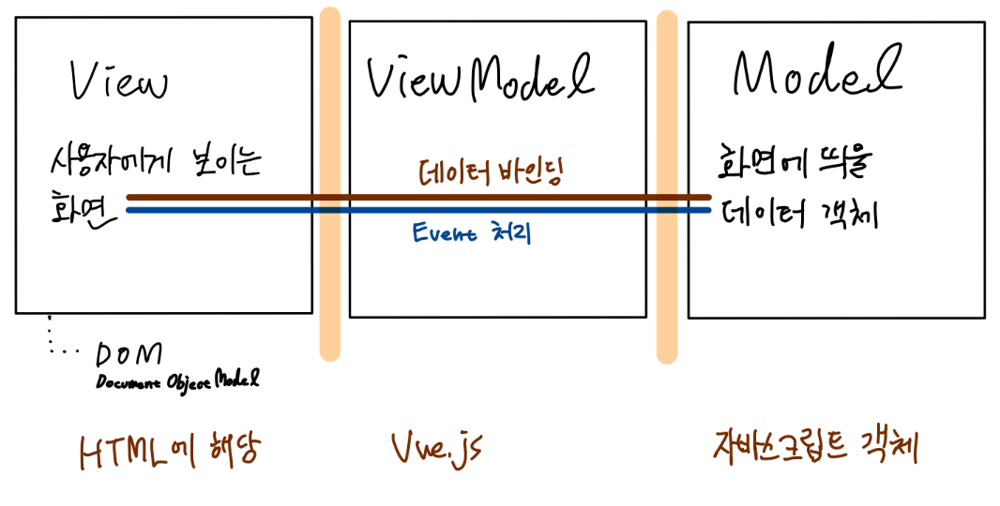
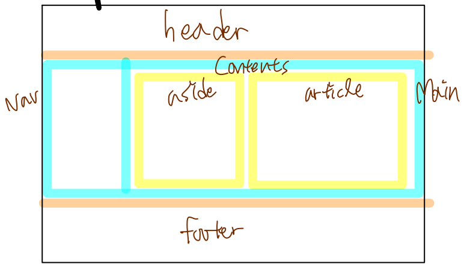
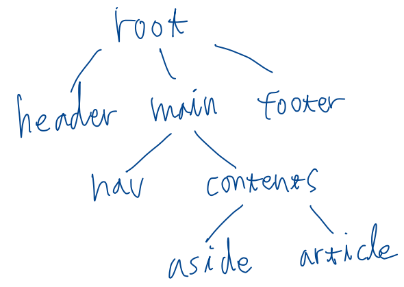
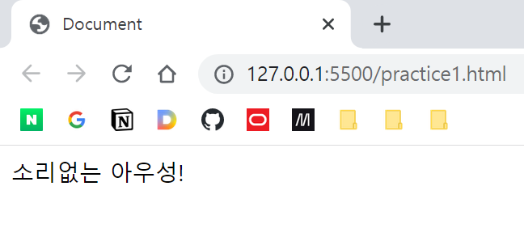
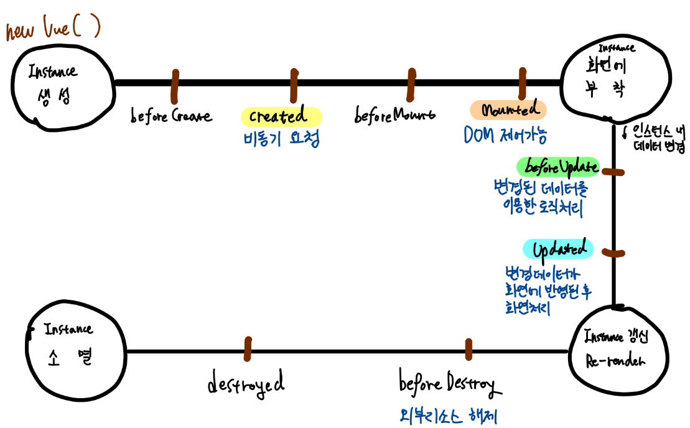
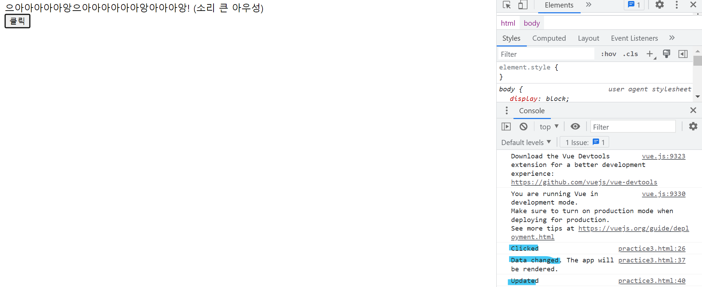

# 3. Vue.js 소개

## Vue.js 개요

웹페이지 화면을 개발하기 위한 **프레임워크**

라이브러리가 아님. 따라서 HTML과 JS를 분리하여 개발했던 이전의 jQuery와 다르게 JS 중심으로 정해진 방식에 따라 개발하게 됨.

뷰 외에도 Angular, React 등 다른 프론트엔드 프레임워크가 많음.  
Angular는 기능적으로는 탁월하지만, Typescript가 강제되는 등 불편한 점이 많고 국내 현업에서는 점점 사라지고 있음. 
React는 페이스북이 개발했으며, 많은 사용자가 있으나, JSX를 알아야하며, Vue보다 어려움.

Vue는 기존 프레임워크보다 난이도가 상대적으로 낮고, 국내 기업에서도 사용 사례가 늘어나고 있어서 우리는 Vue를 다룰 것임. Vue에 능숙해지고 프론트엔드에 관심이 더욱 생기면 React를 공부해보길 바람.

현재 2.x와 3.x가 혼용되고 있음. 최신은 3.x이지만, 현업에서는 2.x를 사용하는 경우가 아직 많음. 현업에서는 장기간 검증되었는지, 안정적인지가 기술을 선택하는 중요한 기준. 우리도 2.x를 사용하려고 함.

## Vue.js 구성 및 특성

1. 코어 라이브러리: 화면에 데이터 표현

2. 컴포넌트 기반: 화면 표시 요소를 컴포넌트라는 단위로 분할하여 재사용성과 유지보수성을 증대

3. 라우팅

4. 상태관리

단순히 jQuery가 제공했듯 화면 제어만 할 수 있는 것이 아니라, 프론트엔드 개발을 위한 다양한 기능을 함께 제공


### MVVM 패턴

MVC 패턴이 아닌 MVVM 패턴

Model-View-ViewModel  
M, V는 MVC와 같음.


MVC와 거의 비슷함.  
재사용성과 유지보수성을 높이는 것이 목표.

### 컴포넌트 기반 개발




화면을 작은 단위로 분할하여 개발함. 재사용성 증가.

## Vue.js 맛보기

### CDN 방식

[참고](https://v2.vuejs.org/v2/guide/installation.html#CDN)

Vue를 적용하고자 하는 HTML 문서에 CDN 주소를 추가한다.

```html
<script src="https://cdn.jsdelivr.net/npm/vue@2.7.14/dist/vue.js"></script>
```

그 후 body root에 "app"을 id로 갖는 div를 만든다.

```html
<body>
    <div id="app">
        {{ message }}
    </div>

    <script>
        // Vue Instance 생성
        new Vue({ // 포함한 Vue 소스코드에 위치. VUe 인스턴스 생성
            el: '#app', // el 속성
            data: { // data 속성
                message: '소리없는 아우성!'
            }
            // 생성자 함수에 대한 더 자세한 정보는 공식 문서를 참고
            // https://v2.vuejs.org/v2/guide/instance.html
        }); 
    </script>
</body>
```



message에 지정한 데이터가 바인딩되었다.

## Vue Instance

### 개요

Vue로 화면을 개발하기 위해 필수적으로 생성해야하는 기본 단위
여러 개 만들어 각 화면에 바인딩할 수 있음

```js
new Vue()
```

생성자 함수의 인자로는 객체를 넘기게 됨. [참고](https://v2.vuejs.org/v2/guide/instance.html)

- el
- data
- methods
- 라이프사이클 관련 훅

### 유효범위

Vue Instance는 el에 지정한 HTML 요소 안에서만 유효함.

### 라이프사이클



이미 8가지의 상태가 정의되어있으며, 상태가 변할 때마다 자동적으로 콜백(훅)이 호출됨. 필요한 경우 각각을 오버라이딩하여 사용할 수 있음. [참고](https://v2.vuejs.org/v2/guide/instance.html#Instance-Lifecycle-Hooks)

1. beforeCreate
    - 라이프사이클 단계 중에서 인스턴스가 생성되고 가장 처음 실행
    - Vue 객체가 화면에 부착되기 전
    - data 속성에 접근할 수도 없음
2. *created*
    - beforeCreate 이후 호출됨
    - data 속성과 method 속성에 접근 가능
    - **일반적으로 이 시점에서 AJAX와 같이 데이터를 받아오는 작업을 수행**
3. beforeMount
    - 생성된 Vue 객체를 화면에 부착하는 것이 Mount 작업
    - Mount 되기 전의 시점에 호출됨
    - 화면에 아직 mounted 되지 않았기 때문에 화면 제어 불가
4. *mounted*
     - Vue 객체 Mounted 직후 호출
     - Mount가 완료된 상태이기 때문에 화면제어 가능
     - **DOM 제어**

```javascript
<div id="app">
    {{ message }}

    <div id="myDiv1"></div>
    <div id="myDiv2"></div>
</div>

<script>
    new Vue({
        el: '#app',
        data: {
            message: '소리없는 아우성!'
        },
        methods : {
            myFunc: function() {
                console.log('Invoked myFunc()');
            }
        },
        beforeCreate: function() {
            // beforeCreate 훅 메서드
            // 라이프사이클 단계 중에서 인스턴스가 생성되고 가장 처음 실행
            console.log('[!] beforeCreate');

            // 아직 Vue 객체에 대해 data, methods 속성이 정의되지 않은 시점.
            // 화면에 Vue 객체가 부착되기도 전.
            console.log(this.message); // this.data.message, this.methods.myFunc 등은 잘못.
            this.myFunc();
        },
        created: function() {
            console.log('[!] created');
            console.log(this.message);
            this.myFunc();
        },
        beforeMount: function() {
            console.log('[!] beforeMount');
            const myDiv = document.getElementById('myDiv1')
            myDiv.innerText = '마운트 완료되지 않음 (beforeMount)' // Not Working
        },
        mounted: function() {
            console.log('[!] mounted');
            const myDiv = document.getElementById('myDiv2')
            myDiv.innerText = '마운트 완료됨 (mounted)'
        },
    }); 

</script>
```


Instance가 갱신(내부 데이터 변경)되면 화면이 다시 그려지게 됨(update)

5. *beforeUpdate*
    - 데이터가 변경되었으나 화면이 업데이트되기 전에 호출되는 훅
    - **변경된 데이터를 이용한 로직 처리**
6. *updated*
    - 데이터가 변경되어 화면이 다시 그려진 후 호출되는 훅
    - **변경된 데이터가 화면에 반영된 후 화면제어**
    - 여기에서 데이터를 변경하면 beforeUpdate <--> updated의 무한 루프에 빠질 수 있음

```javascript

```

7. beforeDestroy
    - Vue 인스턴스 소멸 전에 호출되는 훅
    - 외부 자원 해제 필요시 여기서 하면 됨
    - 다만 대부분의 데이터는 자바스크립트 엔진에 의해 가비지콜렉트 됨
8. destroyed
    - 소멸 이후 호출됨



### 반응성
데이터가 변하면 자동으로 화면이 업데이트됨. 이것이 View Model으로서의 Vue가 해주는 역할. DOM을 일일이 조작할 필요 없이 데이터만 변경해주면 됨.

## Vue Component

### 컴포넌트 개요

컴포넌트는 상술했듯 화면을 구조화하기 위한 단위. 가장 상위에 Root 컴포넌트가 있고, 그 아래에 여러 컴포넌트가 포함될 수 있음. 즉, 계층 구조를 띄게 됨.

### 컴포넌트의 특성

#### 컴포넌트의 표현

컴포넌트는 자바스크립트 객체로 표현될 수 있음.  
Vue가 정의한 방법으로 객체를 만들어야 하며, 그 안에는 화면 일부를 구성하는 HTML 요소도 포함하고 있음.

#### 컴포넌트의 등록

컴포넌트는 두 가지 형태로 등록하여 사용할 수 있음.

- 전역 컴포넌트 Global component: 여러 뷰 인스턴스에서 공통적으로 사용이 가능
- 지역 컴포넌트 Local component: 특정 인스턴스 내에서만 유효함

##### 전역 컴포넌트의 등록

Vue 생성자 함수의 프로퍼티인 component 함수를 이용하면 됨. 인자로 컴포넌트 이름과, 컴포넌트에 대한 option 객체를 넘겨줌.

이때 컴포넌트의 이름은 소문자 케밥 컨벤션을 따름.

```javascript
<div id="app">
    {{ myMsg }}
    <button>세요</button>

    <my-component></my-component> <!-- 전역으로 등록했기 때문에 어디서든 호출 가능 -->
</div>

<script>
    // 전역 컴포넌트 등록
    Vue.component('my-component', {  // 이름 컨벤션: 소문자 케밥 스타일
        template: '<div>DIV 전역 컴포넌트</div>'
    });

    new Vue({
        el: '#app',
        data: {
            myMsg: "안녕하"
        }
    });
</script>
```

##### 지역 컴포넌트의 등록

컴포넌트가 될 객체를 정의하고, Vue 생성자 함수를 호출할 때, option 객체의 components 속성에 '컴포넌트 이름: 컴포넌트 객체'와 같은 형태로 넣어주면 된다.

```javascript
<div id="app1">
    {{ myMsg }}
    <button>세요</button>

    <my-component-g></my-component-g> <!-- 전역으로 등록했기 때문에 어디서든 호출 가능 -->
    <my-component-l></my-component-l>
</div>

<div id="app2">
    {{ myMsg }}
    <my-component-g></my-component-g> <!-- 정상적으로 표시됨 -->
    <my-component-l></my-component-l> <!-- 표시되지 않음 -->
</div>

<script>
    // 전역 컴포넌트 등록
    Vue.component('my-component-g', {  // 이름 컨벤션: 소문자 케밥 스타일
        template: '<div>DIV 전역 컴포넌트</div>'
    });

    // 지역 컴포넌트 등록
    let cmp = {
        template: `
            <div>
                DIV 지역 컴포넌트
            </div>
        `
    };

    new Vue({
        el: '#app1',
        data: {
            myMsg: "안녕하"
        },
        components: {
            'my-component-l': cmp
        }
    });

    new Vue({
        el: '#app2',
        data: {
            myMsg: "두번째 앱"
        }
    });
</script>
```

