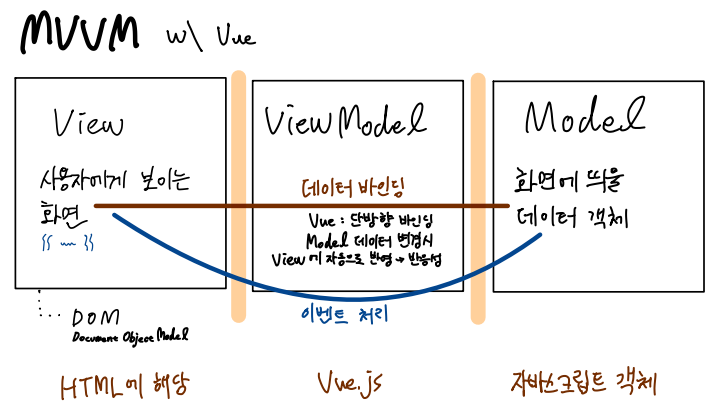
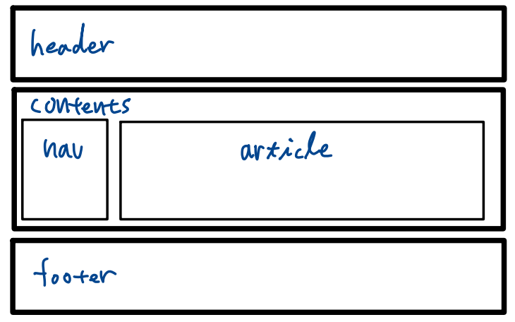
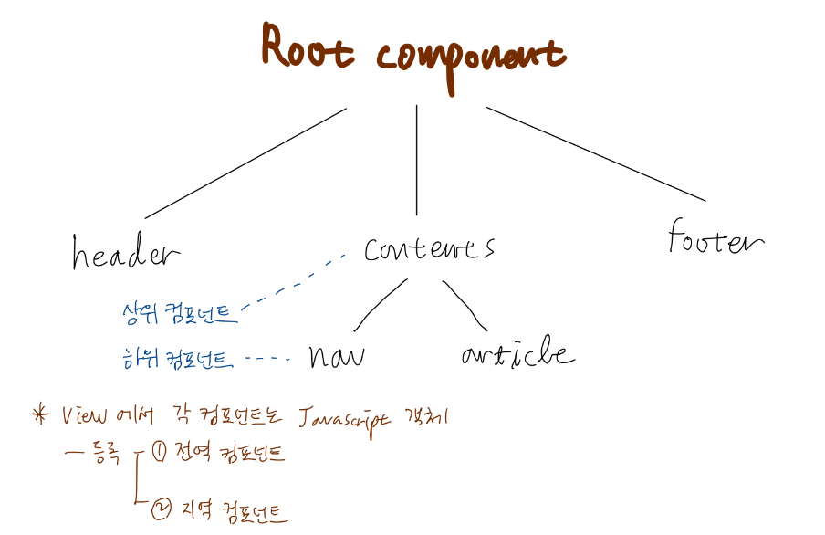

# 복습

## MVVM 패턴

웹 UI 개발시 주로 MVVM 패턴 사용 (Model-View-ViewModel)

## 컴포넌트 기반 개발

### 다이어그램

### Root Component

어제 실습을 기억해보자. (지역 컴포넌트로 등록하는 경우) 뷰 인스턴스를 생성할 때 option 객체에 사용할 컴포넌트를 넘겨주었다. 이후 뷰 인스턴스가 마운트된 div 요소 내에서 해당 컴포넌트 이름으로 태그를 사용하였다. 이러한 과정에서 체감 가능하듯이, Root 컴포넌트는 Vue 인스턴스 자체가 된다. Vue 인스턴스를 Root로 하여 그 하위 컴포넌트로 각종 컴포넌트가 계층 구조로 위치하게 되는 것이다.

