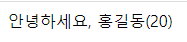

# Vue 인스턴스

## option 객체의 여러 속성

### template

```javascript
<div id="app">
    안녕하세요
</div>

<script>
    // Vue Instance 생성
    new Vue({ // Vue Instance 자체가 Root Component
        el: '#app',
        template: ` // template 속성이 존재하면, 요소의 내용을 template 속성값으로 치환.
            <div>소리없는 아우성!</div>
        `
    }); 

</script>
```

### data

```javascript
<div id="app">
    안녕하세요, {{myName}}({{myAge}})
</div>

<script>
    // Vue Instance 생성
    new Vue({ // Vue Instance 자체가 Root Component
        el: '#app',
        data: {
            myName: '홍길동',
            myAge: 20
        }
    }); 

</script>
```



{{ }} 내에 자바스크립트 구문을 입력하는 것을 머스태쉬 문법이라고 하며, 해당 구문의 결과가 {{ }} 내에 보간(Interpolation)된다.

자바스크립트 구문이 들어가는 것이므로 다음도 가능하다.

```javascript
<div id="app">
    안녕하세요, {{this.myName}}({{this.myAge}})
</div>

<script>
    // Vue Instance 생성
    new Vue({ // Vue Instance 자체가 Root Component
        el: '#app',
        data: {
            myName: '홍길동',
            myAge: 20
        }
    }); 

</script>
```

data 객체 내에 데이터를 넣는 방법은 Vue 인스턴스 생성 시에만 사용 가능하다. 다른 컴포넌트와 구별되는 특별한 루트 컴포넌트이기 때문이다.

### components

#### 전역 컴포넌트

```javascript
<div id="app">
    안녕하세요, {{myName}}({{myAge}})
</div>

<script>
    // 전역 컴포넌트 등록
    let myCmp = {
        template: `
            <div>전역 컴포넌트 영역</div>
        `
    };
    Vue.component('my-component', myCmp); // 컴포넌트 이름, 컴포넌트 option 객체
    // 컴포넌트 이름 -> 태그 명으로 사용
    // 컨벤션
    //     1. 소문자 케밥 케이스가 권장됨 (my-component)
    //     2. 두 단어 이상이 권장됨
    //     3. 케밥 케이스가 싫다면 파스칼케이스 사용 (MyComponent)

    new Vue({ // Vue Instance 자체가 Root Component
        el: '#app',
        data: {
            myName: '홍길동',
            myAge: 20
        }
    }); 

</script>
```

우선 option 객체를 만들어두고, Vue.component()에 컴포넌트의 이름과 함께 객체를 넘겨 등록. 이때 컴포넌트의 이름은 다음 컨벤션을 따름.

1. 소문자 케밥 케이스가 권장됨 (my-component)
2. 두 단어 이상이 권장됨
3. 케밥 케이스가 싫다면 파스칼케이스 사용 (MyComponent)

등록한 이름을 태그 명으로 사용할수 있으며, 태그는 Vue Instance의 유효 범위 내에서 유효하다.

#### 지역 컴포넌트 (component 속성 이용)

```javascript
<div id="app">
    안녕하세요, {{myName}}({{myAge}})
    <gl-component></gl-component>
    <lo-component></lo-component>
</div>

<script>
    // 전역 컴포넌트
    let glCmp = {
        template: `
            <div>전역 컴포넌트 영역</div>
        `
    };

    // 지역 컴포넌트
    Vue.component('gl-component', glCmp);
    let loCmp = {
        template: `
            <div>지역 컴포넌트 영역</div>
        `
    }

    new Vue({ // Vue Instance 자체가 Root Component
        el: '#app',
        data: {
            myName: '홍길동',
            myAge: 20
        },
        components: {
            'lo-component': loCmp
        }
    }); 

</script>
```

지역컴포넌트는 등록한 Vue Instance의 유효 범위 내에서만 사용 가능


