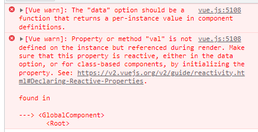
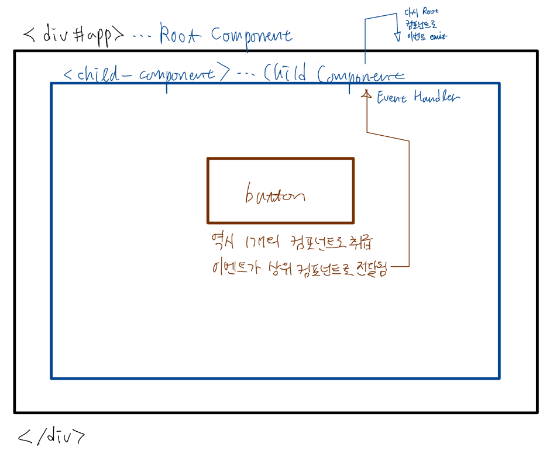
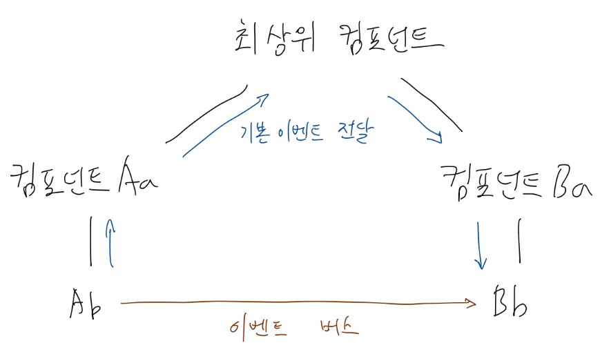

# Vue 컴포넌트

## data 속성

### 컴포넌트의 data

Vue 인스턴스(루트 컴포넌트)와 다른 일반 컴포넌트는 data 객체를 취급하는 방법에 있어 다소 차이가 있음. Vue 인스턴스 생성 시에나 컴포넌트 생성 시에나  넘겨주는 option 객체에 data 속성이 있음.

이때, Vue 인스턴스 생성 시에는 data 속성에 객체 자체를 넣어주지만, 컴포넌트 생성 시에는 data 속성에 객체를 리턴하는 함수를 넣어줘야 함.

> When defining a **component**, `data` must be declared as a function that returns the initial data object, because there will be many instances created using the same definition. If we use a plain object for `data`, that same object will be **shared by reference** across all instances created! By providing a `data` function, every time a new instance is created we can call it to return a fresh copy of the initial data. [Vue 문서](https://v2.vuejs.org/v2/api/#Options-Data)

아래와 같이 컴포넌트에 대해 data 속성을 순수 객체로 지정하면 에러가 발생한다.

```javascript
<div id="app">
    {{ myName }}, 안녕하세요
    <global-component/>
</div>

<script>
    Vue.component('global-component', {
        template: `
            <div>
                변수의 값은: {{ val }}    
            </div>
        `,
        data: {
                val: 'testtest1234'
        }
    })

    new Vue({
        el: '#app',
        data: {
            myName: '홍길동'
        }
    });
</script>
```



아래와 같이 수정하면 정상적으로 동작한다.

```javascript
Vue.component('global-component', {
    template: `
        <div>
            변수의 값은: {{ val }}    
        </div>
    `,
    data: function() {
        return {
            val: '소리 큰 아우성: 아아아아아아아아아아악!!!'
        }
    }
})
```


ES6부터 도입된 [메서드 표현법](https://developer.mozilla.org/en-US/docs/Web/JavaScript/Reference/Functions/Method_definitions)으로 아래와 같이 줄여 쓸 수도 있다.

```javascript
Vue.component('global-component', {
    template: `
        <div>
            변수의 값은: {{ val }}    
        </div>
    `,
    data() {
        return {
            val: '소리 큰 아우성: 아아아아아아아아아아악!!!'
        }
    }
})
```

### 이유

아래와 같이 하나의 컴포넌트를 여러 번 사용한다고 해보자.

```javascript
<div id="app">
    {{ myName }}, 안녕하세요
    <global-component/>
    <global-component/>
    <global-component/>
    <global-component/>
    <global-component/>
</div>
```

\#app 내부에 <global-component/>를 사용하면,  Vue는 'global-component'라는 이름으로 등록된 option 객체로부터 컴포넌트 객체를 생성해 DOM의 해당 위치에 넣어줄 것이다.

이때, data에 순수 객체가 들어간다면 여러 개의 <global-component/>가 하나의 data 객체를 공유할 수 있고, 따라서 예기치 않은 문제가 발생할 수 있다. 따라서 data 속성에 객체(초기 data 값)를 리턴하는 함수를 넣어 컴포넌트가 생성될 때마다 새로운 객체를 생성하도록 한 것이다. 이 글 상단의 Vue 문서 인용에도 관련 내용이 있으니 참고.

### 컴포넌트의 스코프와 data

컴포넌트의 데이터는 스코프가 각 컴포넌트로 한정됨.  
아래와 같은 소스 코드에서,

```javascript
<script>
    let cmp1 = {
        template: `
            <div>
                첫번쨰 지역 컴포넌트: {{ cmp1Data }}
            </div>
        `,
        data() {
            return {
                cmp1Data: 100
            }
        }
    }

    let cmp2 = {
        template: `
            <div>
                두번째 지역 컴포넌트: {{ cmp2Data }}
            </div>
        `,
        data() {
            return {
                cmp2Data: 100 // 첫번째 컴포넌트의 data를 직접 참조 -> 불가능
            }
        }
    }

    new Vue({
        components: {
            'component-one': cmp1,
            'component-two': cmp2
        }
    });
</script>
```

component-two는 애초에 스코프가 다르기 때문에, component-one의 data에 직접 접근할 수 없음. 그렇다면 두 컴포넌트 사이의 데이터 공유는 어떠헥 할 수 있을까?

두 개 이상의 컴포넌트가 데이터를 공유해야하는 상황은 적지 않다. 예컨대, 검색 컨트롤 컴포넌트와, 검색 결과 표시 컴포넌트가 있다고 하자. 검색창에 사용자가 입력한 문자열을 검색 결과 컴포넌트에 전달해야 값을 받아와 화면에 표시할 수 있을 것이다. Vue는 이를 위해 다른 몇가지 방법을 제공한다.

- 상하 관계의 두 컴포넌트가 있을 때,
    - 상위 컴포넌트는 하위 컴포넌트에 데이터를 전달할 수 있다. [Props]
    - 하위 컴포넌트는 상위 컴포넌트에 이벤트를 전달하여 데이터를 공유해줄 수 있다.
        - 이벤트는 그 자체로 데이터 전달 목적으로 고안된 개념은 아니지만, 이벤트 객체에 데이터를 넣어서 전달할 수 있다.

## Props: 상위 → 하위

```javascript
<div id="app">
    <!-- 3. 컴포넌트 배치 및 prop 넘겨주기 -->
    <!-- v:bind 디렉티브 사용 // 어트리뷰트 네임으로는 prop명을 케밥 스타일로 바꾸어 씀 -->
    <child-component v-bind:msg-from-parent="msg" v-bind:another="num"></child-component>
</div>

<script>
    // [상위] Vue Instance ───────┬──────> [하위] 전역 컴포넌트
    //                          props

    // 1. 컴포넌트 하나를 전역 컴포넌트로 등록 후,
    Vue.component('child-component', {

        // [간편] 배열로 props 지정
        // props: ['msgFromParent', 'another'], // 일반적으로 prop명은 카멜 케이스로 쓴다

        // [권장] 객체 리터럴로 props 지정. prop별 타입 지정 가능
        props: {
            msgFromParent: String, // value에 데이터 타입을 나타내는 생성자 함수 지정
            another: Number
        },
        template: `
            <div>
                자식 컴포넌트: <br>
                My parent says "{{ msgFromParent }}" <br>
                Today's lucky number is {{ another }}
            </div>
        `
    });

    // 2. 해당 컴포넌트를 Vue 인스턴스에 하위 컴포넌트로 등록
    new Vue({
        el: '#app',
        data: {
            msg: 'Hi, there~',
            num: 100
        }
    });

</script>
```

## Event: 하위 → 상위

### 개요



하위 컴포넌트에서 상위 컴포넌트로 데이터를 전달하려면 하위 컴포넌트에서 사용자 정의 event emit하여 상위 컴포넌트에서 받으면 됨

### 실습

```javascript
<div id="app">
    <child-component v-on:print_msg="printMsg"></child-component> <!-- 하위 컴포넌트에서 emit한 이벤트를 받을 수 있도록 처리 -->
</div>

<script>
    // 전역 컴포넌트를 루트 컴포넌트 하위에서 사용
    Vue.component('child-component', {
        template: `
            <div>
                <button v-on:click="childFunc">클릭</button>    
            </div>
        `,
        data() {
            return {
                myVar: 200
            };
        },
        methods: {
            // 여기에 버튼에 대한 이벤트 핸들러가 있어야 함
            childFunc() { // 혹은 축약하지 않고: childFunc: function() { ... }
                this.$emit('print_msg', 100, 'Hello', {
                    msg: '전달된 이벤트'
                }); // 이벤트를 발생시킴. 사용자 정의 이름과 추가적인 데이터 지정 가능
            }
        }
    });

    new Vue({
        el: '#app',
        methods: {
            printMsg(...args) {
                console.log('이벤트 발생');

                args.forEach((item) => {
                    console.log(item);
                })
            }
        }
    })
</script>
```
그렇다면 상하위 관계가 아니라, 같은 계층 (형제 관계)에 있는 컴포넌트 간의 데이터 전달은 어떻게 할 수 있을까?

지금까지 배운 방법을 통해 다이렉트로 데이터를 교환하는 것은 불가능하다. 두 컴포넌트에 대해 공통적인 상위 컴포넌트를 마련하여 데이터를 중계해줘야 한다. 즉, 데이터 전달을 위해 필요하지도 않은 브릿지 컴포넌트를 만들어야 되는 것이다.

대안 중 하나가 이벤트 버스이다. 이벤트 버스를 이용하면 계층 구조에 있지 않은 컴포넌트 사이에도 이벤트를 주고 받을 수 있다.  
그러나 이벤트를 주고 받는 컴포넌트가 많아지면 코드가 복잡해지게 된다는 한계점이 있다. 따라서 vuex와 같은 상태관리 라이브러리가 필요해지게 되는 것이다.

## Event Bus



```javascript
<div id="app">
    <child-component></child-component>
</div>

<script>
    // 이벤트 버스를 이용하기 위해 Vue Instane 생성
    let eventBus = new Vue(); // option 객체 없이 생성자 함수 호출 빛 변수에 할당

    // 하위 컴포넌트 전역 등록
    Vue.component('child-component', {
        template: `
            <button v-on:click="btnClick">클릭</button>
        `,
        methods: {
            btnClick() {
                // 이벤트 버스에 대해 이벤트 발생
                eventBus.$emit('simpleEvent', 200);
            }
        }
    });

    new Vue({
        el: '#app',
        created() {
            eventBus.$on('simpleEvent', function(value) {
                console.log('이벤트 버스에 대해 이벤트 발생gka', value)
            })
        }
    })
</script>
```
이벤트 버스 용도로 사용하기 위해 빈 Vue 인스턴스 생성

eventBus.$emit()를 통해 이벤트 버스에 대해 특정 이벤트를 발생시키고,  
eventBus.$on()을 통해 해당 이벤트에 대한 리스너를 등록할 수 있음.

위에서는 인스턴스 생성 직후 이벤트 리스너를 등록하기 위해 라이프사이클 훅 중 created를 이용하였음.