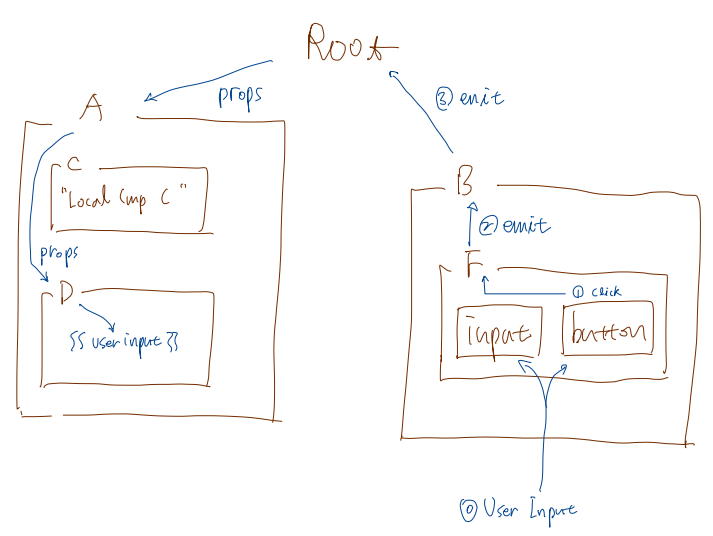
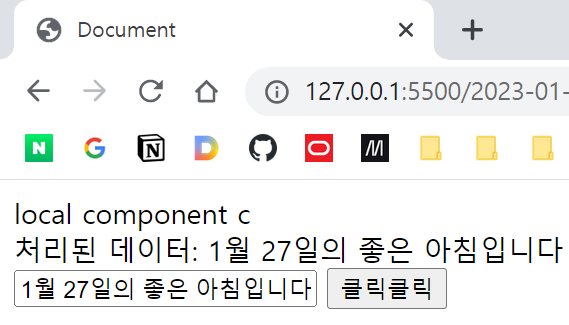

# 연습문제 풀이
## 개요
어제의 연습문제 풀이  
아래와 같이 여러 컴포넌트가 계층적으로 구성되어 있을 때, 컴포넌트 F의 텍스트필드의 입력 값을 컴포넌트 D의 div에 출력하라. 이때 컴포넌트 A, B는 전역 컴포넌트이며, 나머지 컴포넌트는 지역 컴포넌트이다.





## 소스 코드
```javascript
<div id="app">
    <global-component-a v-bind:input-data="input"></global-component-a>
    <global-component-b v-on:event-b="handleEvent"></global-component-b>
</div>

<script>
    Vue.component('global-component-a', {
        template: `
            <div>
                <local-component-c></local-component-c>
                <local-component-d v-bind:input-data="inputData"></local-component-d>
            </div>`,
        components: {
            'local-component-c': {
                template: '<div>local component c</div>'
            },
            'local-component-d': {
                template: '<div>처리된 데이터: {{ inputData }}</div>',
                props: {
                    inputData: String
                }
            }
        },
        props: {
            inputData: String
        }
    });

    Vue.component('global-component-b', {
        template: '<local-component-f v-on:event-f="myFunc"></local-component-f>',
        components: {
            'local-component-f': {
                template: `
                <div>
                    <input type="text">
                    <button v-on:click="btnClick">클릭클릭</button>
                </div>
                `,
                methods: {
                    btnClick: function() {
                        let val = $('input[type="text"]').val();
                        console.log('F got an input data from the user: ', val);

                        console.log('F will emeit an event to B: ', val);
                        this.$emit('event-f', val);
                    }
                }
            }
        },
        methods: {
            myFunc: function(data) {
                console.log('B got the event from F: ', data);
                console.log('B will emeit an event to root: ', data);
                this.$emit('event-b', data);
            }
        }
    });

    new Vue({
        el: '#app',
        methods: {
            handleEvent: function(data) {
                console.log('Root got the event from B: ', data);
                this.input = data;
                console.log('Root set data to: ', data);
            }
        },
        data: {
            input: ''
        }
    });
</script>
```
