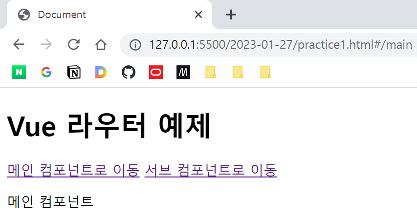

# 2. 라우팅
## 개요

SPA에서 URL 주소에 따른 페이지 이동을 구현하는 방법. 실제로 페이지 전체가 새로고침되는 것이 아니라, 주소에 따라 컴포넌트 일부분이 교체되거나 재렌더링되기 때문에 매끄럽게 화면이 전환되는 것이 특징임.

보통은 바닐라 자바스크립트를 사용하지 않고 외부 라이브러리를 통해 구현. 대표적으로 router.js가 범용적으로 사용되나, Vue 진영에서는 Vue.js가 공식적으로 제공하는 라이브러리인 Vue Router를 많이 사용함. 우리도 Vue Router를 사용할 것임.

## 맛보기

Vue.js와 마찬가지로 CDN을 통해 Vue Router 소스 코드를 임포트하여 사용할 것. 주의할 점은 Vue 2.x에 맞는 Vue Router 3를 사용해야한다는 것. 최신 버전인 Vue Router 4는 Vue 3.x에 호환된다.

```html
<!-- Vue.js -->
<script src="https://cdn.jsdelivr.net/npm/vue@2.7.14/dist/vue.js"></script>

<!-- Vue Router -->
<script src="https://unpkg.com/vue-router@3.5.3/dist/vue-router.js"></script>
```

Vue Router에서는 anchor 태그 대신 router-link 태그를 사용하여 태그를 표현한다.

```html
<router-link to="">메인 컴포넌트로 이동</router-link>
<router-link to="">서브 컴포넌트로 이동</router-link>
```

html에서 경로에 따라 동적으로 변화해야하는 부분은 router-view 태그를 이용하여 정의한다.

```html
<router-view></router-view>
```

경로에 따른 컴포넌트를 사전에 정의해줘야 한다. 우선 컴포넌트로 등록할 객체를 정의하고, 경로를 설정해준다.
```javascript
// 메인 컴포넌트와 서브 컴포넌트 정의
let mainComponent = {
    template: `
        <div>
            메인 컴포넌트
        </div>
    `
};

let subComponent = {
    template: `
        <div>
            서브 컴포넌트
        </div>
    `
};

// 경로 설정 -- 배열 이용
let routes = [
    {
        path: '/main',
        component: mainComponent
    },
    {
        path: '/sub',
        component: subComponent
    }
];
```

경로 정보를 담은 배열을 이용해 Vue Router 객체를 생성할 수 있다. → VueRouter() 생성자 함수 이용

```javascript
let router = new VueRouter({
    routes // 'routes: routes'와 같다.
});
```

이렇게 만든 라우터를 Vue 인스턴스에 넣어준다.

```javascript
new Vue({
    el: '#app',
    router
});
```



경로에 따라 지정된 컴포넌트가 렌더링된다.

