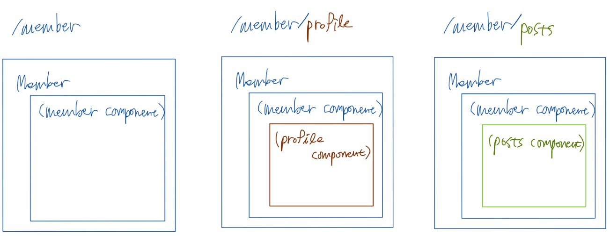
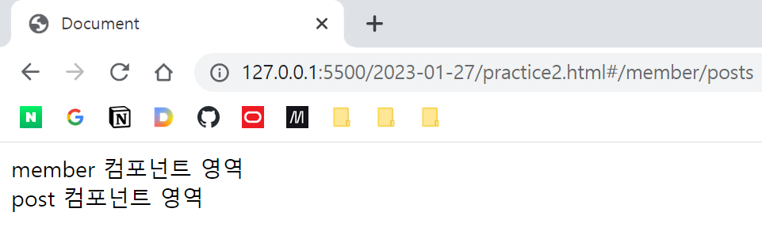

# 뷰 라우터 (1) - Nested Routing

## 개요

상위 컴포넌트 하나에 하위 컴포넌트 여러 개를 포함하는 식으로 라우팅을 할 수도 있다.  
예를 들면 아래와 같은 상황이 있을 수 있다. 네스티드 라우팅 기법을 활용하면 간편하게 경로별로 분기할 수 있다.



## 실습

```html
<div id="app">
    <router-view></router-view>
</div>

<script>
    // member 컴포넌트
    let memberComponent = {
        template: `
            <div>
                <span>member 컴포넌트 영역</span>
                <router-view></router-view>    
            </div>
        ` // router-view가 내부에 다시 등장 [Nested Routing]
    };

    // profile 컴포넌트
    let profileComponent = {
        template: `
            <div>
                <span>profile 컴포넌트 영역</span>
            </div>
        `
    };

    // post 컴포넌트
    let postsComponent = {
        template: `
            <div>
                <span>post 컴포넌트 영역</span>
            </div>
        `
    };

    // 경로 설정
    let routes = [{
            path: '/member',
            component: memberComponent,
            children: [
                {
                    path:'profile', // /member/profile -- 여기에는 앞에 슬래시 안 붙임
                    component: profileComponent
                },
                {
                    path: 'posts',
                    component: postsComponent
                }
            ]
    }];

    // Vue 라우터 객체 생성 후 Vue 인스턴스에 넣어줌
    let router = new VueRouter({
        routes
    });

    new Vue({
        router
    }).$mount('#app');
</script>
```
router-view가 root 컴포넌트에도 있으며, 뷰 라우터에 의해 root 컴포넌트의 roter-view에 마운팅될 member 컴포넌트에도 있다.

routes를 지정할 떄에 children 속성에 네스티드 될 라우트 정보를 명시해주었다.




