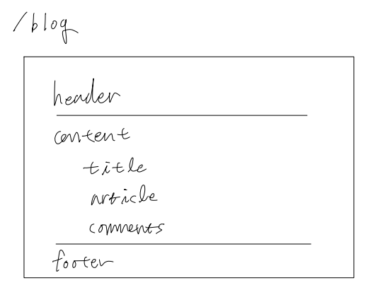
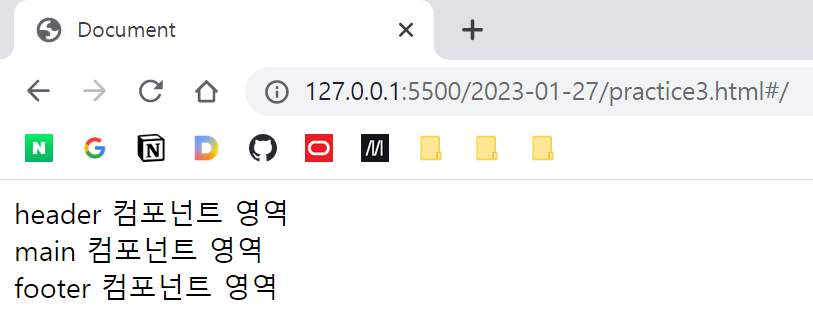

# 뷰 라우터 (2) - Named-View
## 개요

Nested 라우팅처럼 상하위 구조의 컴포넌트가 아니라, 여러 개의 컴포넌트를 같이 렌더링하는 기법



하나의 경로에 여러가지 컴포넌트를 원하는 위치 곳곳에 넣을 수 있음

\<router-view name=""\>을 이용

## 실습

```javascript
<div id="app">
    <router-view name="header"></router-view>
    <router-view></router-view> <!-- 이름이 없으면 default로 취급되며, 한 개만 있을 수 있음 -->
    <router-view name="footer"></router-view>
</div>

<script>
    // 각 위치에 넣어줄 세 개의 컴포넌트 작성
    let headerCmp = {
        template: `
        <div>
            header 컴포넌트 영역
        </div>
        `
    };

    let mainCmp = {
        template: `
        <div>
            main 컴포넌트 영역
        </div>
        `
    };

    let footerCmp = {
        template: `
        <div>
            footer 컴포넌트 영역
        </div>
        `
    };

    let router = new VueRouter({
        routes: [{
            path: '/',    // 경로 root
            components: {    // component가 아니라 components임에 주의
                header: headerCmp, // 키는 router-view의 name 값
                footer: footerCmp,
                default: mainCmp
            }
        }]
    });

    new Vue({
        router
    }).$mount('#app');
</script>
```



