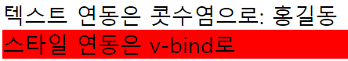
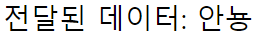
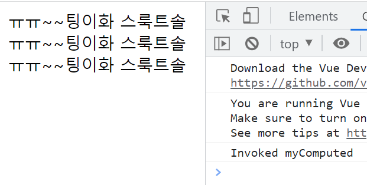

# 뷰 템플릿

## 개요

template은 하나의 root 엘리먼트로 감싸져 있어야 한다. 우리가 해왔던 방법으로 뷰 옵션 객체를 만들고 template 속성을 지정하면 코드의 가독성과 유지보수성에 문제가 생긴다.

대안으로 Single File Component 방식이 있다. 컴포넌트 1개를 하나의 파일에 대응시켜 작성하는 것이다. 각각의 해당 파일에서는 \<template\> 태그를 사용하여 해당 컴포넌트에 대한 요소만을 기술할 수 있다.

그러나 Single File Component 방식을 사용하려면, ES6 import/export 개념을 이해해야 하며, 각 파일을 합쳐 프로젝트 구조를 만들고 유지보수를 돕는 vue-cli를 사용해야한다. 

Single File Component 방식에 대해서는 다음 주 월요일에 더 자세히 알아보기로 하고, 오늘은 template 속성을 활용하는 방법에 대해 더 자세히 다뤄본다.

## 데이터 바인딩

화면에 표현하고자 하는 객체(→모델)의 데이터를 화면에 표현하기 위해 특수한 표기법을 이용해 연동하는 것.  
대표적으로 우리가 사용해왔던 {{ }}가 있다. (Mustache 표기법)  

또한 props를 넘겨줄 떄 사용했던 v-bind 디렉티브가 있다.

> 여기서 디렉티브라고 하면, 'v-'로 시작하는 속성을 총칭하는 것이다. 특수한 기능을 위해 예약된 속성들이다.

### Mustache 표기법

텍스트 사이에 텍스트를 끼워넣는, 즉 보간법에 사용한다.

### v-bind

HTML 요소의 어트리뷰트 값(id, ...)을 객체와 연동할 때 사용

```javascript
<style>
    .red {
        background-color: red;
    }
</style>

<div id="app">
    <div>텍스트 연동은 콧수염으로: {{ message }}</div>    
    <div v-bind:class="className">스타일 연동은 v-bind로</div>    
</div>

<script>
    new Vue({
        data: {
            message: '홍길동',
            className: 'red'
        }
    }).$mount('#app');
</script>
```



⇒ 두 방법은 용도가 다르다는 것을 알 수 있다.

v-bind는 축약 가능하다.  
예컨대 v-bind:attr="val"은 :attr="val" 로 축약할 수 있다.

일반 html 요소가 아닌 Vue 컴포넌트 요소에도 사용할 수 있다.

```javascript
<div id="app">
    <my-component v-bind:my-data="message2"></my-component>
</div>

<script>
    // 전역 컴포넌트
    Vue.component('my-component', {
        template: '<div>전달된 데이터: {{ myData }}</div>',
        props: ['myData']
    })

    new Vue({
        data: {
            message2: '안뇽'
        }
    }).$mount('#app');
```




### Mustache 표기법 고오급

콧수염 안에 간단한 자바스크립트 구문이 들어갈 수 있다.

```javascript
<div id="app">
    {{ message + '!!!' }}
</div>

<script>
    new Vue({
        data: {
            message: '홍길동'
        }
    }).$mount('#app');
</script>
```


아래와 같은 구문을 넣을 수도 있지만, 지양해야함. 처리가 끝난 값을 그대로 찍는 것이 바람직하다.  
결과값이 문자열로만 반환되면 넣을 수 있다.

```html
<div id="app">
    <div>Original: {{ message + '!!!' }}</div>
    <div>Reversed: {{ message.split('').reverse().join('') }}</div>

</div>

<script>
    new Vue({
        data: {
            message: '솔트룩스 화이팅~~'
        }
    }).$mount('#app');
</script>
```


다만 삼항연산자를 사용할 수는 있다. 간단한 분기를 처리할 수 있다.

위에서 문자열을 뒤집는 기능을 함수로 따로 만들어 구현해보자.

```html
<div id="app">
    <div>{{ myFunc() }}</div>
</div>

<script>
    new Vue({
        data: {
            message: '솔트룩스 화이팅~~ㅠㅠ'
        },
        methods: {
            myFunc: function() {
                console.log('Invoked myFunc');
                return this.message.split('').reverse().join('')
            }
        }
    }).$mount('#app');
</script>
```

정상적으로 동작한다. 그러나 methods 속성 대신 computed 속성을 사용할 수도 있다.

```html
<div id="app">
    <div>{{ myComputed }}</div>
    <div>{{ myComputed }}</div>
    <div>{{ myComputed }}</div>
</div>

<script>
    new Vue({
        data: {
            message: '솔트룩스 화이팅~~ㅠㅠ'
        },
        computed: {
            myComputed: function() {
                console.log('Invoked myComputed');
                return this.message.split('').reverse().join('')
            }
        }
    }).$mount('#app');
</script>
```



결과는 같지만, 콧수염 안에서 () 없이 레퍼런스만 넣어줘야 한다. 즉 매번 호출되는 것이 아님을 알 수 있다. 콘솔을 보면 세 번 참조되었는데, 한 번 호출되었음을 볼 수 있다.

사실 Computed 속성의 함수는 내부에서 참조하는 데이터의 값이 변경되었을 떄에만 호출되고, 그 결과를 캐싱한다. 이러한 상황에서는 Computed를 사용하는 것이 성능상 이점도 있을 것이다.


