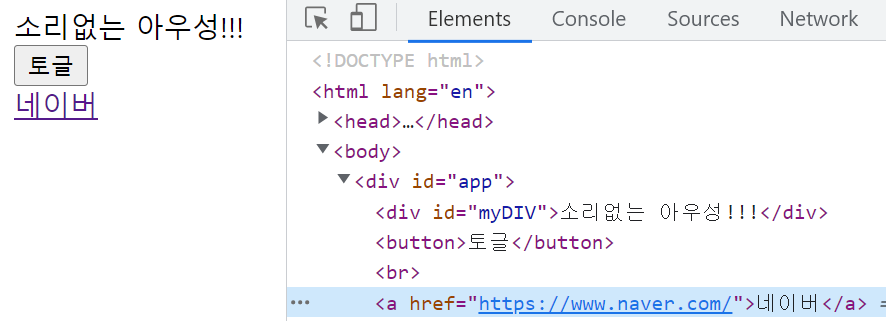
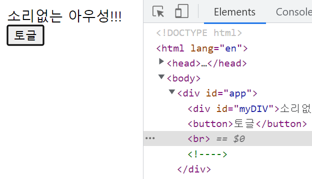
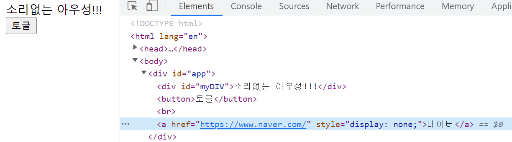
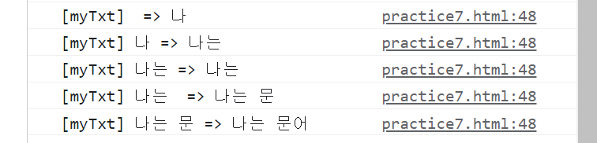
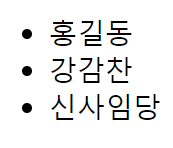

# 뷰 디렉티브

## 개요

디렉티브란, 'v-' 접두사를 가지는 모든 속성을 말한다. 우리가 사용해봤던 것으로는 v-on과 v-bind가 있다. 코드를 통해 사용 방법을 익혀보자.

## v-if와 v-show
v-if의 속성 값에는 boolean 값을 가지는 data 객체 속 변수의 이름이 들어갈 수 있다. 해당 값이 true면 DOM에서 요소를 렌더링하고, flase이면 DOM에서 요소를 제거한다.

```html
<div id="app">
    <div v-bind:id="myID">소리없는 아우성!!!</div>
    <button v-on:click="toggle">토글</button> <br>
    <a v-if="flag" href="https://www.naver.com/">네이버</a>
</div>

<script>
    new Vue({
        data: {
            flag: false,
            myID: 'myDIV'
        },
        methods: {
            toggle: function() {
                this.flag = !this.flag;
            }
        }
    }).$mount('#app');
</script>
```





DOM에서 완전히 사라졌다.

보이지 않게만 한다면 v-show 디렉티브를 사용하면 된다.



DOM에서 a 요소가 지워지지는 않았으나 display: none이 지정되어 보이지는 않는다.

## v-bind

생략

## v-on

생략

## v-model

form에서 사용.

```html
<div id="app">
    <div>{{ myTxt }}</div>
    <input type="text" v-model="myTxt">
    <button v-on:click="printInputVal">입력상자의 value 출력</button>
</div>

<script>
    new Vue({
        data: {
            myTxt: ''
        },
        methods: {
            printInputVal: function() {
                alert(this.myTxt)
            }
        }
    }).$mount('#app');
</script>
```

속성 값에 data 객체 내의 변수의 이름을 지정. 자동으로 폼의 입력 값이 해당 변수에 들어가게 됨.

### watch
option 객체의 속성 중 하나. v-for과 함께 활용할 수 있음.

```html
<div id="app">
    <input type="text" v-model="myTxt">
</div>

<script>
    new Vue({
        data: {
            myTxt: ''
        },
        watch: {
            myTxt: function(val, oldVal) {
                console.log('[myTxt]', oldVal, '=>', val);
            }
        }
    }).$mount('#app');
</script>
```



## v-for

같은 요소를 데이터를 바꾸어 출력해야할 떄 활용한다.

```html
<div id="app">
    <ul>
        <li v-for="name in names">{{ name }}</li>
    </ul>
</div>

<script>
    new Vue({
        data: {
            names: ['홍길동', '강감찬', '신사임당']
        }
    }).$mount('#app');
</script>
```



