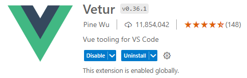
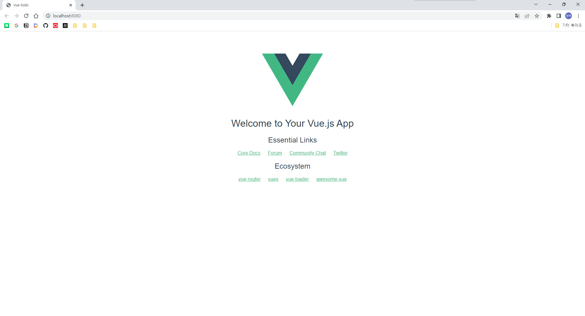
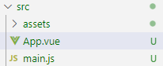
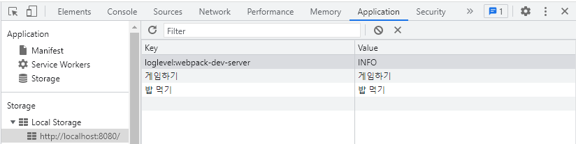

# 싱글 파일 컴포넌트

## 개요

우리는 지금까지 Vue 프로그램을 작성할 때, HTML 파일 내에 Vue의
소스코드를 CDN을 통해 직접 포함하고, 컴포넌트를 작성할 때 option 객체의 
template 속성을 이용하였다.

이러한 방식은 사용하기 불편하며 유지보수에도 어려움이 많다. 이러한 
불편함  때문에 싱글 파일 컴포넌트가 도입되었으며, 현업에서는 기존 
방법보다는 이 방법이 주로 사용된다.

이 방법은 말 그대로 컴포넌트 1개를 1개의 파일에 작성하는 것으로, 
컴포넌트가 파일별로 분리되어 재사용성과 유지보수성을 높일 수 있다. 
이때 이 파일은 HTML도, JS 파일도 아닌 '.vue' 파일이다.

## .vue 파일

### 구조

태그를 통해 세 부분으로 나뉘어진다. 

- \<template\>\</template\>: option 객체의 template 속성에 해당하는 부분
- \<script\>\</script\>: 자바스크립트 구문이 위치. export default로 모듈화
  ```js
    export default {
        // data, method, props, computed, created 등 template을 제외한 속성
    }
  ```
- \<style\>\</style\>: 현재 컴포넌트의 스타일 지정

### 번들링

다만 .vue 파일은 웹브라우저가 바로 읽을 수 있는 파일이 아니므로 .vue 파일을 html, css, js로 나누고 각각을 합쳐주는 과정이 필요하다. 이를 위해 모듈 번들러가 필요하다. 번들러의 종류로는 webpack, browserify, vite 등이 있는데, 많이 사용되는 것은 webpack이다.

그러나 웹팩을 설치하고 세팅해주는 과정은 번거로우며, 이를 사용하기 위해 추가적으로 공부해야 할 것이 늘어난다. Vue는 웹팩을 포함해 SFC 파일을 변환하고 번들링해주는 도구를 사용하기 쉽게 묶어 Vue CLI를 제공한다. (\*Vue 3에 들어가서는 vite 기반의 create-vue를 제공)

## Vue CLI

[참고: Vue CLI 2.x 문서](https://github.com/vuejs/vue-cli/tree/v2#vue-cli--)

### 설치

1. Vue CLI는 노드 기반이므로 우선 node.js가 설치 되어있어야 한다.

```
> node -v
```

2. npm을 이용해 Vue CLI를 설치한다. npm이란 node.js의 패키지 관리자이다.

```
> npm install -g vue-cli
```

\*현재는 vue-cli가 \@vue/cli로 바뀌었다. 

3. 이후 vue 명령을 실행해 아래와 같이 표시되면 잘 설치된 것이다.

```
PS D:\Git\KOSAjava> vue
Usage: vue <command> [options]

Options:
  -V, --version  output the version number
  -h, --help     output usage information

Commands:
  init           generate a new project from a template
  list           list available official templates
  build          prototype a new project
  create         (for v3 warning only)
  help [cmd]     display help for [cmd]
```

### 프로젝트 생성

vue-cli를 통해 프로젝트 생성시 6개 옵션을 사용할 수 있는데, 보통 다음과 같이 사용한다.

```
> vue init webpack-simple my-project
(하위 my-project 디렉토리)

> vue init webpack-simple
(현재 디렉토리)
```

이후, 아래와 같이 진행된다.

```
PS D:\Git\KOSAjava\Projects-With-JS\vue-todo> vue init webpack-simple

? Generate project in current directory? Yes
? Project name vue-todo
? Project description A simple todo app
? Author 0tak <0tak2.code@gmail.com>
? License MIT
? Use sass? No


   To get started:

     npm install
     npm run dev
```

개발환경에 필요한 패키지를 다운로드하기 위해 다음을 입력한다.

```
> npm install
```

### vs-code 플러그인 설치



이제 자동완성을 사용할 수 있다!

\* [인터넷](https://www.reddit.com/r/vuejs/comments/pahxs4/whats_the_general_opinion_on_vetur_vs_volar/) 찾아보니 vue 2는 volar보다 vetur이 나은 것 같다더라...

#### 크롬 Vue extention 설치

1. 크롬 웹 스토어 접속
2. [Vue.js devtools](https://chrome.google.com/webstore/detail/vuejs-devtools/nhdogjmejiglipccpnnnanhbledajbpd?hl=ko) 설치

#### 프로젝트 디렉토리 톺아보기

- package.json: 의존 패키지와 run을 통해 실행할 수 있는 스크립트
- 기타 프로젝트 스켈레톤 위치

##### index.html
이 프로젝트의 엔트리포인트 역할을 하는 html 파일. /dist/build.js를 임포트하고 있는데, 이 파일은 vue-cli가 웹팩을 통해 .vue 파일 등 일체를 빌드하여 이 파일 하나로 합쳐줌. Vue 인스턴스 및 각종 컴포넌트가 이 파일에 위치하게 됨.

### 프로젝트 실행

```
> npm run dev
```



표시되는 화면은 src/ 내의 컴포넌트가 렌더링된 것이다.



App.vue는 가장 상위에 위치하는 루트 컴포넌트이다. Vue 인스턴스는 main.js를 보면 찾을 수 있으며, 여기에 바로 템플릿을 지정하지 않고, 루트 컴포넌트 App을 따로 만들어 포함한 것이다.

App.vue를 아래와 같이 수정해보자.

```html
<template>
  <div id="app">
    <h1>이것은 소리없는 아우성!</h1>
    <h2>{{ message }}</h2>
  </div>
</template>

<script>
export default {
  data: function() {
    return {
      message: '신사임당'
    }
  }
}
</script>

<style>
</style>
```

이전에 사용했던 방법과 크게 다르지 않다.

[구현 결과](https://github.com/0tak2/KOSAjava/tree/main/Projects-With-JS/vue-todo)

###  TodoInput에서 할 일 저장 구현 유의점

백엔드가 없으므로 외부 DBMS 접근이 불가하기 때문에 브라우저 내부 저장소 사용.

- Storage
    - LocalStorage
    - SessionStorage
- IndexedDB

자바스크립트를 사용하여 저장 가능. Map 구조 형태 (Key - Value)로 저장됨.

여러 앱에 의해 데이터가 중복되는 것을 방지하기 위해 각 데이터는 도메인별로 구분되어 저장됨.

우리는 LocalStorage를 사용할 것이며 localStorage.setItem(KEY, VALUE)을 이용하여 값을 추가할 수 있음.

```html
<template>
    <div>
      <input type="text"
              placeholder="할 일을 입력하세요"
              v-model="newTodoItem">
      <button @click="addTodo">추가</button>
    </div>
  </template>
  
  <script>
  export default {
    data() {
      return {
        newTodoItem: ''
      }
    },
    methods: {
      addTodo() {
        // 입력한 할 일을 저장
        // 백엔드가 없으므로 외부 서버 대신 브라우저 내부 저장소 사용

        localStorage.setItem(this.newTodoItem, this.newTodoItem); // 키 값과 밸류 값을 동일하게 저장
      }
    }
  }
  </script>
```



위와 같이 개발자도구를 통해 접근 가능함. 따라서 중요 데이터나 기밀 데이터는 스토리지를 사용하면 안됨. 암호화 한다고 하더라도 임의로 지우거나 덮어 씌울 수 있음.

값을 가져오려면 localStorage.getItem(KEY)

