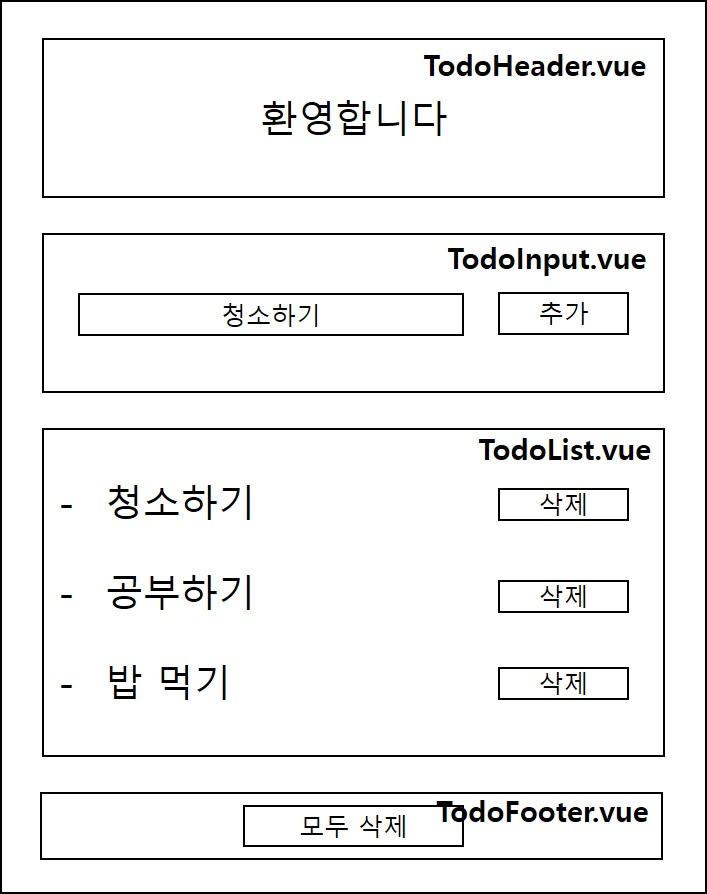
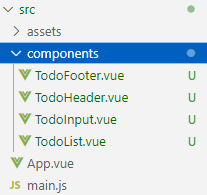

# 2. 간단한 TO-DO 앱 만들기

## 설계



## index.html 수정

이 앱을 모바일 환경에도 대응 가능한 반응형으로 만들기 위해 \<meta\> 태그 추가

## 컴포넌트 작성


src 폴더에 components 폴더를 만들고, 컴포넌트 파일 생성.

각 파일에 컴포넌트 작성.

기본 구조:

```html
<template>
  <div>Header</div>
</template>

<script>
export default {
}
</script>

<style>
</style>
```

## App.vue에 하위 컴포넌트로 추가

```html
<template>
  <div id="app">

  </div>
</template>

<script>
import TodoHeader from './components/TodoHeader.vue';
import TodoInput from './components/TodoInput.vue';
import TodoList from './components/TodoList.vue';
import TodoFooter from './components/TodoFooter.vue';

export default {
  
}
</script>

<style>
</style>
```

