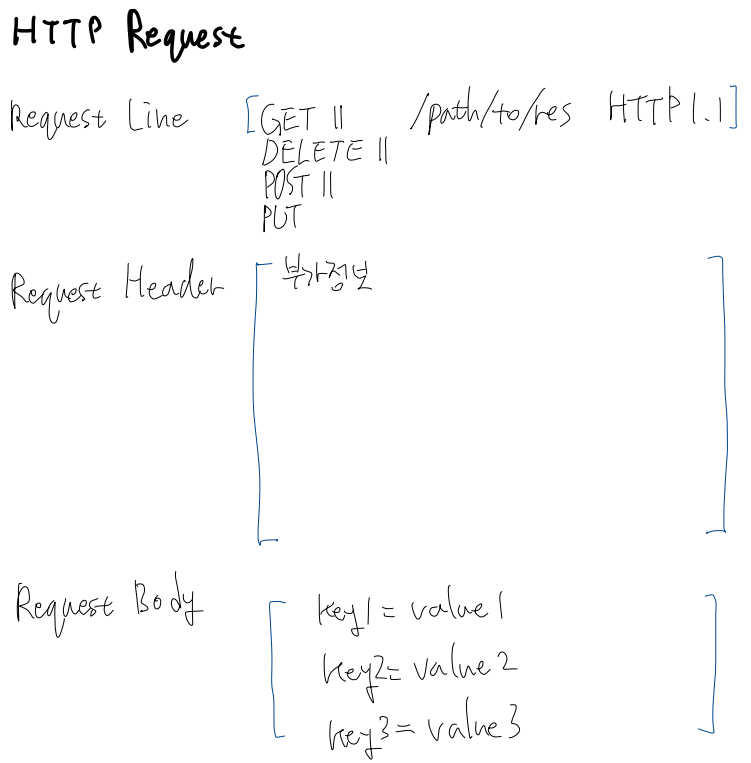
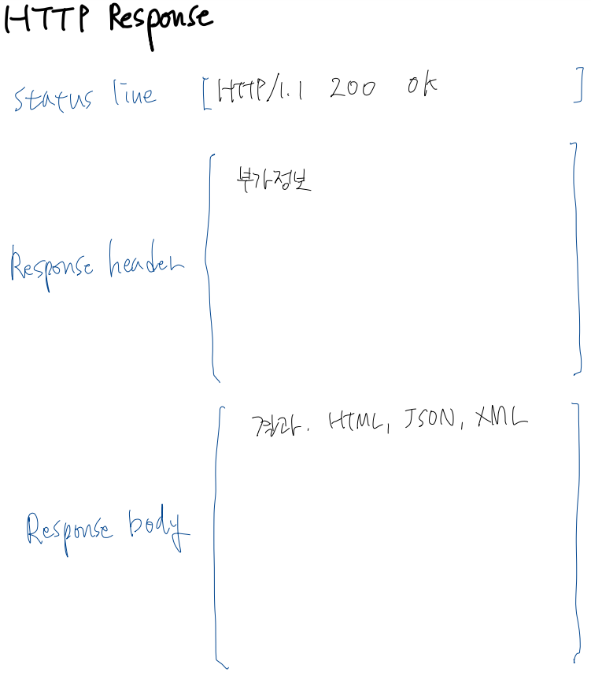

# 서블렛 소개

## 서블렛이란?

웹페이지(HTML + JS + CSS)를 동적으로 생성하는 자바 프로그램

## 웹 기본 개념 및 용어 복습

1. 인터넷: 네트워크의 네트워크. 전세계적인 네트워크 인프라스트럭쳐을 지칭하는 물리적 개념.
2. 서비스: 인터넷 위에서 동작하는 여러가지 응용프로그램
    - 이메일
    - Torrent
    - **WWW**
3. IP 주소: 인터넷 상의 여러 호스트들이 서로 데이터를 주고받기 위해서는 송수신 호스트가 서로를 식별할 수 있어야 함. 인터넷 프로토콜에서 이를 위해 사용되는 식별자가 IP 주소.
    - IPv4: 32비트 주소.
        - 0.0.0.0 ~ 255.255.255.255 (실제 사용되는 대역과는 차이가 있음)
        - 컴퓨터 자체에 할당한다기 보다는 NIC(Network Interface Card)에 할당. 일상적으로 랜카드라고 지칭되며 PC에 탑재되는 모듈이 이것임. 여러 개의 NIC를 꼽으면 한 컴퓨터가 여러 개의 IP를 가질 수 있음.
        - 사용자가 임의로 정할 수 있는 것은 아니며, 정해진 규칙에 따라 ISP로부터 할당받을 수 있음.
            - → 물리적 주소가 아니라 논리적 주소라는 것을 알 수 있음.
        - 실제 호스트간 통신을 위해서는 논리 주소인 IP를 물리 주소인 MAC 주소로 변환하는 과정을 거침 (ARP 등)
        - 127.0.0.1: 루프백. 요청시 내 컴퓨터로 돌아옴.
        - 서브넷: 아이피 네트워크를 가상으로 (논리적으로) 나누어 사용할 수 있게 함.
    - IPv6: 128비트 주소.
        - IPv4 주소 체계를 만들 때에는 32비트로 충분할 줄 알았으나, 시간이 지날수록 고갈되었음.
        - 이를 해결하기 위해 고안한 표준.
        - 그러나 아직 활발하게 도입되고 있지는 않음.
4. DNS (Domain Name System): 기억하기 어려운 IP 주소 대신 사용할 수 있는 문자열 주소.
    - 'Domain Name Server'도 DNS로 줄여 부르기 때문에 혼동할 수 있는데, 이 경우 도메인 네임을 IP로 바꿔주는 서버를 의미함.
    - 즉, www.naver.com 요청시,
        - → 여러 DNS를 거쳐 네이버 웹 서버의 IP로 변환
        - → 서버가 위치한 데이터 센터 내부 망에서 IP가 MAC 주소로 변환
        - → 네이버 웹 서버에 요청 도달
5. Port
    - 호스트에서 실행되고 있는 프로세스 1개의 프로세스에 할당되는 0~65535 범위의 정수. (unsigned 16비트 범위)
    - 컴퓨터 내 모든 프로세스가 포트 번호를 할당 받는 것은 아님. 네트워크 연결이 필요한 경우 할당 가능.
    - 특정 IP 주소로 요청시 호스트 컴퓨터의 NIC까지 도달 가능. 이후 이 요청을 받을 프로세스를 식별하기 위해 포트 번호가 추가로 필요한 것.

=> 하나의 프로세스가 네트워크로 연결된 다른 호스트의 프로세스와 데이터 통신을 하기 위해 필요한 것  
1. IP 주소
2. 포트 번호
3. 프로토콜 (데이터 통신 규칙)  

→ 도메인의 구조  
```
PROTOCOL_SCHEME://IP_ADDRESS_OR_DOMAIN_NAME:PORT/*
```

6. HyperText
    - 뉴진스의 Hyper보이요...
    - 사용자의 선택에 따라서 관련된 정보 쪽으로 옮겨갈 수 있도록 만들어진 특별한 텍스트
    - 일상적으로 링크라고 지칭됨. \<a href="https://newjeans.kr/"\>\</a\>

7. WWW (World Wide Web)
    - 하이퍼텍스트를 통해 거미줄처럼 연결된 정보 공간 체계를 제공하는 서비스
    - 흔히 인터넷이라고 지칭되는 것

8. 프로토콜
    - 데이터 통신을 위해 정해놓은 통신 규약.
    - WWW에서 사용되는 대표적인 프로토콜은 HTTP (HyperText Transfer Protocol)
    - 따라서 웹 개발을 위해서는 HTTP를 이해할 필요가 있음

> **HTTP**  
>    - Client-server 구조.
>        - 클라이언트가 서버에 Request
>        - 서버가 클라이언트에 Response
>        - 연결 종료
>        - 위와 같이 연결이 필요할 떄 생성되어 응답 후 종료되는 일련의 과정이 반복됨.
>            - 왜 연결을 유지하지 않는가? WWW는 서버에 비해 클라이언트가 절대 다수. 서버가 특정 클라이언트와 오랜 시간 연결을 유지한다면 다른 클라리언트의 요청을 받을 수 없음.
>        - 비교적 단순한 구조의 프로토콜

9. REST (REpresentational State Transfer)
    - 직역하면 표현가능한 상태 전송
    - 자원을 자원의 이름으로 표현(Representaion)하여 구분해 자원에 대한 정보(State)를 주고 받는(Transfer) 아키텍쳐 스타일을 의미
    - /index.html, /api/data.json, /blog/static/base.css 등 이름을 이용하여 요청하면 그에 해당하는 정보를 반환하는 것.
        - 즉 우리가 일상적으로 웹서버에 요청하고 응답받는 방식이 이미 REST 방식.
        - 좁은 의미의 State'를 받아오는 경우, 일반적 응답 형식은 JSON, XML 등.
        - REST는 위와 같은 아키텍쳐 스타일일 뿐이지만, 실제 HTTP의 동작 방식과 거의 부합. → HTTP 프로토콜을 그대로 REST 아키텍쳐를 이용한 서비스 구현에 사용할 수 있음.
        - HTTP에서는 자원의 표현을 URI를 통해 할 수 있음.
    - 자원을 가지고 수행할 일은 HTTP의 Method를 통해 명시할 수 있음.
        - GET (read / 서버의 자원을 읽고자 함)
        - POST (create / 서버의 자원을 생성하고자 함)
        - PUT (update / 서버의 자원을 수정하고자 함)
        - DELETE (delete / 서버의 자원을 삭제하고자 함)
        - CRUD를 모두 표현할 수 있음.
    - 즉, URI와 Method를 명시하여 작업을 원하는 자원과, 해당 자원을 가지고 수행하고자 하는 CRUD Operation을 표현할 수 있으며, 그 결과는 보통 XML이나 JSON으로 반환됨.
    - ⇒ 우리가 API를 만들 떄에도, 위와 같은 스타일을 지켜서 만들어줘야 함.
    - 장점
        - 자원과 작업을 보다 명시적으로 구분할 수 있음
        - REST 스타일은 HTTP에 바로 적용될 수 있기 때문에, 적용을 위해 별도의 인프라가 필요 없음. 비용이 적음.

> **URI와 URL의 차이**  
> - URI: Uniform Resource Identifier. 웹 상의 자원에 할당하는 유일한 식별자. REST 아키텍쳐에서 원하는 자원을 표현할 때 사용할 수 있음.
> - URL: Uniform Resource Locator: 자원의 위치를 지정.
> 형식은 동일하거나 유사하게 보이지만 개념적 맥락이 다름. 의미 상의 차이는 분명하게 있음.


10. SOAP (Simple Object Access Protocol)
    - API 요청에 종종 사용되는 별도의 프로토콜
    - 웹과는 잘 맞지 않으며, 일반적인 데스크톱 앱에 잘 어울림. 일반 앱에 적용하면 HTTP보다 보안적 측면에서 우수하고, 트랜잭션 처리에 좋음.

11. 웹 브라우저
    - 우리는 크롬을 사용

12. 웹 서버
    - 대표적으로 아파치 httpd, 엔진엑스
    - 전통적으로 많이 사용된 것은 아파치. 최근에는 엔진엑스의 점유율이 높아지고 있음.
    - 작동 방식이 다름.

13. HTTP Request




14. HTTP Resoponse



