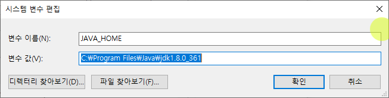
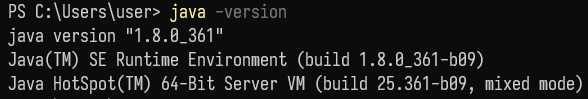
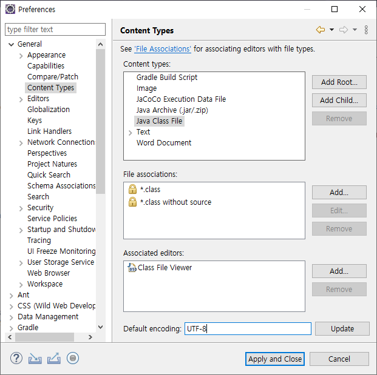
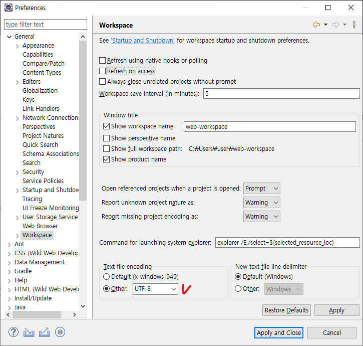
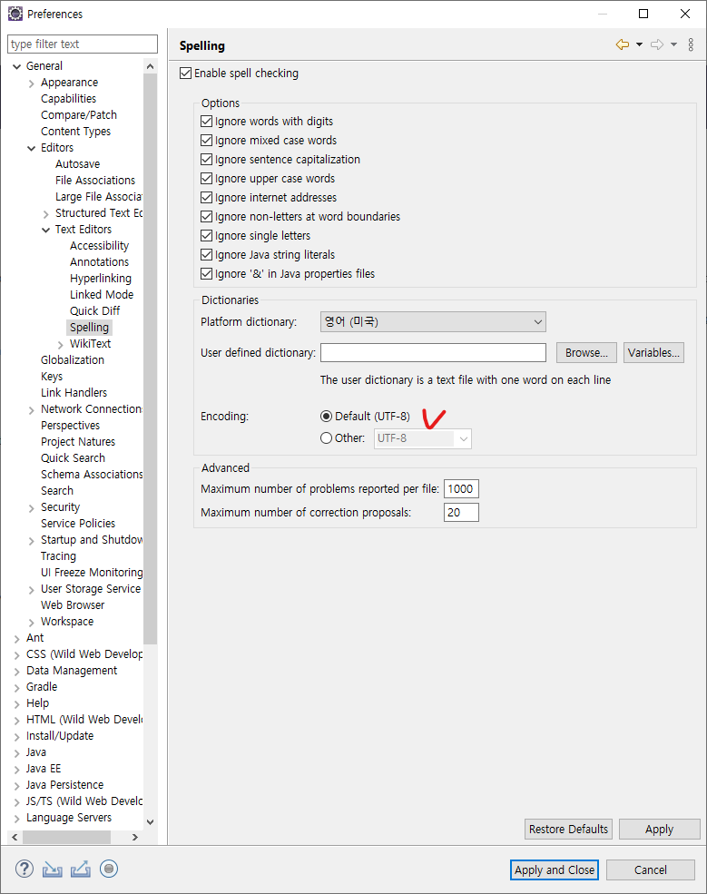
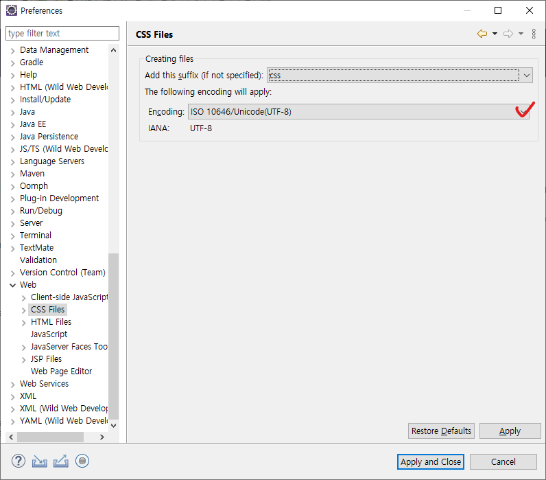
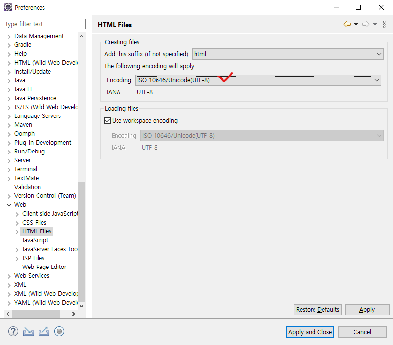
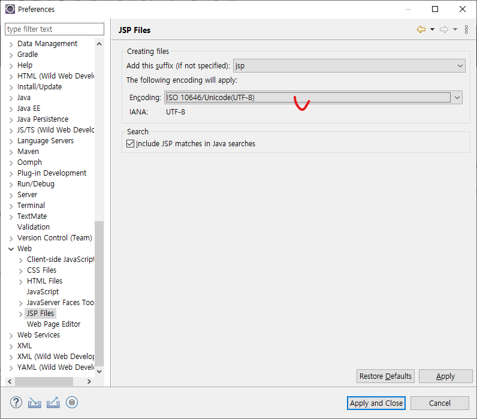
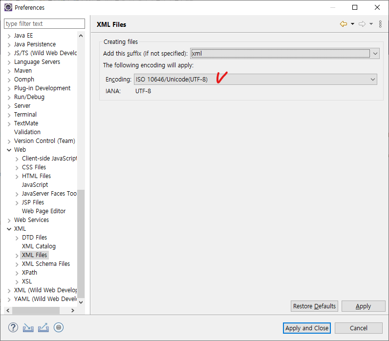

# 서블렛 환경설정

## 자바 8 설치
- 현재 자바 버전: 11 / 현업에서는 거의 8 버전을 사용
- 우리도 자바 8로 다운그레이드
- 오라클 JDK와 OpenJDK
    - 오라클 JDK는 오라클에서 제작하여 배포하는 JDK.
    - 자바의 오픈소스 구현체.
        - 오라클의 Sun Microsystems 인수 후, 상업용 라이센스 도입에 따라 라이센스 적용을 피하기 위해 OpenJDK도 사용하는 사례가 늘어남.
    - 우리는 오라클 JDK를 이용

[다운로드 페이지](https://www.oracle.com/java/technologies/downloads/)로 이동하여 JDK 8 다운로드

환경변수 설정
설치된 경로를 복사
고급 시스템 설정 – 고급 – 환경 변수로 들어가서 JAVA_HOME을 복사한 경로로 변경

터미널에서 java -version 입력 후 버전이 1.8로 잘 출력되면 성공

## 이클립스

### 새로운 워크스페이스

web-workspace라는 새로운 워크스페이스를 만들어 이클립스 구동

### 인코딩 바꾸기 (UTF-8)

**Window - Preferences - General - Content Types**

**General - Workspace**

**General - Editors - Text Editors - Spelling**

**Web - CSS Files**

**Web - HTML Files**

**Web - JSP Files**

**XML - XML Files**

