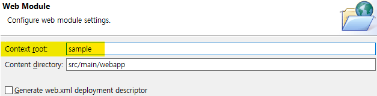

# Web 프로젝트 생성

## 개요

### 웹 프로젝트의 종류

- Static Web Project
자바 프로그램이 들어가있지 않은 웹 프로젝트

- Dynamic Web Project
자바 프로그램이 포함되어 동적으로 요청을 처리하는 웹 프로젝트  
즉, 서블릿 프로젝트

## Dynamic Web Project 생성


일단 넘어간다


마찬가지로 일단 넘어간다


주의해야 할 것: Context root  
기본적으로는 프로젝트 이름이 들어간다.  
본래 컨텍스트 루트는 웹 상에서 우리 프로젝트에 대한 식별자 역할을 한다. 클라이언트가 우리 프로그램을 웹 상에서 찾기 위해 필요하다.




우리는 우선 sample로 지정한다. (대소문자 구분)
나중에 변경 가능하다.

### 설정

1. 별도의 XML 파일을 만들어 설정 작성
2. 소스코드 내에 어노테이션으로 설정 사항 지정

어떤 방법이 절대적으로 좋다고는 할 수 없다. 장단점이 있다.  
전통적인 방법은 XML 파일로 설정하는 것인데, 일반적으로는 어노테이션으로 설정하는 것이 선호된다.

어노테이션 설정은 서블릿 3.0 이후부터 가능하다. 간단하다는 장점이 있다.  
XML로 설정을 하면 자세한 설정이 가능하며, 한 눈에 설정을 볼 수 있다는 장점이 있다.


Generate web.xml \~\~을 체크하면 XML로 설정 가능하지만, 우선 우리는 어노테이션으로 설정하겠다.

### 프로젝트 구조 톺아보기


src/main/java에 자바 소스가 들어간다. 즉 서블릿 서버 프로그램의 소스코드가 위치하게 된다. (.java)

src/main/webapp은 Web 상에서 우리 웹앱의 Home 폴더가 된다. 여기에 사용자에게 제공될 HTML, CSS, JS 등의 정적 파일이 위치하게 된다.  
\* 다만 META-INF, WEB-INF, WEB-INF/lib은 특수한 목적을 위해 사용되는 디렉토리이므로, 이 내부에 정적 파일이 위치하면 안된다.

## 테스트 및 배포 실습

### test.html 만들기


HTML5를 선택하고 Finish를 누른다.  

### Tomcat 설치

이렇게 만든 프로젝트를 웹에 Deploy 하기 위해서는? → 웹서버가 필요  
따라서 웹서버를 설치하여 이클립스와 연동해줘야 함.

우리는 나중에 서블릿 코드도 작성하고 실행해야하기 때문에 웹 서버 기능과 서블릿 컨테이너를 같이 갖춘 Apache Tomcat을 설치

#### Tomcat 다운로드
1. [Tomcat 홈페이지](https://tomcat.apache.org/)로 이동
2. Tomcat 11은 알파 버전이므로 특별한 이유가 없으면 설치하지 않음. 일반적으로 8 이상을 설치. 우리는 9버전을 설치할 것임. Download - Tomcat 9
3. Windows Installer가 아닌, Zip을 다운로드
4. 압축을 풀면 나오는 apache-tomcat-9.x를 복사하여, C:\Program Files\Java에 복사
    - Maven을 배우면 더 편한 방법으로 할 예정. 그 이전까지는 기억하기 쉽게 Java 디렉토리 아래에 복사하여 사용하겠음.

#### Tomcat 이클립스 연동


우선 그냥 놔두고 Finish


정상 로드 되었다.

#### Tomcat Configure

톰캣이 우리 프로젝트를 인식할 수 있도록 설정


우클릭 – Add and Remove


왼쪽에 위치한 현재 프로젝트를 오른쪽으로 옮겨준다.


Finish를 누르면 설정이 완료된다.


프로젝트 트리에 Servers 프로젝트가 생겼다. 내부에 톰캣의 설정이 위치하므로 지워서는 안된다.


오른쪽 녹색 버튼을 눌러 톰캣을 기동한다.


[http://127.0.0.1:8080/sample/test.html](http://127.0.0.1:8080/sample/test.html)에 접속하면 아까 만든 html 파일이 로드되는 것을 볼 수 있다.

### 소결

위와 같이 정적 리소스를 작성하고 톰캣을 통해 배포하여 로드해보았다. 사실 우리가 지금까지 했던 것과 다르지 않다.

이번에는 동적 리소스를 작성하고 배포해보려고 한다. 동적 리소스란, 자바 서블렛 프로그램을 실행하여 동적으로 생성되는 결과를 말한다.

## 서블릿 테스트 및 배포 실습

### 서블릿 클래스 만들기


새로운 서블릿 클래스를 만든다.


패키지와 클래스 이름을 임의로 지정한다.


Name에는 이 클래스의 논리적인 이름을 지정할 수 있다.  
중요한 것은 아래의 URL Mappings이다. 클라이언트가 이 서블릿 프로그램을 실행시킬 수 있는 URL에 해당한다.


시작은 꼭 '/'로 시작해야 한다.


기본으로 두고 Finish


템블릿이 생성되었으나, javax.servlet가 정상적으로 임포트되지 않아 오류가 발생하고 있다.   
javax.servlet가 자바의 기본 패키지가 아니기 때문이다. 빌드 패스에 이 패키지를 추가해줘야 할 것이다.


프로젝트 설정 – Java Build Path – Libraries로 들어간다.


톰캣의 라이브러리를 이제 이 프로젝트에서 사용할 수 있다.  Apply and Close  
이제 에러가 없어졌다.

생성된 소스코드를 간단히 훑어보자. 클라리언트가 이 클래스가 맵핑된 URL에 GET 요청을 하면 아래의 메서드가 실행될 것임을 예상할 수 있다.

```java
// GET http://127.0.0.1:8080/sample/myservlet
protected void doGet(HttpServletRequest request, HttpServletResponse response) throws ServletException, IOException {
    // TODO Auto-generated method stub
    response.getWriter().append("Served at: ").append(request.getContextPath());
}
```

간단한 출력 처리를 해보자.

1. 우선 클라이언트에게 전달할 데이터가 어떤 데이터인지 MIME 타입을 설정한다.
    ```java
    response.setContentType("text/html; charset=UTF-8");
    ```

2. 클라이언트에게 데이터를 전달하기 위해 Stream 개방
    ```java
    PrintWriter <ins>out</ins> = response.getWriter();
    ```
    
3. Stream을 통해 데이터 전달
    ```java
 out.println("&lt;html&gt;");

 out.println("&lt;head&gt;&lt;/head&gt;");

 out.println("&lt;body&gt;서블릿의 출력 결과. 소리없는 아우성!!&lt;/body&gt;");

 out.println("&lt;/html&gt;");
    ```
    
    
4. Stream 닫아 자원 할당 해제
    ```java
 out.close();
    ```
    
웹브라우저로 접속하면 결과가 출력된다.

