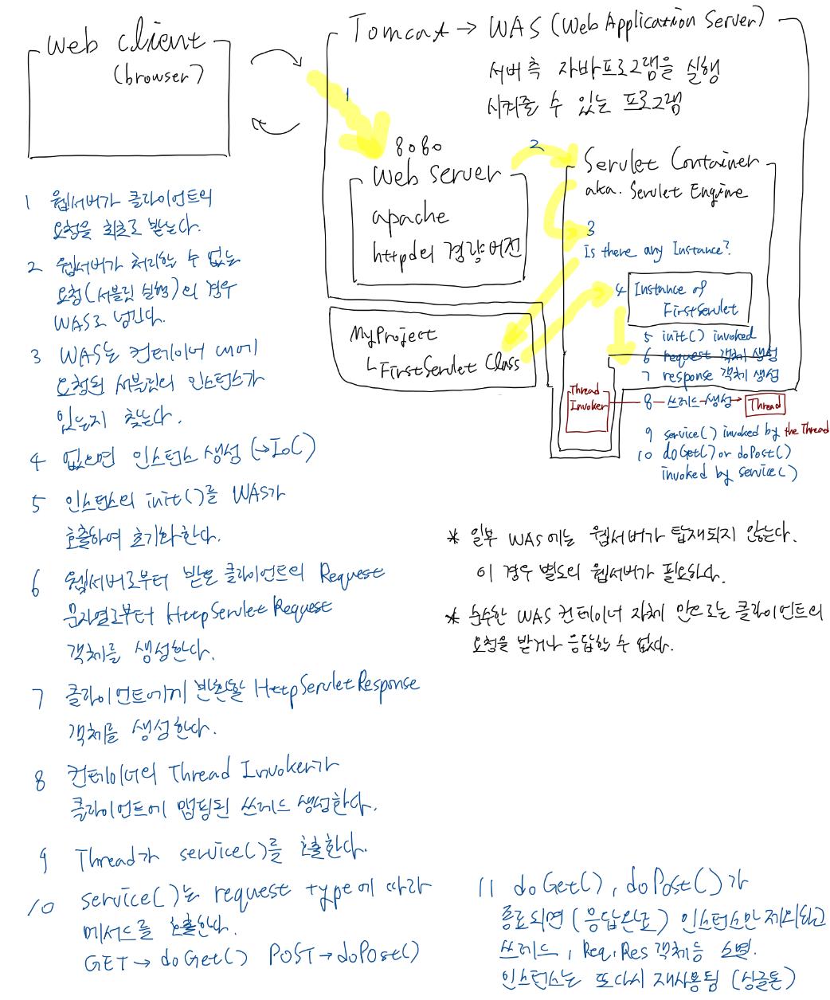
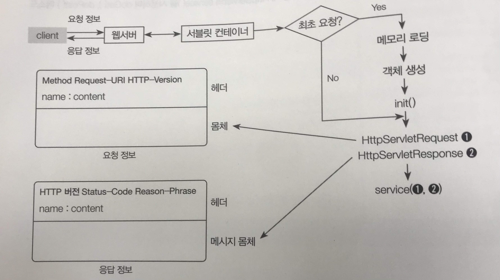

# 톰캣의 요청 처리 과정

Tomcat은 위와 같은 구조로 되어있다. 아파치 HTTP 서버를 경량화한 자체 HTTP 서버와, 서블릿 프로그램을 실행할 수 있는 컨테이너가 한데 묶여있다.

순수한 서블릿 컨테이너 자체는 클라이언트의 요청을 처리할 수 없다. 우선 클라이언트의 요청은 자체 HTTP 서버로 간다.  
HTTP 서버는 해당 요청을 서블릿 컨테이너로 넘겨줄지 말지를 경정한다. 정적 리소스를 요청받은 경우 해당 리소스를 찾아 응답해주면 되지만, 서블릿 클래스에 맵핑된 URL로 요청이 왔다든지 서블릿 프로그램을 실행해야하는 경우 서블릿 컨테이너로 요청을 넘긴다.

서블릿 컨테이너는 컨테이너 내에 요청된 서블릿의 인스턴스가 컨테이너 내에 이미 생성되어 존재하는지 검사한다. 인스턴스가 이미 있다는 것은 이전에 실행된 적이 있다는 것이고, 없다는 것은 실행된 적이 없다는 것이다. 인스턴스가 없으면 새로운 인스턴스를 생성한다. 이때 사용자가 아닌 톰캣이 인스턴스를 생성한다는 것이 특이하다. 이는 IoC와 관련된 내용으로, 나중에 자세히 다룬다.

톰캣은 인스턴스를 생성하고 나서 인스턴스의 init()를 호출한다. init()는 서블릿 클래스에서 Override할 수 있으며, 여기에서 인스턴스 생성 직후 필요한 초기화 작업을 수행할 수 있다.  
이후 웹서버로부터 넘어온 Request 문자열로부터 HttpServletRequest 타입의 객체와 클라이언트에 반환해줄 HttpServletResponse 타입의 객체를 생성한다. 각 객체는 앞으로 톰캣에 의해 호출될 메서드에 주입된다.

그 후 컨테이너 내의 Thread Invoker가 새로운 쓰레드를 만든다. 이 쓰레드는 요청한 클라이언트에 맴핑된다. 쓰레드는 이어서 서블릿 인스턴스의 service()를 호출하며, service()는 Request Type에 따라 그에 맞는 메서드를 호출한다. 예컨대 GET 요청이면 doGet(), POST 요청이면 doPost()를 호출하는 것이다.

doGet()이나 doPost()가 종료되면(응답 완료) 쓰레드, request, response 객체는 소멸된다. 그러나 인스턴스 자체는 소멸되지 않고, 이후 동일 요청이 들어왔을 떄 재사용된다. 즉, 서블릿 클래스는 싱글톤 방식으로 인스턴스화되는 것이다. 동일 요청이 들어오면 init()는 호출되지 않고, request 객체와 response 객체를 만드는 작업부터 다시 반복된다.

한편 동시에 요청이 여러 개가 들어오는 경우 어떻게 될까? 쓰레드는 여러 개가 생기지만, 인스턴스는 한 개만 생성되어 싱글톤을 유지한다. 인스턴스가 공유객체로서 여러 쓰레드에게 참조되는 것이다.

