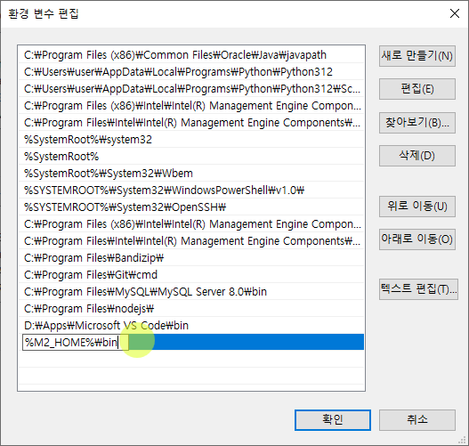

# Maven 소개

## Build Tool

자바 프로젝트의 빌드를 위해 사용하는 도구. 우리는 지금까지 빌드 툴을 사용하지 않고, 이클립스에서 직접 소스코드를 컴파일해왔다.

### 빌드 툴의 종류

- Maven: 가장 많이 사용. Spring Legacy Project에서 기본
- Gradle: 최근 많이 사용. Spring Boot에서 기본
- Ant: 최근에는 거의 사용되지 않음.

## 빌드

### 빌드란 무엇인가

빌드란 1차적으로 작성한 소스코드를 실행할 수 있는 독립적인 형태로 변환하는 과정과 그 결과물을 총칭한다. 여기에는 프로덕션 환경에의 배포를 전제하고 있는 것으로, 이클립스와 같은 IDE에서 테스트 목적으로 빌드하는 것 보다도 조금 더 넓은 맥락의 이야기이다. 최종적으로 .class나 .jar로 뽑혀나와 서버에 배포할 수 있는 직전의 상태까지 만들어내는 과정을 말하는 것이다. 이를 도와주는 도구가 빌드 툴이며, Maven이나 Gradle을 사용할 수 있다.

### 빌드 과정

1. 프로젝트 생성
2. **라이브러리 포함 및 설정**: 의존적인 라이브러리를 포함시켜야 한다.
3. 소스코드 작성
4. 컴파일 과정: 소스코드를 JVM이 이해할 수 있도록 자바 바이트 코드로 변환
5. 테스트: 단위 테스트, 통합 테스트 등. 소스코드가 기대한 대로 동작하는지 검증
6. 패키징: JAR 등 배포하기 쉬운 형태로 압축
7. 배포: 프로덕션 환경에서 프로그램을 실행시켜 서비스 가능한 상태로 전환

빌드 툴은 위의 과정을 전담하는 전문 도구이며, 기본적으로 IDE에 종속되지 않는다. Maven도 Standalone으로 사용할 수 있다, 편의를 위해 이클립스 등의 IDE와 연동하여 사용하는 것이지, 이클립스에 포함되는 것은 아니라는 것이다. 

Maven 등의 빌드 툴을 사용하면 위의 과정을 보다 더 효율적으로 수행할 수 있다.

## Maven 설치

1. [홈페이지](https://maven.apache.org/) 접속
2. Binary zip archive를 다운로드
3. 적절한 위치에 Extract (C:\Program Files\Java)
4. 환경변수 설정
    - M2_HOME 변수 만들기

    ```
    이름: M2_HOME
    값: C:\Program Files\Java\apache-maven-3.9.0
        * 압축을 푼 경로
    ```

    

    - path에 메이븐 바이너리 폴더 추가

    ```
    이름: Path
    값: ..., %M2_HOME%\bin
    ```

    
    
## Maven으로 자바 프로젝트 생성

### 환경변수 테스트

```ps
PS D:\> mkdir D:\maven_test
PS D:\> cd maven_test
PS D:\maven_test> mvn
[INFO] Scanning for projects...
[INFO] ------------------------------------------------------------------------
[INFO] BUILD FAILURE
```

오류가 출력되면 환경변수가 잘 설정된 것이다.

### 프로젝트 만들기

```ps
mvn archetype:generate `
    -DgroupId="com.test" `
    -DartifactId="myProject" `
    -DarchetypeArtifactId="maven-archetype-quickstart"
```

- groupId: 프로젝트 구분자. 보통 패키지 이름처럼 겹치지 않게 지정
- artifactId: 프로젝트 이름
- archetypeArtifactId: 보일러 플레이트 지정

그럼 다음과 같은 프롬프트가 표시된다.
```
Define value for property 'version' 1.0-SNAPSHOT: 
```

그냥 엔터를 치면 기본값인 1.0-SNAPSHOT으로 된다. SNAPSHOT은 개발중인 프로젝트라는 의미의 접미사이다. 그냥 기본값으로 주자.

```
[INFO] Using property: package = com.test
Confirm properties configuration:
groupId: com.test
artifactId: myProject
version: 1.0-SNAPSHOT
package: com.test
 Y: :
```
확인하고, 엔터를 친다.

'[INFO] BUILD SUCCESS'가 출력된다.

-DarchetypeArtifactId="maven-archetype-quickstart"를 지정했기 때문에 아래와 같이 보일러플레이트 코드가 마련되어 있다.

```
D:.
└─myProject
    └─src
        ├─main
        │  └─java
        │      └─com
        │          └─test
        └─test
            └─java
                └─com
                    └─test
```

## Maven으로 프로젝트 컴파일

프로젝트 루트의 pom.xml이 프로젝트 설정 파일이다. 아래와 같이 자바 버전을 지정해준다.


```xml
  <properties>
    <maven.compiler.source>1.8</maven.compiler.source>
    <maven.compiler.target>1.8</maven.compiler.target>
  </properties>
```

```ps
cd myProject
mvn compile
```

컴파일에 성공하면,

```
D:.
├─src
│  ├─main
│  │      └─com
│  │          └─test
│  └─test
│      └─java
│          └─com
│              └─test
└─target
    ├─classes
    │  └─com
    │      └─test
    ├─generated-sources
    │  └─annotations
    └─maven-status
        └─maven-compiler-plugin
            └─compile
                └─default-compile
```

target 폴더가 만들어졌으며, src\main\java\com\test\App.java가 target\classes\com\test에 App.class로 컴파일되었다.

실행하려면, target\classes로 이동하여, 아래와 같이 명령하면 된다.

```ps1
PS D:\maven_test\myProject\target\classes> java com.test.App
Hello World!
```

## Maven으로 프로젝트 패키징

```ps1
PS D:\maven_test\myProject> cat pom.xml
  ...
  <packaging>jar</packaging>
  ...
```

패키징이 JAR로 지정되어 있다.

```ps1
> mvn package

[INFO] Building jar: D:\maven_test\myProject\target\myProject-1.0-SNAPSHOT.jar
[INFO] ------------------------------------------------------------------------
[INFO] BUILD SUCCESS
[INFO] ------------------------------------------------------------------------
[INFO] Total time:  22.479 s
[INFO] Finished at: 2023-02-07T10:28:44+09:00
[INFO] ------------------------------------------------------------------------
```

완료되었다. target 폴더에 myProject-1.0-SNAPSHOT.jar가 생성된 것을 볼 수 있다.    
package 명령을 실행하면 compile 과정을 포함하여 라이브러리 포함까지 자동으로 수행해 하나의 패키지로 묶어준다.

JAR을 실행하려면,  

```
PS D:\maven_test\myProject\target> java -cp myProject-1.0-SNAPSHOT.jar com.test.App
Hello World!
```
Hello World!가 잘 출력된다.


