# Maven, Eclipse 연동

## myProject Import

Maven은 CLI 툴로 사용해도 휼륭한 도구이지만, 불편한 것도 사실이다. 이클립스와 연동하여 사용해보자.  
우선 이클립스를 실행하여 아까 Maven으로 만든 프로젝트를 Import 해보자

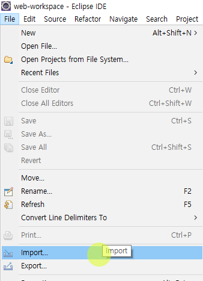

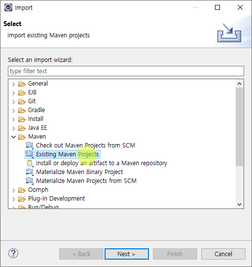

서블릿 프로젝트를 위해 pom.xml을 열고, 패키징 타입을 아래와 같이 war로 변경

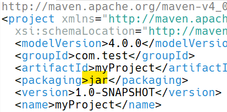

그럼 아래와 같이 Update Project를 실행하면 프로젝트 구조가 웹 프로젝트로 자동으로 변경된다.

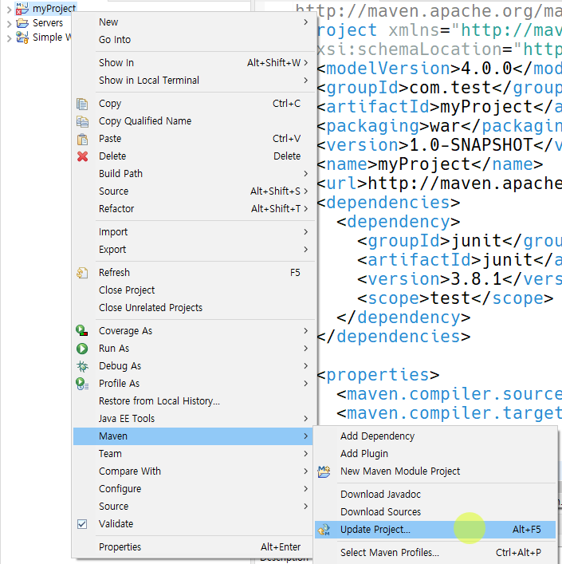

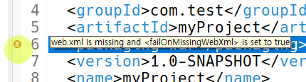

web.xml을 찾지 못한다는 오류가 발생하지만, 우리는 어노테이션으로 설정해줄 것이기 때문에 일단은 무시해도 무방하다.

이 프로젝트는 테스트용이기 때문에 이제 지운다. 이클립스에서 프로젝트를 바로 생성해보자.

## 이클립스에서 Maven을 이용해 서블릿 프로젝트 생성

어제 Simple Web Project를 만들 때에는, 톰캣 런타임 라이브러리를 Build Path에 수동으로 불러왔다. 그러나 이렇게 되면 나중에 다른 컴퓨터에서 소스 코드를 열면 라이브러리를 찾지 못한다. 라이브러리를 같은 경로에 복사하거나, 새로운 경로로 재지정해줘야 한다.  
메이븐을 쓰면 의존 라이브러리를 편리하게 관리할 수 있다. 또한 버전, 라이브러리 간 충돌 등도 알아서 관리해준다.

이클립스에서 메이블을 연동하여 서블릿 프로젝트를 생성해보자.

우선 JavaEE Perspective를 열어준다.

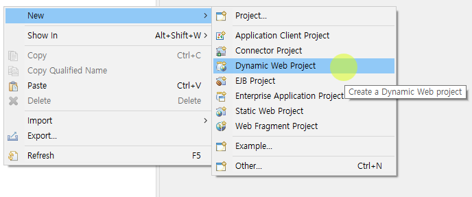

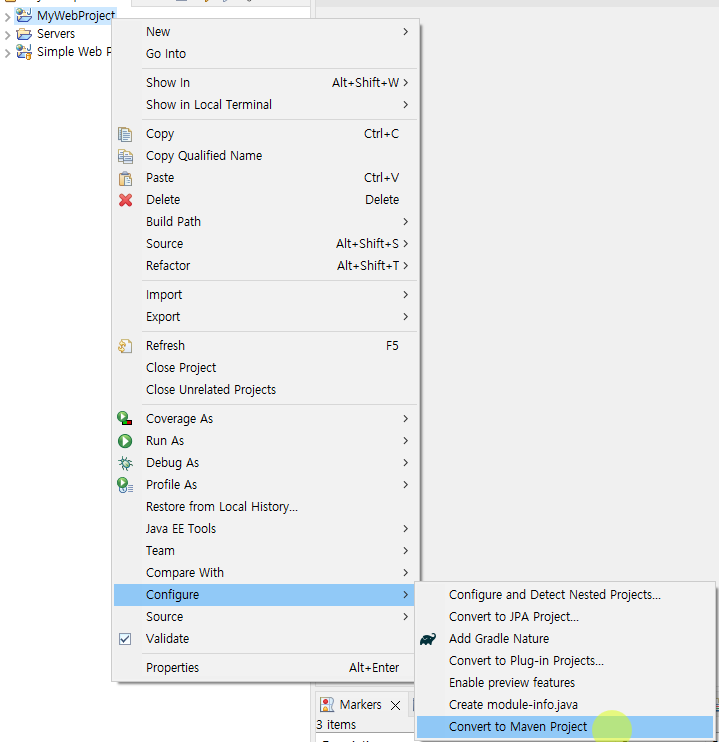

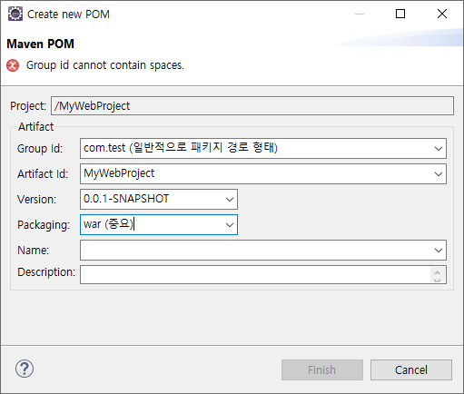

pom.xml이 생성된 것을 확인할 수 있다.
이제 프로젝트에 대해 우클릭하면 Maven 메뉴가 생긴다. 여기서 Update Project를 해준다.  

### pom.xml을 이용한 의존성 관리

pom.xml을 열고, \<project\> 바로 아래에 \<dependencies\> 태그를 만든다.

이 프로젝트가 의존하는 라이브러리에 대한 정보를 \<dependencies\> 요소 내에 기록하면 된다.

#### Servlet 라이브러리

우리는 Tomcat 9을 사용하므로, Tomcat 9에 해당하는 버전의 서블릿 라이브러리를 포함해야 한다.

우선 톰캣의 [문서](https://tomcat.apache.org/tomcat-9.0-doc/index.html)에 접속한다.   
왼쪽 메뉴의 Reference를 보면 [Servlet 4.0 Javadocs](https://tomcat.apache.org/tomcat-9.0-doc/servletapi/index.html)가 있다. 이를 보면 우리가 사용하는 톰캣 버전이 9.0.71이고, 포함해야할 서블릿 라이브러리 버전이 4.0임을 알 수 있다.

[Maven Repository](https://mvnrepository.com/)로 이동하면 포함할 수 있는 디펜던시에 대한 정보를 찾을 수 있다. tomcat 9 servlet를 검색하면 이용할 수 있는 다양한 모듈이 표시된다. 

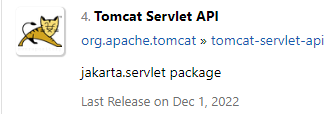

우리는 이 라이브러리를 사용해보려고 한다. 하단 목록에서 9.0.71을 찾아 누른다.

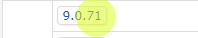

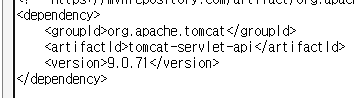

pom.xml에 들어갈 xml을 자동으로 제공해주며, 복사하여 우리 프로젝트의 pom.xml에 추가한다.


마찬가지로 mysql connector j를 검색하여 Connector/J를 추가한다.

그럼 pom.xml의 \<dependencies\>는 아래와 같은 모습이 된다.

```xml
  <dependencies>
  <!-- 필요 라이브러리를 포함시킨다 -->
  	<!-- https://mvnrepository.com/artifact/org.apache.tomcat/tomcat-servlet-api -->
	<dependency>
	    <groupId>org.apache.tomcat</groupId>
	    <artifactId>tomcat-servlet-api</artifactId>
	    <version>9.0.71</version>
	</dependency>
	
	<!-- https://mvnrepository.com/artifact/mysql/mysql-connector-java -->
	<dependency>
	    <groupId>mysql</groupId>
	    <artifactId>mysql-connector-java</artifactId>
	    <version>8.0.28</version>
	</dependency>
  </dependencies>
```

저장하면 이클립스가 자동으로 다운로드 받는다. 기본 다운로드 디렉토리는 유저 홈 디렉토리의 .m2이다.

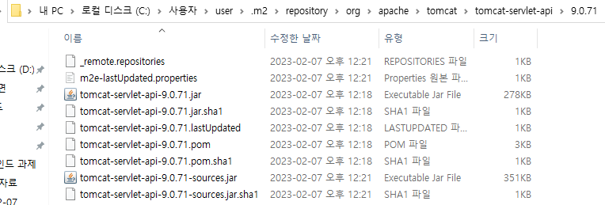

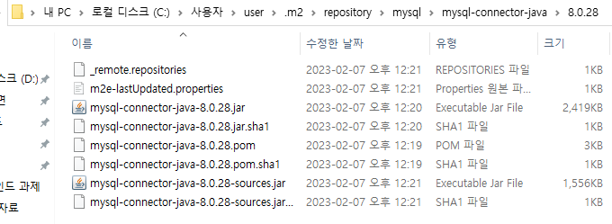

앞으로는 모든 실습에서 Maven을 이용해 프로젝트를 생성하고, 의존성을 관리할 것이다.

