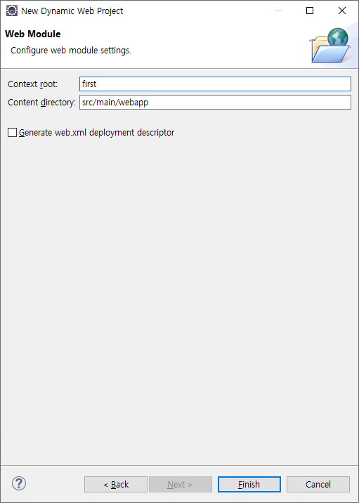
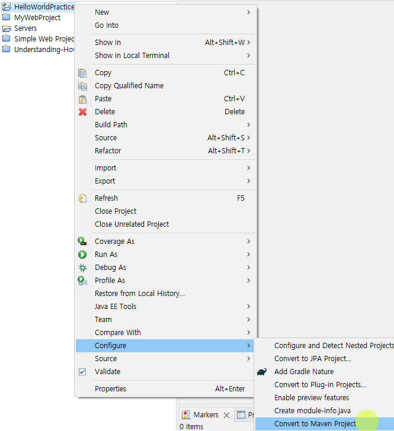
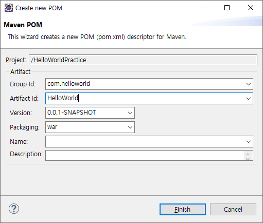
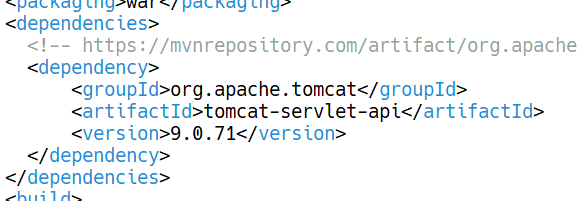
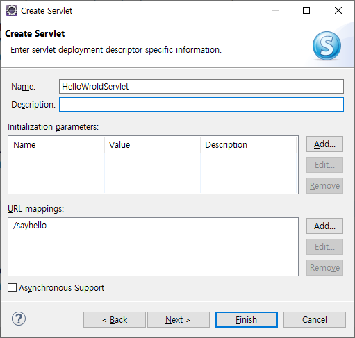
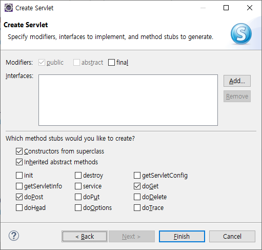
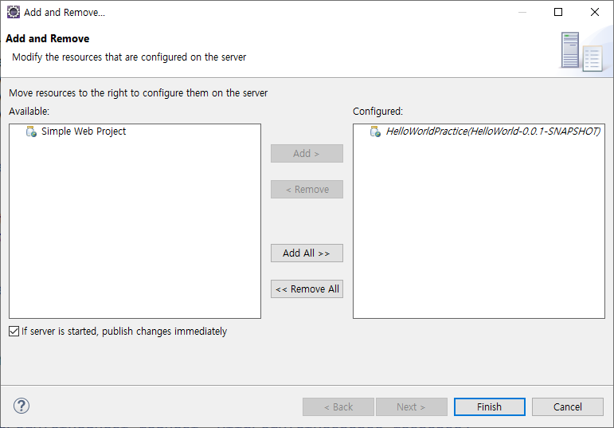
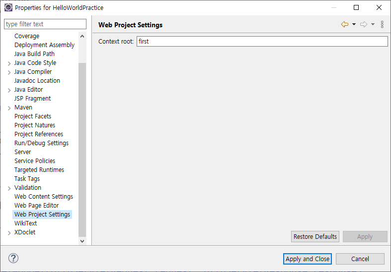
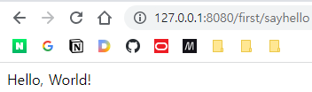

# 서블릿 2

## 서블릿의 동작 방식 이해

서블릿의 동작 방식을 이해하기 위해 그와 유사한 미니 프로그램을 작성해보자. 우선 일반 자바 프로젝트를 하나 만든다.

[어제 공부 내용](../2023-02-06/2023-02-06-4-%EC%A0%9C%EB%AA%A9.md)을 참고하라.

### 굳이 스레드를 사용하는 이유는?

요청 처리 객체를 매 요청마다 생성하게 되면 서버의 부하가 심해진다. 따라서 객체 자체(서블릿)는 한 번만 생성하고, 그보다 오버헤드 정도가 낮은 스레드를 생성하는 것이다.

## HelloWorld

### 프로젝트 생성

> Context root: 프로젝트를 클라이언트가 웹 상에서 식별하기 위한 논리적인 이름



context root를 유일하고 적당한 값으로 바꾼다. content directory는 이미 세팅이 되어있기 때문에 건들지 않는다. 어노테이션으로 설정할 것이기 때문에 xml도 만들지 않는다.

### Maven 프로젝트로 전환






혹시 모르니 프로젝트 우클릭 - Maven - Update Project

### pom.xml 설정

서블릿 라이브러리만 추가하자. [메이븐 레포지토리](https://mvnrepository.com/artifact/org.apache.tomcat/tomcat-servlet-api/9.0.71)에서 적용할 라이브러리를 찾는다.



### 소스코드 작성


MVC로 치면 서블렛은 컨트롤러이다. 컨트롤러는 사용자와 대면하는 뷰와, 비즈니스 로직이 모여있는 모델을 연결해주는 역할을 했다. 그래서 패키지 이름도 controller로 잡는다. 자세한 MVC 패턴 이야기는 뒤에서 한다.




여기서의 Name은 클래스명이 아닌 논리적 이름이다. 설정에 xml을 사용한다면 이 명칭이 사용되므로 주목해야하지만, 우리는 어노테이션을 사용하므로 바꾸지 않아도 된다.

중요한 것은 URL mappings이다. 이 서블릿이 실행되기 위해 사용자가 접근할 경로이므로 정확히 달아줘야 한다. 패턴은 '/'로 시작해야한다.



앞에서 서블릿 동작 과정을 공부하면서 봤던 메서드 이름이 보인다. 우리는 기본값대로 doGet과 doPost만 사용할 것이다.  
doPut, doDelete는 REST API 서버를 만들고 싶은 경우 오버라이드하면 되고, init은 초기화할 일이 있을 떄 오버라이드 한다. service는 하는 일이 너무 분명하므로 오버라이딩할 일이 거의 없다.

우리는 결과적으로 실행되는 doGet과 doPos만을 오버리이드하여 수정해주면 된다.

```java
protected void doGet(HttpServletRequest request, HttpServletResponse response) throws ServletException, IOException {
		// 1. 입력 처리: response 객체 이용
		// 2. 로직 처리 / DB처리 포함
		// 3. 응답 처리: request 객체 이용
		// => MVC 패턴을 배우면 일련의 작업을 각각 다른 부분에서 수행하도록 분할할 수 있다.
		
		// 처리 결과를 전송하기 전에, 보낼 데이터의 MIME 타입을 먼저 전송해야 함
		// MIME을 잘못 보내면 브라우저가 렌더링하지 못하고 다운로드 프롬프트 표시
		response.setContentType("text/html; charset=UTF-8"); // 대분류/소분류
		
		// 결과 데이터 전송
		PrintWriter out = response.getWriter();
		
		out.println("<html><head></head><body>Hello, World!</body></html>");
		// HTML 문서를 통 문자열로 보내고 있다. 되기는 되지만 불편하다.
		
		out.close();
	}
```

실행해보기 위해 톰캣을 설정한다.



Maven 프로젝트로 바뀌면서 Context root가 Maven Artifact ID로 덮어씌워 졌을 것이다. 프로젝트 설정에서 변경할 수 있다.



설정이 적용되지 않는다면, 톰캣을 완전히 종료하고, 톰캣 서버의 Add and Remove에서 프로젝트를 제외했다가 다시 추가해보라.

그럼 [http://127.0.0.1:8080/first/sayhello](http://127.0.0.1:8080/first/sayhello)으로 접속하면 페이지가 잘 표시된다.



