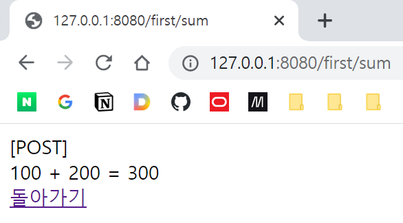

# 서블릿 3

## 패러미터 전달

### 쿼리스트링

> **클라리언트가 서블릿에 데이터를 전달하려면**

- 쿼리스트링  Query String: URL 뒤에 문자열을 붙여 데이터를 전달하는 방법
    - ?key1=val1&key2=val2
    - GET 방식

  > 문제: 클라리언트가 2개의 숫자를 보내면 그 합의 결과를 알려주는 서블릿을 작성하라. 이떄 데이터 전달 방식은 쿼리 스트링 전송 방식을 사용한다.
  
  /sum에 맵핑된 새로운 서블릿 클래스 AddServlet 작성
  
  ```java
// 전략

	protected void doGet(HttpServletRequest request, HttpServletResponse response) throws ServletException, IOException {
		// 1. 입력 처리
		//    http://127.0.0.1/first/sum?num1=3&num2=5
		//    으로부터,
		//    num1과 num2를 받아와 처리.
		int num1 = Integer.parseInt(request.getParameter("num1"));
		int num2 = Integer.parseInt(request.getParameter("num2"));
		
		// 2. 로직 처리
		int sum = num1 + num2;
		
		// 3. 출력 처리
		PrintWriter out = response.getWriter();
		out.printf("<html><head></head><body>%d + %d = %d</body></html>", num1, num2, sum);
		out.close();
	}
  ```

request.getParameter("key")를 사용하였다. 이 값은 무조건 String이므로 정수로 변환하여 처리하였다.


### 폼

HTML 폼에서 전송된 Request Body로부터 값을 입력받아 처리해보자.

우선 HTML 파일을 만든다.


```html
<!DOCTYPE html>
<html>
<head>
<meta charset="UTF-8">
<title>Insert title here</title>
</head>
<body>
	<h1>두 수의 덧셈</h1>
	<form action="http://127.0.0.1:8080/first/sum" method="GET">
		<input name="num1" type="text"> + <input name="num2" type="text"> =
		<input type="submit" value="?">
	</form>
</body>
</html>
```

메서드를 GET으로 하여 폼을 작성하였다. 이전에 작성한 서블릿 코드를 변경하지 않아도 잘 작동한다.

```html
<h1>두 수의 덧셈</h1>
<form action="http://127.0.0.1:8080/first/sum" method="POST">
    <input name="num1" type="text"> + <input name="num2" type="text"> =
    <input type="submit" value="?">
</form>
```

doPost를 작성하여 POST 방식으로 넘어온 데이터를 받을 수 있도록 처리하자.




잘 동작한다.

