# 서블릿 4

## 객체의 상태

### Stateful

전형적인 기본 자바 프로그램을 떠올려보자.

```java
package test;

class MyClass {

	// 생성자
	public MyClass() {
		// TODO Auto-generated constructor stub
	}
	
	// 필드
	private int cost;
	
	// 메서드
	public int times(int num) {
		return this.cost * num;
	}

	// Getter & Setter
	public int getCost() {
		return cost;
	}

	public void setCost(int cost) {
		this.cost = cost;
	}
	
}

public class Test {

	public static void main(String[] args) {
		MyClass obj = new MyClass();
		
		// 객체의 메서드를 이용해 객체의 필드를 제어
		obj.setCost(100);
		obj.times(5);
		System.out.println(obj.getCost());;
		
		
	}
}
```

이러한 구조를 Stateful한 구조라고 한다. 정보를 객체가 직접 가지고 있도록 하고, 객체의 메서드를 이용해 제어하는 방식이다. 우리는 이러한 방식을 계속해서 사용해왔다.

### Stateless

그에 반해 Stateless한 구조도 있다. 구현 차원에서 보면, 필드를 가지고 있지 않은 클래스와 그 인스턴스를 말하는 것이다. 이제 서블릿으로 넘어오게 되면서, 이러한 스타일을 많이 보게 될 것이다.  

## 서블릿의 라이프사이클

### 인스턴스 생성

톰캣의 컨테이너(엔진)은 특정 서블릿에 대한 요청이 들어왔을 떄 메모리 상에 해당 서블릿의 인스턴스가 만들어지지 않은 경우 새롭게 생성한다. 이후 같은 서블릿에 대한 요청이 들어왔을 떄에는 이미 해당 서블릿의 인스턴스가 생성된 시점이기 떄문에 이전에 만들어진 인스턴스를 재사용한다. 즉, 싱글톤 패턴이다.

우리의 프로젝트에는 복수의 서블릿 클래스가 존재할 수 있다. 따라서 프로젝트에 N개의 서블릿이 있는 경우, 컨테이너의 메모리 상에는 각 서블릿에 대한 인스턴스도 N개까지 존재할 수 있는 것이다.

### 서블릿 인스턴스 상의 메서드 호출

인스턴스를 생성하고 나서, 컨테이너는 init()를 호출하고, request와 response 객체를 만든다. 이후 컨테이너의 스레드 인보커가 서블릿 인스턴스, requset 및 response 객체를 인자로 갖는 스레드를 생성하고, 스레드에서 서블릿 인스턴스의 service()를 호출한다. servece()에서 doGet(), doPost() 등의 메서드를 호출하면서 개발자가 작성한 로직이 실행된다.

### 서블릿은 스테이트리스해야한다.

이런 와중에, 하나의 서블릿에 대한 요청이 동시에 있을 수 있다. 이 경우 서블릿 인스턴스는 단 한 개만 생성되어 클라이언트별 스레드에 넘겨지기 떄문에, 공유 객체 역할을 하게 된다. 이때, 특정 서블릿이 스테이트풀하게 작성되었고, 클라이언트 A와 클라이언트 B가 동시에 해당 서블릿을 요청했다고 하자.

클라이언트 A 스레드에서 서블릿 인스턴스의 필드에 있는 데이터를 수정한다면? 클라이언트 B 스레드가 작업을 수행할 떄에도 영향을 미칠 것이다. 동기화를 수행해도 문제가 발생할 여지가 있다. (예> 싱글톤으로 돌지 않을 경우) 따라서 일반적인 경우에는 서블릿은 스테이트리스하게 작성하는 것이 바람직하다. [참고](https://velog.io/@woply/%EC%8B%B1%EA%B8%80%ED%86%A4-%ED%8C%A8%ED%84%B4%EC%97%90-%EB%AC%B4%EC%83%81%ED%83%9Cstateless%EA%B0%80-%ED%95%84%EC%9A%94%ED%95%9C-%EC%9D%B4%EC%9C%A0)

## 클라이언트로부터의 입력 처리

### 프로젝트 생성

- 실습을 위해 Dynamic Web Project로 ServletInputTest를 만든다. 어제도 했듯이 Runtime은 None, Web module version은 4.0으로 한다.  
- web.xml은 만들지 않는다.  
- Configure - Convert To Maven Project로 메이븐 프로젝트로 바꿔준다. 
    - Group Id는 패키지 경로처럼 유일하게 잡아준다. (com.test)
    - Arifact Id가 곧 컨텍스트 루트가 되기 때문에 input으로 바꿔준다.  
- 혹시 모르니 업데이트 프로젝트를 해준다 (Maven - Update Projects)  
- Maven Repository에서 [tomcat-servlet-api](https://mvnrepository.com/artifact/org.apache.tomcat/tomcat-servlet-api)를 찾아, 9.0.71의 태그를 pom.xml에 추가해준다. 저장하면 자동으로 이클립스가 홈 디렉토리의 .m2에 패키지를 다운로드 받아 저장한다.
    - (이미 다운로드 받은 적 있으면 다운로드하지 않음 - 모든 프로젝트가 이 패키지를 공유한다 / 패키지 관리 효율 상승)  

### HTML 생성

webapp 아래에 index.html 생성 (html5)
같은 디렉토리의 META-INF, WEB-INF는 특정 역할을 수행하기 위해 만들어진 것이기 때문에 수정하지 않는다.

```html
<!DOCTYPE html>
<html>
<head>
<meta charset="UTF-8">
<title>Insert title here</title>
</head>
<body>
	<h1>입력 연습</h1>
	
	<!-- 서버에 데이터를 보낼 때에는 GET 혹은 POST -->
	<!-- POST 요청 시 FORM 태그(기본)를 이용하거나 자바스크립트 이용. -->
	<form>
		<span>사용자 ID: </span>
		<input type="text">
	</form>
</body>
</html>
```

### 톰캣 서버 Configure

하단 Servers의 Tomcat v9.0 우클릭 - Add and Remove  
현재 프로젝트를 Add  
여기서 변경 내용은 사실 서버 설정의 server.xml에 저장된다.

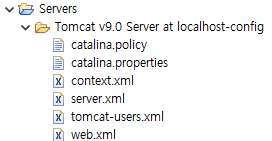

```xml
<!-- 하단부 -->
<Context docBase="ServletInputTest" path="/input" reloadable="true" source="org.eclipse.jst.jee.server:ServletInputTest"/>
```

서버를 실행하고, 브라우저로 접속해본다. [http://127.0.0.1:8080/input/index.html](http://127.0.0.1:8080/input/index.html) (index.html은 생략 가능)

텍스트 필드가 보인다. 사용자가 아이디를 입력하면 그에 대한 처리를 수행하는 서블릿을 작성하고자 한다. 그 전에 submit 버튼을 추가하자.

```html
<!DOCTYPE html>
<html>
<head>
<meta charset="UTF-8">
<title>Insert title here</title>
</head>
<body>
	<h1>입력 연습</h1>
	
	<!-- 서버에 데이터를 보낼 때에는 GET 혹은 POST -->
	<!-- POST 요청 시 FORM 태그(기본)를 이용하거나 자바스크립트 이용. -->
	<form action="http://127.0.0.1:8080/input/inputTest" method="POST">
		<span>사용자 ID: </span>
		<input type="text" name="userID">  <br><br>
		<button type="submit">전송</button> <!-- 혹은 <input type="submit" value="전송"> -->
	</form>
</body>
</html>
```
 서브밋 버튼을 추가하고, form의 어트리뷰트에 action과 method를 지정하였다. action을 현재 컨텍스트의 /inputTest로 잡았으므로, 이후 데이터를 처리할 서블릿을 만들 떄 /inputTest로 URL 맵핑을 해줘야할 것이다.  
 이 상태에서 바로 [http://127.0.0.1:8080/input/index.html](http://127.0.0.1:8080/input/index.html)로 접속하여 전송 버튼을 누르면 404 오류 (Not Found)가 발생한다. 아직 서블릿 클래스를 만들지 않았기 떄문이다.
 
 ### 서블릿 작성 (POST)
 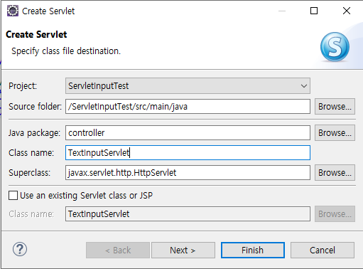
 
 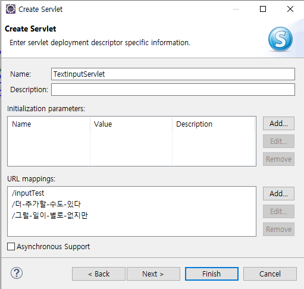
 \* 그렇다고 진짜 추가하지는 말 것. 필요한 URL만 맵핑.

```java
public class TextInputServlet extends HttpServlet {
	private static final long serialVersionUID = 1L;
	
	// 필드 (Stateful)
	int count = 0; // 클라이언트 스레드에 의해 공유됨

    // 중략
    protected void doPost(HttpServletRequest request, HttpServletResponse response) throws ServletException, IOException {
		count += 1; // Stateful. 정말 공유하는가?
		
		// MVC를 배우기 전까지는 여기서 모두 수행
		// 1. 입력 처리
		String userInput = request.getParameter("userID");
		
		// 2. 로직 처리 - 없음
		
		// 3. 출력 처리
		response.setContentType("text/html; charset=UTF-8");
		PrintWriter out = response.getWriter();
		out.println("<html>");
		out.println("<head></head>");
		out.printf("<body>%s님 환영합니다.</body>", userInput);
		out.println("</html>");
		out.close();
	}
```

테스트 해보면, 영문을 잘 처리되지만, 한글이 깨진다.

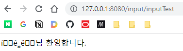

POST 방식으로 문자열이 들어올 떄, ISO 8859-1 (Latin-1)로 들어온다. 따라서 기본적으로 한글 처리가 안되며, 인코딩을 따로 바꿔줘야 한다.  
우리가 만든 HTML 파일은 이미 인코딩을 UTF-8로 지정되어 있으므로, 받는 입장, 즉 서블릿 측에서 바꿔주면 된다. getParameter를 하기 전에, 아래와 같은 명령을 추가한다.

```java
// 1. 입력 처리
request.setCharacterEncoding("UTF-8");
String userInput = request.getParameter("userID");
```

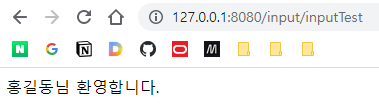

### GET 요청 처리

GET으로도 요청을 받아보자.

먼저 index.html을 수정한다.

```html
<!-- GET 요청 -->
<form action="http://127.0.0.1:8080/input/inputTest" method="GET">
    <span>사용자 ID: </span>
    <input type="text" name="userID">  <br><br>
    <button type="submit">전송</button>
</form>

<br>혹은<br>

<a href="http://127.0.0.1:8080/input/inputTest?userID=강감찬">
    'http://127.0.0.1:8080/input/inputTest?userID=강감찬'으로 직접 이동
</a>
```

doGet에 doPost의 코드를 복사한다.

```java
protected void doGet(HttpServletRequest request, HttpServletResponse response) throws ServletException, IOException {
    count += 1; // Stateful. 정말 공유하는가?

    // MVC를 배우기 전까지는 여기서 모두 수행
    // 1. 입력 처리
    request.setCharacterEncoding("UTF-8");
    String userInput = request.getParameter("userID");

    // 2. 로직 처리 - 없음

    // 3. 출력 처리
    response.setContentType("text/html; charset=UTF-8");
    PrintWriter out = response.getWriter();
    out.println("<html>");
    out.println("<head></head>");
    out.printf("<body>[GET] %s님 환영합니다.</body>", userInput);
    out.println("</html>");
    out.close();
}
```

잘 작동한다. 한글 문자열도 잘 넘겨받는다.  
\* 원래 이전 버전에서는 쿼리스트링으로 한글이 잘 안넘어가는 경우가 있었다고 한다. 일단은 잘 되니까 교수님이 그냥 넘어가자고 하셨다.

또한 doGet에서는 request.setCharacterEncoding("UTF-8")를 지워도 한글이 꺠지지 않는다. 주석처리 해보라.  
GET 요청에서 쿼리 스트링을 가져오는 방법과 POST 요청에서 Request Body에서 파싱해오는 방법이 내부적으로 다르다. 따라서 request.setCharacterEncoding("UTF-8")는 POST 요청 처리시에 유효한 것이다. GET 요청 처리시에는 쓰지 않는다.

### 상대경로

다시 POST 방식으로 폼을 변경한다.

현재 form의 action 어트리뷰트에는 절대경로가 지정되어 있다. 절대경로란 전체 URL을 스킴부터 시작하여 모두 지정하는 것이다. 직관적이라는 장점은 있지만, 일반적으로는 상대경로를 많이 쓴다. 호스트 주소, 포트 번호, 컨텍스트 루트 등을 변경해야할 경우 절대경로로 하드코딩되어 있으면 곤란하기 떄문이다.

상대경로는 컨텍스트 루트를 기준으로 경로를 설정하는 것이다. 그 기준점이 어떤 위치에서 주소를 쓰는지에 따라 달라지므로 유의해서 써야한다.

```java
<form action="inputTest" method="POST">
    <span>사용자 ID: </span>
    <input type="text" name="userID">  <br><br>
    <button type="submit">전송</button>
</form>
```

inputTest만 썼는데도 잘 된다. 그러나,

```
action="/inputTest"
```

로 쓰면 절대경로로는 http://127.0.0.1:8080/inputTest를 가리키게 되어 오류가 발생한다. 즉, '/'로 시작하는 경우 '/'는 앞에 도메인(스킴+아이디+포트)까지를 지칭하는 것이다.

> '/' => 'http://127.0.0.1:8080/'

따라서 '/'로 시작하려면 '/input/inputTest'로 줘야한다.

a 요소의 href에도 상대경로를 줄 수 있다.

```html
<a href="inputTest?userID=강감찬">
    'inputTest?userID=강감찬'으로 직접 이동
</a>
```


### 다른 컨트롤로부터 입력받기 (복수 데이터)

check.html를 만든다

```html
<h1>취미를 선택해주십시오</h1>
<form action="myhobby" method="POST">
    <input type="checkbox"> 운동 <br>
    <input type="checkbox"> 공부 <br>
    <input type="checkbox"> 게임 <br>
    <input type="checkbox"> 잠자기 <br>

    <button type="submit">전송</button>
</form>
```

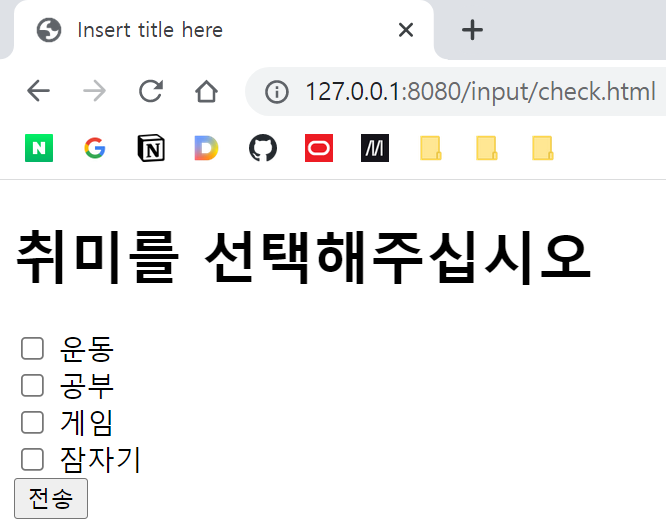

여러 개의 데이터가 넘어와야 한다.

처리할 서블릿을 만들자.


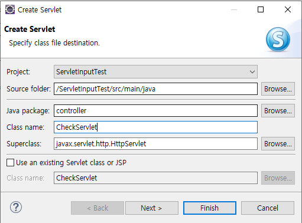

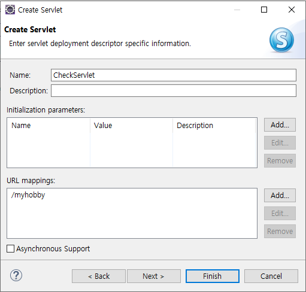

또한, html을 수정해줘야 한다. \<input type="checkbox"\>에도 이 체크박스를 식별할 수 있도록 하는 무언가 어트리뷰트가 필요하다. '운동'과 체크박스는 이웃하여 렌더링 될 뿐이지, 사실 내부적으로 어떠한 연간관계는 없기 떄문이다.

그렇다고,

```html
    <input type="checkbox" name="check1"> 운동 <br>
    <input type="checkbox"  name="check2"> 공부 <br>
    <input type="checkbox"  name="check3"> 게임 <br>
    <input type="checkbox"  name="check4"> 잠자기 <br>
```

이렇게 하면, 다수의 항목이 필요할 때 체크박스를 만드는 것이 번거로워진다. 따라서 아래와 같이 한다.

```html
<form action="myhobby" method="POST">
    <input type="checkbox" name="myCheck" value="weight"> 운동 <br>
    <input type="checkbox" name="myCheck" value="study"> 공부 <br>
    <input type="checkbox" name="myCheck" value="game"> 게임 <br>
    <input type="checkbox" name="myCheck" value="sleep"> 잠자기 <br>
    <br>
    <button type="submit">전송</button>
</form>
```

그럼 서브밋 버튼을 눌렀을 때 value 값이 넘어가게 된다.

그럼 서블릿에서는 이 값을 어떻게 받아야 할까? request 객체의 getParameterValues 메서드를 사용하면 된다. 선택된 values를 문자열 배열로 반환해준다.

```java
String[] data = request.getParameterValues("myCheck");
```

이 배열을 반복하여 작업을 수핸하면 된다.

아래와 같이 구현할 수 있다.

```java
protected void doPost(HttpServletRequest request, HttpServletResponse response) throws ServletException, IOException {
    // 1. 입력 처리
    request.setCharacterEncoding("UTF-8");
    String[] hobbies = request.getParameterValues("myCheck");

    // 2. 로직 처리 -- 없음

    // 3. 출력 처리
    response.setContentType("text/html; charset=UTF-8");
    PrintWriter out = response.getWriter();
    out.println("<html>");
    out.println("<head></head>");
    out.println("<body>");
    out.println("<h1>선택된 취미</h1>");

    for (String hobby : hobbies) {
        out.println(hobby + "<br>");
    }

    out.println("</body>");
    out.println("</html>");
    out.close();
}
```

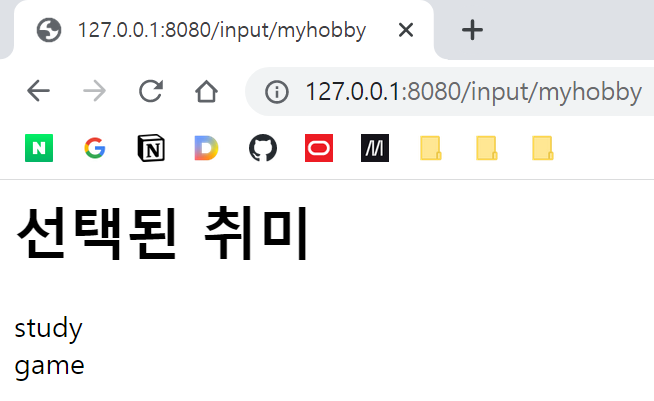


## 입력 실습: 도서 검색

이전에 구축했던 도서 데이터베이스로부터, 사용자가 입력한 키워드와, 가격 조건에 해당하는 도서를 검색하여 표시하는 서블릿을 작성하라.

사용자의 입력은 별도 HTML의 Form으로부터 받고, POST 방식으로 서블릿으로 전달한다. 서블릿에서는 doPost에서 전달받은 값으로 myBatis를 통해 해당하는 도서 리스트를 가져와 반환해준다.

### 구현 결과

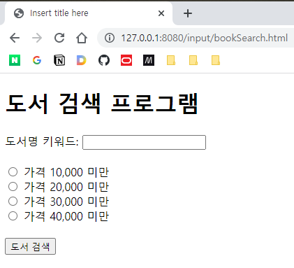

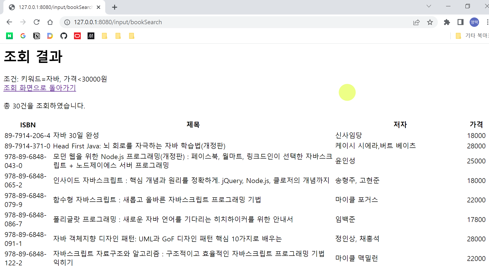

[소스코드](../../Projects-With-Servlet/)