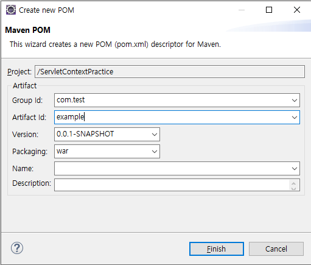
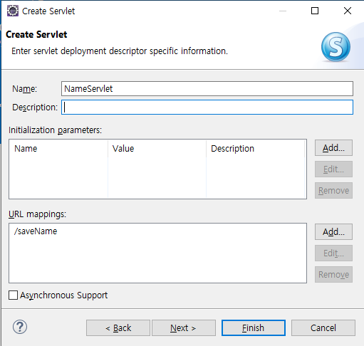
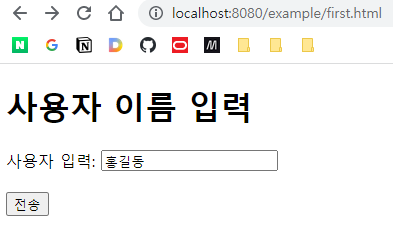
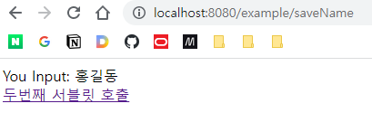
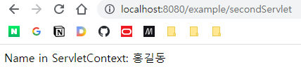

# 서블릿 5

## 오늘 배울 것

- ServletContext
- Session 처리
- JSP

## ServletContext

모든 서블릿을 작성할 때 필요한 것은 아니지만, 필요한 경우가 있다.

반복적으로 다루고 있듯이, 클라이언트가 요청하면, 톰캣 내의 HTTP 서버가 받아 컨테이너에 Request를 넘긴다. 컨테이너는 해당 요청에 대한 서블릿의 인스턴스가 있는지 없는지를 확인하여 없는 경우 새로 인스턴스를 만들며, 스레드 인보커가 해당 인스턴스를 갖는 스레드를 만든다. 스레드는 넘겨받은 인스턴스의 service(). doGet() 등을 실행한다.

서블릿 인스턴스의 메서드가 종료되어 스레드도 종료되면, 인스턴스를 제외하고 요청을 처리하기 위해 만들어졌던 각종 객체들이 소멸된다. 예컨대 request, response 등 말이다. 그러나 해당 서블릿의 처리 결과를 다른 서블릿에서 받아오고 싶다면 어떻게 해야할까? 객체를 공유해야 하는가? 안 된다. Stateless하게 서블릿을 설계하려면 객체를 공유해 각 서블릿의 필드로 잡는 것은 지양해야 한다.

> **Stateless한 서블릿**  
> 서블릿은 기본적으로는 싱글톤 패턴으로 운용되기 떄문에, 동기화 처리를 잘 하면 Stateful하게 사용해도 괜찮아보인다. 그러나 설정에 따라 서블릿을 싱글톤 방식으로 생성하지 않을 수도 있는 등 싱글톤을 항상 보장할 수 있는 것은 아니다. 따라서 Stateless하게 짜는 것이 원칙이다.

따라서 그 대안으로, 컨테이너에는 모든 서블릿이 공유할 수 있도록 데이터를 저장할 수 있는 공간이 있으며, 이것이 ServletContext이다. ServletContext는 Map 구조의 객체이며, Key와 Value의 쌍으로 데이터를 저장할 수 있다. 컨테이너 안에 위치하기 때문에 컨텍스트에서 유일하며, 클라이언트 스레드의 doPost, doGet 등에서 레퍼런스를 얻어 접근할 수 있다.

**스코프** 모든 서블릿에서 접근할 수 있으며, 컨테이너가 소멸될 때 같이 소멸된다.

## 실습

### 프로젝트 생성

- 프로젝트명: ServletContextPractice
- Context Root: example



- HTML 파일 생성: 
```html
<!DOCTYPE html>
<html>
<head>
<meta charset="UTF-8">
<title>Insert title here</title>
</head>
<body>
	<!-- 사용자 이름을 ServletContext에 저장 -->
	<h1>사용자 이름 입력</h1>
	<form action="saveName" method="post">
		사용자 입력: <input type="text" name="userName">
		 
		<br><br>
		
		<button type="submit">전송</button>
	</form>
</body>
</html>
```

- 서블릿1 생성


```java
protected void doPost(HttpServletRequest request, HttpServletResponse response) throws ServletException, IOException {
    // 1. 입력 처리
    request.setCharacterEncoding("UTF-8");
    String userName = request.getParameter("userName");

    // 2. 로직 처리
    ServletContext context = this.getServletContext(); // ServletContext 가져오기
    context.setAttribute("memberName", userName); // Key, Value의 쌍으로 데이터 저장

    // 3. 출력 처리
    response.setContentType("text/html; charset=UTF-8");
    PrintWriter out = response.getWriter();

    out.println("<html><head></head>");
    out.println("<body>");
    out.println("<a href='secondServlet'>두번째 서블릿 호출</a>");
    out.println("</body></html>");
    out.close();
}
```

아래에 주목!!

```java
ServletContext context = this.getServletContext(); // ServletContext 가져오기
		context.setAttribute("memberName", userName); // Key, Value의 쌍으로 데이터 저장
```


- 서블릿2 생성

ClassName: SecondServlet
mapped url: /secondServlet

```java
protected void doGet(HttpServletRequest request, HttpServletResponse response) throws ServletException, IOException {
    // 1. 입력 처리 - 없음

    // 2. 로직 처리
    ServletContext context = this.getServletContext();
    String name = (String) context.getAttribute("memberName"); // Object 타입을 String으로 형변환

    // 3. 출력 처리
    response.setContentType("text/html; charset=UTF-8");
    PrintWriter out = response.getWriter();

    out.println("<html><head></head>");
    out.println("<body>");
    out.printf("Name in ServletContext: %s<br>\n", name);
    out.println("</body></html>");
    out.close();
}
```

아래에 주목!!

```java
ServletContext context = this.getServletContext();
String name = (String) context.getAttribute("memberName"); // Object 타입을 String으로 형변환
```






 
 ServletContext에 저장된 데이터를 잘 불러왔다.
 
 그러나 Tomcat을 재기동하는 등 컨테이너가 소멸되면 ServletContext도 같이 날라간다는 것에 주의해야 한다.
 
 
