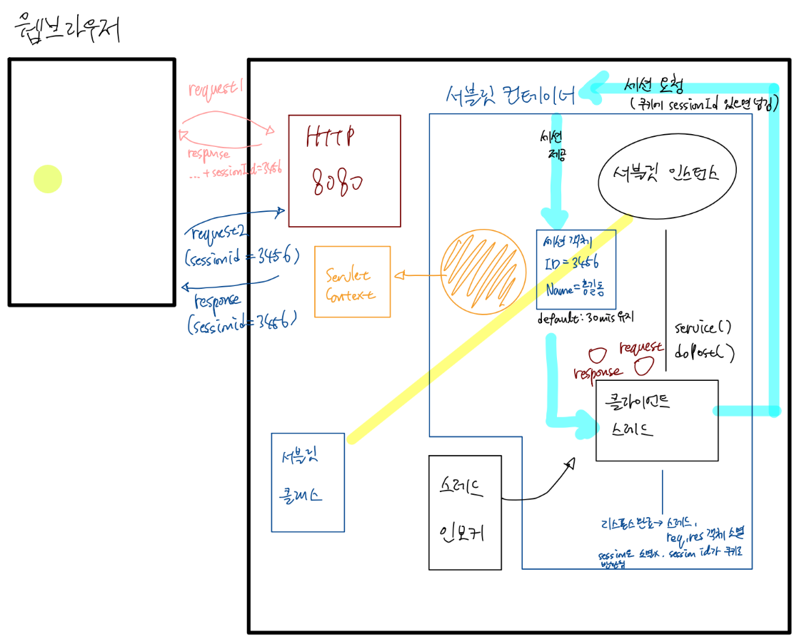

# 서블릿 6: Session

## 세션 개요

HTTP 프로토콜이 내포한 한계 때문에 필요하게 되었다. HTTP 프로토콜은 다른 프로토콜에 비교하면 아주 간단하게 설계되었으며, 동작 방식도 단순하다. 클라이언트가 서버에 Request를 보내는 시점에서 커넥션이 생기며, 서버가 처리 후 Response를 보내면 바로 커넥션이 종료된다. 

즉 매 요청마다 커넥션이 생겼다가 종료되기를 반복한다는 것이다. 단순한 동시에 비효율적이라고 할 수 있는 구조이지만, 일반적으로 서버가 클라이언트에 비해 절대 소수이기에 이런 구조가 채택되었다.

> HTTP는 무상태(Stateless) 프로토콜이다.

어찌되었든 웹은 HTTP 프로토콜 위에서 동작하므로, 필연적으로 연결성이 없다는 한계까 있다. 예컨대 커넥션이 한 번 종료되면 서버 측에는 요청했던 클라이언트의 상태(정보)가 남아있지 않게 되는 것이다.

단순히 보고서 따위를 서버에 올려두고 원격으로 열람하는 정도였던 초창기 웹에서 이러한 한계는 단점이 되지 못했을 것이다.  
그러나 최근의 웹 생태계는 더 복잡하다. 예컨대 쇼핑몰 서비스라면, 사용자는 서비스에 최초 접속 시 단 한 번만 로그인을 수행하고, 그 이후에는 로그인 정보가 서버에 유지되어, 장바구니에 물건을 담고, 결제를 수행하는 과정까지 매끄럽게 진행되어야 한다. 이를 위해서는 클라이언트에 대한 정보가 서버에 유지되어야 한다. 로드되는 모든 페이지마다 로그인을 하길 원하는 사용자는 없을 것이기 때문이다. 이를 위해 필요한 것이 세션이다.

## 간단한 로그인 구현

### DB 준비

#### 새로운 스키마 생성

이름: servletsession


#### 테이블 생성

새로 만든 스키마 선택 후,

```sql
CREATE TABLE members (
	id			VARCHAR(10) NOT NULL PRIMARY KEY,
	name		VARCHAR(20) NOT NULL,
	password	VARCHAR(20) NOT NULL
);

INSERT INTO members VALUES('hong', '홍길동', '1234');
```

### HTML 작성

index.html 작성

```html
<!DOCTYPE html>
<html>
<head>
<meta charset="UTF-8">
<title>Insert title here</title>
</head>
<body>
	<h1>로그인</h1>
	<form action="login" method="post">
		ID: <input type="text" name="userID"> <br>
		PW: <input type="password" name="userID"> <br>
		<button type="submit">로그인</button> <br>
	</form>
</body>
</html>
```

### MyBatis 세팅 및 로그인 처리 서블릿 작성

#### 세션 없이 해보기 (과제)
세션을 적용하기 전 단계까지 직접 해보라.

해당하는 계정이 있으면 환영한다는 문구를 출력, 없으면 로그인 실패 출력.

- 구현 결과

[소스코드](https://github.com/0tak2/KOSAjava/tree/main/Projects-With-Servlet/ServletSessionPractice)


올바른 계정정보를 입력하면,


인삿말이 출력된다.

잘못된 계정 정보를 입력하면,


다시 시도하라는 메시지가 출력된다.

그러나 세션을 적용하지 않았기 떄문에, 로그인 정보는 재요청시 유지되지 않는다.

#### 세션 적용

로그인에 성공한 유저에게 게시판으로 접속할 수 있는 링크를 제공한다고 하자.

```java
if(result != null) {
    // 로그인 성공
    out.printf("%s(%s)님 다시 오신 것을 환영합니다.<br>\n", result.getName(), result.getId());
    out.println("<a href='board'>게시판</a>");
    out.println("<a href='login.html'>로그아웃</a>");
} else {
    // 로그인 실패
    out.println("<script>");
    out.println("alert('로그인에 실패했습니다. 아이디와 비밀번호를 다시 확인해주세요.');");
    out.println("history.back();");
    out.println("</script>");
}
```

##### BoardServlet 작성

- Class Name: BoardServlet
- Mapped URL: /board

```java
protected void doGet(HttpServletRequest request, HttpServletResponse response) throws ServletException, IOException {
    // 로그인한 유저만 접근 가능

    // 출력 처리
    response.setContentType("text/html; charset=UTF-8");
    PrintWriter out = response.getWriter();

    out.println("<html><head></head>");
    out.println("<body>");
    out.println("게시판에 오신 것을 환영합니다.<br>\n");
    out.println("</body></html>");
    out.close();
}
```

그럼 로그인 성공 화면에서 게시판 접속 링크를 누르면, 게시판으로 이동하게 된다.

그러나, 로그인 여부에 상관 없이 해당 URL(http://localhost:8080/example2/board)로 요청하면 같은 내용이 표시된다. 즉, 로그인 하지 않은 사람도 게시판에 접속할 수 있다는 것이다.  
또한, 로그인한 사람이 누구인지 BoardServlet 서블릿에서는 알 수 없다. 이를 해결하기 위해 세션을 도입할 수 있다.




##### LoginServlet 수정

```javascript
// 전략
if(result != null) {
    // 로그인 성공
    // 서블릿 컨테이너에 Session 객체 요청
    // request.getSession(true)
    //		: 기존에 할당받은 세션이 있는 경우 해당 세션 반환. 없으면 새로 생성
    HttpSession session = request.getSession(true);
    session.setAttribute("loginName", result.getName());
    session.setAttribute("loginID", result.getId());

    out.printf("%s(%s)님 다시 오신 것을 환영합니다.<br>\n",
            session.getAttribute("loginName"), session.getAttribute("loginID"));
    out.println("<a href='board'>게시판</a><br>");
    out.println("<a href='login.html'>로그아웃</a>");
} else {
    // 로그인 실패
    out.println("<script>");
    out.println("alert('로그인에 실패했습니다. 아이디와 비밀번호를 다시 확인해주세요.');");
    out.println("history.back();");
    out.println("</script>");
}
// 후략
```

##### BoardServlet 수정

```java
protected void doGet(HttpServletRequest request, HttpServletResponse response) throws ServletException, IOException {
    // 로그인한 유저만 접근 가능
    //	request.getSession(false): 기존에 할당된 세션이 있으면 해당 세션 반환.
    //								없으면 null 반환. 즉 로그인 안된 유저라면 null
    HttpSession session = request.getSession(false);

    // 출력 처리
    response.setContentType("text/html; charset=UTF-8");
    PrintWriter out = response.getWriter();

    out.println("<html><head></head>");
    out.println("<body>");
    if (session != null) {
        out.println("<h1>게시판에 오신 것을 환영합니다.</h1>\n");
    } else {
        out.println("로그인이 필요한 서비스입니다.");
        // 로그인 화면으로 리다이렉트
    }
    out.println("</body></html>");
    out.close();
}
```

이제, 정상적인 경로로 로그인한 유저에게만 인사말이 출력된다. 직접 URL에 대해 GET 요청한 경우 로그인이 필요하다는 문구가 출력된다.


