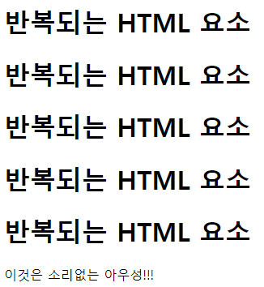

# 서블릿 7: JSP

## 개요

원래 Java Server Pages의 약자. 오라클 인수 후 라이센스 관련 문제로 풀네임이 Jakarta Server Page로 변경되었음.  
JSP는 템플릿 엔진. Vue.js에서 {{}}를 사용해 보간을 했듯이, JSP를 사용하면 HTML 내에 자바 소스 코드 삽입 가능.

기반은 서블릿과 완전히 동일함. 그러나 서블릿은 HTML을 출력하기 위해 스트림을 수동으로 다뤄야 한다는 한계가 있었음. JSP는 출력을 쉽게 할 수 있게 해주면서도, 결과적으로는 서블릿으로 변환됨.

## 형식

상술했듯이 HTML에 JSP 요소가 포함된 구조이다. JSP요소는 Java Code에 JSP 특유의 표기법이 결합된 것이다. 서블릿의 만대라고 생각하면 된다. Java 코드 내에 HTML 요소를 스트링으로서 부분적으로 취급했던 서블릿과 달리 JSP에서는 HTML 문서에 자바 코드가 일부 포함되어있는 꼴을 하고 있다.

## Scriptlet, Expression


webapp 디렉토리 아래에 login_jsp.jsp를 만든다.


일반 HTML처럼 렌더링되었다.  
다만 상단의 <%@ %>가 독특하다. 이는 **디렉티브**라고 부르며, 설정과 관련되어 있다.

**JSP 제공 과정 다이어그램**


즉, JSP의 각 HTML 라인은 out.println과 같은 코드로 자동으로 변환된다.

<% %> 내에는 일반 자바 코드가 나올 수 있다.
    - 변수 선언
    - for, if, while문과 같은 제어문
    - 메서드 호출, 객체 생성 등
    - <%, %>를 포함한 JSP 요소 전체를 Scriptlet이라고 부른다.
    - Scriptlet 내용물은 JSP 컨테이너에 의해 자바 코드로 변환될 떄, \_JSPService() 내에 들어가게 된다.
    - 이를 Scriptlet이라고 한다.
다음과 같은 코드가 가능하다.

```jsp
<%
    for(int i=0; i<5; i++) {
%>
    <h1>반복되는 HTML 요소</h1>	
<%
    }
%>

이것은 소리없는 아우성!!!
```



뷰의 {{ }}와 같이 **변수의 값을 특정 위치에 출력**하고 싶다면,  
<%= 출력하고자_하는_값 %>

아래와 같다.

```jsp
<% String name = '홍길동'; %>
사용자의 이름: <%= name %>
```


이를 Expression이라고 한다. <% %>와 <%= %> 대신 다른 표현식도 있지만, 이정도만 알면 된다. 예전에는 서블릿을 전혀 사용하지 않고, JSP 만으로 모든 로직을 처리한 적이 있었다. 문서 상단의 어딘가에서 로직처리, DB처리를 하고, 본문 어딘가에서 로직 처리 결과를 끼워넣어 출력했다. 이를 위해서 다양한 Syntactic Sugar가 필요했던 것이다.

이렇게 하면 만들기는 쉽다. 그러나 입력, 로직, 출력이 한 문서 안에 있으니, 유지보수에 문제가 생기기 시작했다. 결국 이를 해결하기 위해 MVC 패턴이 적극적으로 도입되었고, 현재 JSP는 View만을 담당하게 되었다.


## 게시판 구현

MVC Pattern이 들어가야하므로 조금 어렵다. 여기에 JSP를 이용한 View처리가 들어가야 한다.

또한 구현에 있어서,
1. 일반적인 Round-Trip 방식으로 만들수도 있고,
2. JQuery AJAX를 이용해서 View처리 분리 가능
3. 또는 Vue.JS와 같이 UI프레임워크를 사용하여 온전히 백엔드와 프론트엔드를 분리하여 구현할 수도 있음.

우선 1번 방법으로 해보자.

### 문제 정의 (도메인 분석)

해결해야하는 문제부터 명확하게 정의하자.

스토리보드 하나를 짜보자.

요구사항
1. 로그인 기능
    - 로그인 해야만 글쓰기, 댓글 쓰기 가능. 자신이 작성한 글만 수정 가능
3. 