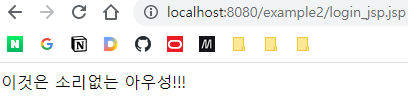
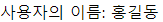
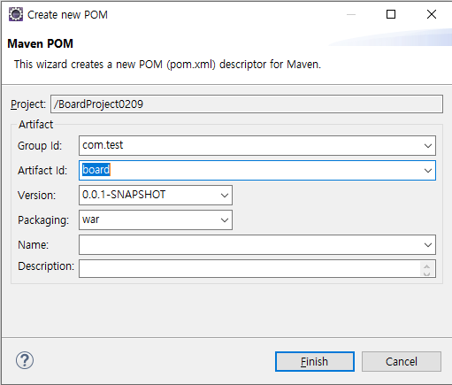
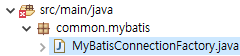

# 서블릿 7: JSP

## 개요

원래 Java Server Pages의 약자. 오라클 인수 후 라이센스 관련 문제로 풀네임이 Jakarta Server Page로 변경되었음.  
JSP는 템플릿 엔진. Vue.js에서 {{}}를 사용해 보간을 했듯이, JSP를 사용하면 HTML 내에 자바 소스 코드 삽입 가능.

기반은 서블릿과 완전히 동일함. 그러나 서블릿은 HTML을 출력하기 위해 스트림을 수동으로 다뤄야 한다는 한계가 있었음. JSP는 출력을 쉽게 할 수 있게 해주면서도, 결과적으로는 서블릿으로 변환됨.

## 형식

상술했듯이 HTML에 JSP 요소가 포함된 구조이다. JSP요소는 Java Code에 JSP 특유의 표기법이 결합된 것이다. 서블릿의 만대라고 생각하면 된다. Java 코드 내에 HTML 요소를 스트링으로서 부분적으로 취급했던 서블릿과 달리 JSP에서는 HTML 문서에 자바 코드가 일부 포함되어있는 꼴을 하고 있다.

## Scriptlet, Expression


webapp 디렉토리 아래에 login_jsp.jsp를 만든다.




일반 HTML처럼 렌더링되었다.  
다만 상단의 <%@ %>가 독특하다. 이는 **디렉티브**라고 부르며, 설정과 관련되어 있다.

**JSP 제공 과정 다이어그램**


즉, JSP의 각 HTML 라인은 out.println과 같은 코드로 자동으로 변환된다.

<% %> 내에는 일반 자바 코드가 나올 수 있다.
    - 변수 선언
    - for, if, while문과 같은 제어문
    - 메서드 호출, 객체 생성 등
    - <%, %>를 포함한 JSP 요소 전체를 Scriptlet이라고 부른다.
    - Scriptlet 내용물은 JSP 컨테이너에 의해 자바 코드로 변환될 떄, \_JSPService() 내에 들어가게 된다.
    - 이를 Scriptlet이라고 한다.
다음과 같은 코드가 가능하다.

```jsp
<%
    for(int i=0; i<5; i++) {
%>
    <h1>반복되는 HTML 요소</h1>	
<%
    }
%>

이것은 소리없는 아우성!!!
```


뷰의 {{ }}와 같이 **변수의 값을 특정 위치에 출력**하고 싶다면,  
<%= 출력하고자_하는_값 %>

아래와 같다.

```jsp
<% String name = '홍길동'; %>
사용자의 이름: <%= name %>
```


이를 Expression이라고 한다. <% %>와 <%= %> 대신 다른 표현식도 있지만, 이정도만 알면 된다. 예전에는 서블릿을 전혀 사용하지 않고, JSP 만으로 모든 로직을 처리한 적이 있었다. 문서 상단의 어딘가에서 로직처리, DB처리를 하고, 본문 어딘가에서 로직 처리 결과를 끼워넣어 출력했다. 이를 위해서 다양한 Syntactic Sugar가 필요했던 것이다.

이렇게 하면 만들기는 쉽다. 그러나 입력, 로직, 출력이 한 문서 안에 있으니, 유지보수에 문제가 생기기 시작했다. 결국 이를 해결하기 위해 MVC 패턴이 적극적으로 도입되었고, 현재 JSP는 View만을 담당하게 되었다.


## 게시판 구현

MVC Pattern이 들어가야하므로 조금 어렵다. 여기에 JSP를 이용한 View처리가 들어가야 한다.

또한 구현에 있어서,
1. 일반적인 Round-Trip 방식으로 만들수도 있고,
2. JQuery AJAX를 이용해서 View처리 분리 가능
3. 또는 Vue.JS와 같이 UI프레임워크를 사용하여 온전히 백엔드와 프론트엔드를 분리하여 구현할 수도 있음.

우선 1번 방법으로 해보자.

### 문제 정의 (도메인 분석)

해결해야하는 문제부터 명확하게 정의하자.

스토리보드 하나를 짜보자.

**요구사항 분석**  
1. 로그인 기능
    - 로그인 해야만 글쓰기, 댓글 쓰기 가능. 자신이 작성한 글만 수정 가능
2. 댓글 기능
    - 게시판에 댓글을 달 수 있도록 함

스타일은 적용하지 않고, 기능 우선으로 구현하기로 한다.

**화면 분석**  

1. 로그인 화면


### 구현

#### 프로젝트 생성

- 프로젝트명: BoardProject0209  
- 컨텍스트 루트: board



- 디펜던시:

```xml
  <dependencies>
	<!-- https://mvnrepository.com/artifact/org.apache.tomcat/tomcat-servlet-api -->
	<dependency>
	    <groupId>org.apache.tomcat</groupId>
	    <artifactId>tomcat-servlet-api</artifactId>
	    <version>9.0.71</version>
	</dependency>
	<!-- https://mvnrepository.com/artifact/com.mysql/mysql-connector-j -->
	<dependency>
	    <groupId>com.mysql</groupId>
	    <artifactId>mysql-connector-j</artifactId>
	    <version>8.0.32</version>
	</dependency>
	<!-- https://mvnrepository.com/artifact/org.mybatis/mybatis -->
	<dependency>
	    <groupId>org.mybatis</groupId>
	    <artifactId>mybatis</artifactId>
	    <version>3.5.11</version>
	</dependency>
  </dependencies>
```

\*각 과정별로 Update Projects 하는 걸 습관화하기…

#### 패키지 구조

두 가지 가능한 방법이 있다.

1. 1안
    - src
        - member
            - controller
            - dao
            - vo
            - service
        - board
            - controller
            - dao
            - vo
            - service

2. 2안
    - src
        - controller
            - member
            - board
        - dao
            - member
            - board
        - vo
            - member
            - board
        - service
            - member
            - board

같이 협업하는 경우 1안으로 하는 것이 소스코드가 충돌될 여지를 줄일 수 있다. 한 명은 member만, 한 명은 board만 작업하는 식이다.

#### 로그인

1. 로그인 폼이 위치한 HTML

```html
<!-- webapp/login.html -->
<!DOCTYPE html>
<html>
<head>
<meta charset="UTF-8">
<title>로그인</title>
</head>
<body>
	<h1>로그인</h1>
	<span>게시판을 이용하려면 로그인해주세요.</span>
	<form action="login" method="post">
		ID: <input type="text" name="userID"> <br>
		PW: <input type="password" name="userPW"> <br><br>
		<button type="submit">로그인</button>
	</form>
</body>
</html>
```

2. 로그인 컨트롤러

class name: LoginServlet
package: member.controller


> **[복습] MVC 패턴**  
> - 모델
>     - 데이터 모델: 데이터베이스로부터 받은 데이터를 담음. VO 클래스.
>     - 비즈니스 로직 모델: 로직을 처리. 서비스 클래스.
> - 뷰: 클라이언트와 직접 대면. 클라이언트에게 데이터 출력 및 이벤트 처리. HTML 및 JSP
> - 컨트롤러: 뷰와 모델(서비스)을 연결. 서블릿. 뷰로부터 사용자 입력 데이터를 받아 모델(서비스)에 전달. 서비스가 로직처리를 완료하면 그 결과는 컨트롤러가 다시 넘겨 받으며, 컨트롤러는 적절한 뷰를 선택해 데이터를 넘겨줌.
> - DAO: 데이터베이스 관련 처리. 서비스가 로직처리를 하는 중 DB 처리를 해야할 일이 있다면 DAO를 호출.

서블릿은 컨트롤러로 사용할 것이다. 뷰로부터 입력을 받고, 로직 처리는 서비스에 맡딘다.

#### 데이터베이스

##### SQL 작업

```sql
-- 스키마 만들기
CREATE DATABASE simpleboard;

USE simpleboard;

-- 테이블 만들기
CREATE TABLE members (
	memberId  varchar(10)  NOT NULL PRIMARY KEY,
	memberName  varchar(20)  NOT NULL,
	memberPw  varchar(20) NOT NULL
);

-- 테스트 데이터
INSERT INTO members VALUES('hong', '홍길동', '1234');
```

##### VO 작성

```java
package member.vo;

public class Member {

	private String memberId;
	private String memberName;
	private String memberPw;
	
	public Member() {
	}

	public Member(String memberId, String memberName, String memberPw) {
		super();
		this.memberId = memberId;
		this.memberName = memberName;
		this.memberPw = memberPw;
	}

	public String getMemberId() {
		return memberId;
	}

	public void setMemberId(String memberId) {
		this.memberId = memberId;
	}

	public String getMemberName() {
		return memberName;
	}

	public void setMemberName(String memberName) {
		this.memberName = memberName;
	}

	public String getMemberPw() {
		return memberPw;
	}

	public void setMemberPw(String memberPw) {
		this.memberPw = memberPw;
	}
	
}

```

#### 로그인 (이어서)

```java
protected void doPost(HttpServletRequest request, HttpServletResponse response) throws ServletException, IOException {
    // 1. 뷰로부터 입력을 받음
    request.setCharacterEncoding("UTF-8");
    String userID = request.getParameter("userID");
    String userPW = request.getParameter("userPW");

    // 2. 서비스로 VO 넘김
    Member member = new Member();
    member.setMemberId(userID);
    member.setMemberPw(userPW);
}
```

이제 로직처리를 위해서 서비스를 만들어야 한다.


```java
protected void doPost(HttpServletRequest request, HttpServletResponse response) throws ServletException, IOException {
    // 1. 뷰로부터 입력을 받음
    request.setCharacterEncoding("UTF-8");
    String userID = request.getParameter("userID");
    String userPW = request.getParameter("userPW");

    // 2. 서비스로 VO 넘김
    Member member = new Member();
    member.setMemberId(userID);
    member.setMemberPw(userPW);

    MemberService service = new MemberService();
    // 나중에 스프링에 들어가면 IoC를 도입하여 이런 코드는 쓰지 않는다.
    // 100명이 접속한다면 100개의 인스턴스를 생성하게 된다.
    // 스프링이 싱글톤으로 만들어 주입해줄 것이다.

    Member result = service.login(member);
    // Boolean으로 받을 수도 있지만, VO로 주고 받는 것이 일반적으로 가장 좋다.
    // 로그인에 성공하면, 결과에서 회원 이름까지 VO에 포함해 들고온다.
    // 로그인에 실패하면 null 리턴	
}
```

MemberService 클래스에 login 메서드를 만들어준다.


우선 service 단 구현은 나중에 하고, 서블릿 구현부터 마저 하자.

```java
protected void doPost(HttpServletRequest request, HttpServletResponse response) throws ServletException, IOException {
		// 1. 뷰로부터 입력을 받음
		request.setCharacterEncoding("UTF-8");
		String userID = request.getParameter("userID");
		String userPW = request.getParameter("userPW");
		
		// 2. 서비스로 VO 넘김
		Member member = new Member();
		member.setMemberId(userID);
		member.setMemberPw(userPW);
		
		MemberService service = new MemberService();
		// 나중에 스프링에 들어가면 IoC를 도입하여 이런 코드는 쓰지 않는다.
		// 100명이 접속한다면 100개의 인스턴스를 생성하게 된다.
		// 스프링이 싱글톤으로 만들어 주입해줄 것이다.
		
		Member result = service.login(member);
		// Boolean으로 받을 수도 있지만, VO로 주고 받는 것이 일반적으로 가장 좋다.
		// 로그인에 성공하면, 결과에서 회원 이름까지 VO에 포함해 들고온다.
		// 로그인에 실패하면 null 리턴	
		
		// 3. 뷰로 넘김
		if (result != null) {
			// 로그인 성공
			// 1. 로그인 세션 생성
			//    -- 서비스는 '비즈니스 로직'을 처리하는 '일반 자바 클래스'이므로.
			//    -- 세션 처리는 서블릿에서 한다.
			// 2. 게시판 페이지 전송 (JSP)
			//    -- 동적 페이지이므로 JSP를 보내준다.
			
			HttpSession session = request.getSession(true);
			session.setAttribute("member", result); // VO 자체를 저장
			
		} else {
			// 로그인 실패
			// 오류 페이지 전송 (HTML)
			//    -- 정적 페이지이므로 HTML을 보내준다.
			
			response.sendRedirect(""); // 리다이렉트
		}
	}
```

우선 로그인이 실패할 경우 해당되는 페이지로 리다이렉팅되게 하는 코드를 작성했다.

**로그인 실패 페이지 작성l**  
loginFail.html

```html
<!-- loginFail.html -->
<!DOCTYPE html>
<html>
<head>
<meta charset="UTF-8">
<title>로그인</title>
</head>
<body>
	<h1>로그인</h1>
	<span>게시판을 이용하려면 로그인해주세요.</span>
	<form action="login" method="post">
		ID: <input type="text" name="userID"> <br>
		PW: <input type="password" name="userPW"> <br><br>
		<button type="submit">로그인</button>
	</form>
</body>
</html>
```

Service 단에서 무조건 null이 리턴되므로, 로그인이 실패되고, 로그인 실패 페이지로 이동한다.

 그럼 서비스를 구현해보자. 그 전에 DB처리를 전담할 DAO를 작성해야 한다.
 
 ```java
package member.dao;

public class MemberDAO {

}
```

그리고 MemberService로 돌아간다.

```java
public class MemberService {

	public Member login(Member member) {
		// 로그인 처리
		// 데이터베이스 처리는 DAO에서

		MemberDAO dao = new MemberDAO();
		Member member = dao.select(member);
		return member;
	}

}
```

select 메서드를 작성해야 한다. 일단 만들어놓고, MyBatis 설정을 해준다.

> **[리마인드] MyBatis**  
> - 우선 SqlSession이 있어야 Mapper XML에 있는 SQL문을 실행할 수 있다
> - SqlSession은 SqlSessionFactory로부터 얻을 수 있다.
> - SqlSessionFactory는 데이터베이스 연결 정보등의 설정을 담은 XML을 가지고 만들 수 있다.


SqlSessionFactory를 만드는 클래스 MyBatisConnectionFactory를 만든다. 내용은 다른 프로젝트에서 복사해와도 좋다. 이 클래스는 member 패키지 뿐 아니라 다른 패키지에서도 사용되므로 common.mybatis 패키지를 따로 잡는다.



MyBatis XML 및 기타 설정이 위치할 resources 디렉토리를 source folder로 잡는다. 


SqlMapConfig, driver.properties 설정 파일을 다른 프로젝트에서 복사해온다. driver.properties를 현재 데이터베이스 정보에 맞추어 수정해준다. SqlMapConfig.xml을 열어서 typeAliases,  mappers 정도를 수정해준다.

```xml
<!-- 전략 -->

<typeAliases>
   <typeAlias type="member.vo.Member" alias="Member"/>
</typeAliases>

<!-- 중략 -->

<mappers>
    <mapper resource="./sqlmap/Member.xml"/>
</mappers>

<!-- 후략 -->
```

Member.xml을 작성한다.

```xml
<?xml version="1.0" encoding="UTF-8"?>
<!DOCTYPE mapper 
          PUBLIC "-//mybatis.org/DTD Mapper 3.0//EN" 
          "http://mybatis.org/dtd/mybatis-3-mapper.dtd" >
          
<mapper namespace="myMember">

	<select id="login" parameterType="Member"
	        resultType="Member">		
		<![CDATA[
			SELECT memberId, memberName, memberPw
			FROM members 
			WHERE memberId = #{memberId} AND memberPw = #{memberPw}
		]]>
	</select>

</mapper>
```

이제 다시 DAO로 돌아가서 DB 처리를 하면 된다.

```java
public class MemberDAO {

	public Member select(Member member) {
		// 데이터베이스 처리 - MyBatis 이용
		SqlSession sqlSession = MyBatisConnectionFactory.getSqlSessionFactory().openSession();
		Member result = sqlSession.selectOne("myMember.login", member); // 트랜잭션 처리는 우선 넘긴다
		sqlSession.close();

		return result;
	}

}
```

그럼 이제 로그인이 동작할 것이다. 이제 로그인 성공 후 게시판 화면으로 넘어가도록 LoginServlet 서블릿을 수정한다.

```java
if (result != null) {
    // 로그인 성공
    // 1. 로그인 세션 생성
    //    -- 서비스는 '비즈니스 로직'을 처리하는 '일반 자바 클래스'이므로.
    //    -- 세션 처리는 서블릿에서 한다.
    // 2. 게시판 페이지 전송 (JSP)
    //    -- 동적 페이지이므로 JSP를 보내준다.

    HttpSession session = request.getSession(true);
    session.setAttribute("member", result); // VO 자체를 저장

    // 게시판 JSP(=Servlet)로 이동 => 서블릿에서 서블릿으로 이동
    // HTML 페이지로 이동하는 것과 다름. RequestDispatcher(JSP_Location) 사용
    RequestDispatcher dispatcher
        = request.getRequestDispatcher(LOGIN_SUCCESS_JSP); // 인자로 주어진 JSP로 제어권을 넘긴다

} else {
    // 로그인 실패
    // 오류 페이지 전송 (HTML)
    //    -- 정적 페이지이므로 HTML을 보내준다.

    response.sendRedirect("loginFail.html"); // 리다이렉트 = 다시 접속하라고 응답함
}
```

리다이렉팅 시킬 webapp/loginSuccess.jsp를 만든다.


```jsp
<%@ page language="java" contentType="text/html; charset=UTF-8"
    pageEncoding="UTF-8"%>
<%@ page import="member.vo.Member" %> <!-- 페이지 디렉티브로 VO 클래스 임포트 -->
<!DOCTYPE html>
<html>
<head>
<meta charset="UTF-8">
<title>Insert title here</title>
</head>
<body>
	<!-- JSP에서는 클라이언트 스레드에 할당된 세션을 바로 'session'으로 참조할 수 있음. -->
	<!-- 즉, request.getSession()과 같은 구문이 필요 없음. -->
	<h1><%= ((Member)session.getAttribute("member")).getMemberName() %>님 환영합니다.</h1>
</body>
</html>
```

그렇다면 LoginServlet를 아래와 같이 수정할 수 있다.

```java
if (result != null) {
    HttpSession session = request.getSession(true);
    session.setAttribute("member", result);

    RequestDispatcher dispatcher
        = request.getRequestDispatcher("loginSuccess.jsp");
    dispatcher.forward(request, response); // 해당 JSP에 현재 Request와 Response 객체를 넘기며 제어권을 넘긴다.

} else {
    response.sendRedirect("loginFail.html");
}
```

